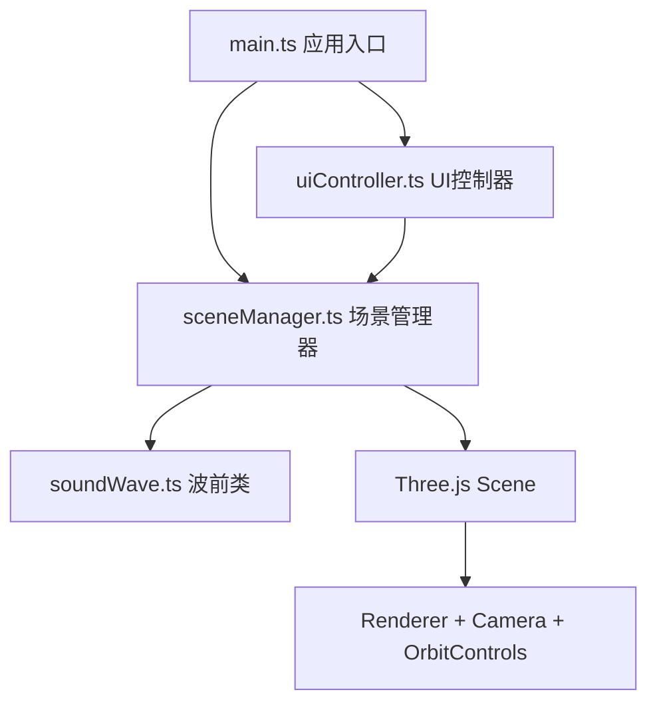

## 1. 架构设计



## 2. 技术说明
- **前端框架**: TypeScript + Vite@5 (纯前端，无后端)
- **3D引擎**: Three.js@0.160 + OrbitControls
- **构建工具**: Vite@5 (devServer端口: 3000)
- **类型系统**: TypeScript 严格模式 (target: ES2020)

## 3. 文件结构定义
| 文件路径 | 用途 |
|---------|------|
| /package.json | 项目依赖和启动脚本 |
| /vite.config.js | Vite构建配置 |
| /tsconfig.json | TypeScript配置 |
| /index.html | 入口HTML，含3D容器和侧边栏结构 |
| /src/main.ts | 应用入口，初始化Three.js核心，管理动画循环 |
| /src/sceneManager.ts | 场景管理器：地面、屏障、声源、波前、干涉、反射衍射逻辑 |
| /src/uiController.ts | UI控制器：侧边栏交互事件监听、状态同步 |
| /src/soundWave.ts | 单波前类：位置、半径、速度、类型、交线计算 |

## 4. 核心数据模型

### 4.1 SoundWave
```typescript
interface SoundWave {
  position: THREE.Vector3;
  radius: number;
  speed: number;
  color: string;
  type: 'original' | 'reflection' | 'diffraction';
  maxRadius: number;
  mesh: THREE.Mesh;
  update(deltaTime: number): boolean;
  getIntersection(other: SoundWave): THREE.Vector3[] | null;
}
```

### 4.2 SceneState
```typescript
interface SceneState {
  source1Pos: { x: number; z: number };
  source2Pos: { x: number; z: number };
  frequency: number;
  medium: 'air' | 'water' | 'glass';
  barrierHeight: number;
  source1Enabled: boolean;
  source2Enabled: boolean;
  isPlaying: boolean;
  interferenceOrder: number;
  maxWaveRadius: number;
}
```

## 5. 性能优化策略
- 波前数量超过200时，合并半径差<0.1单位的相邻波前
- 使用RingGeometry + MeshBasicMaterial高效渲染半透明波前
- 干涉条纹使用PointsMaterial批量粒子渲染
- 对象池复用波前Mesh避免频繁GC
