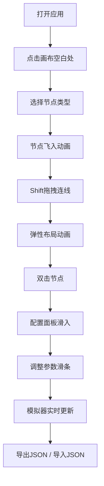

## 1. 产品概述

2D平台跳跃游戏角色技能树可视化编辑器与模拟器，帮助游戏设计师通过拖拽方式构建玩家技能节点网络、配置技能效果参数，并实时模拟角色在不同技能组合下的跳跃与空中机动能力。

- 目标用户：游戏设计师、关卡策划
- 核心价值：可视化技能树设计 + 实时效果模拟，提升技能系统迭代效率

## 2. 核心功能

### 2.1 用户角色
| 角色 | 注册方式 | 核心权限 |
|------|----------|----------|
| 设计师 | 无需注册，直接使用 | 创建、编辑、导入导出技能树，实时模拟 |

### 2.2 功能模块
1. **技能树编辑区**：Canvas画布、节点卡片、连接线、拖拽布局
2. **技能配置面板**：节点参数滑条、等级调整、实时数值反馈
3. **工具栏**：重置、导出JSON、导入JSON
4. **模拟器区域**：2D跳跃场景、角色属性面板、实时计算

### 2.3 页面详情
| 页面名称 | 模块名称 | 功能描述 |
|----------|----------|----------|
| 主页面 | 技能树编辑画布 | 800x600白色画布，节点拖拽、连线、弹性布局 |
| 主页面 | 节点配置面板 | 右侧300px侧栏，根据节点类型显示不同滑条配置 |
| 主页面 | 顶部工具栏 | 重置、导入、导出按钮 |
| 主页面 | 模拟器区域 | 下半部300px高度，2D场景+属性面板 |

## 3. 核心流程

设计师打开应用 → 在空白画布点击添加技能节点 → 按住Shift拖拽连线建立前置关系 → 双击节点打开配置面板调整参数 → 在模拟器区域实时查看角色属性变化 → 导出JSON保存配置 / 导入JSON加载已有配置

## 4. 用户界面设计

### 4.1 设计风格
- **主色调**：暗色背景#2C3E50，编辑区白色#FFFFFF，模拟器渐变#F5F5F5→#E8E8E8
- **节点颜色**：基础浅灰#E0E0E0，强化蓝色#4A90D9，特殊紫色#9B59B6
- **按钮色**：重置橘红#E67E22，导入导出绿色#27AE60
- **选中效果**：蓝色光晕#00BFFF，半径8px，1.5Hz闪烁
- **字体**：系统默认无衬线，数值标签monospace 12px
- **圆角**：按钮8px，节点卡片圆角，配置面板12px

### 4.2 页面设计概览
| 页面名称 | 模块名称 | UI元素 |
|----------|----------|--------|
| 主页面 | 技能树画布 | 800x600白底，圆角矩形节点卡片，贝塞尔曲线连线 |
| 主页面 | 配置面板 | 右侧滑入，纯白背景阴影，滑条控件 |
| 主页面 | 工具栏 | 左上重置按钮，右上导入导出按钮 |
| 主页面 | 模拟器 | 下方渐变背景，左侧2D场景Canvas，右侧属性面板 |

### 4.3 响应式
- 宽屏（≥1200px）：编辑画布+配置面板左右布局，模拟器下方全宽
- 平板（768px-1200px）：配置面板与模拟器上下叠放

## 5. 动画与交互
- 节点添加：鼠标位置飞入（0.2s ease-out）
- 连线绘制：源节点平滑伸长至目标（0.3s线性）
- 节点选中：蓝色外发光闪烁（1.5Hz）
- 拖拽移动：子树跟随，连线弹性伸缩（阻尼0.5s）
- 配置面板：右侧滑入（0.25s cubic-bezier）
- 数值变化：颜色微变+数字跳动（0.1s缩放1.05x）
