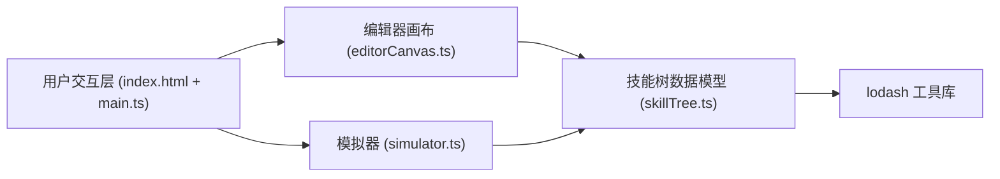

## 1. 架构设计



## 2. 技术描述
- **前端**：TypeScript + Vite@5 + Canvas 2D API
- **工具库**：lodash
- **构建工具**：Vite 5（devServer端口3000）
- **TypeScript配置**：严格模式，target ES2020，DOM类型

## 3. 文件结构
| 文件 | 职责 |
|------|------|
| package.json | 依赖声明、启动脚本 |
| vite.config.js | Vite构建配置 |
| tsconfig.json | TypeScript编译配置 |
| index.html | 入口页面，DOM容器布局 |
| src/main.ts | 应用入口，模块装配与事件绑定 |
| src/skillTree.ts | 数据模型：节点接口、前置校验、解锁路径、导入导出校验 |
| src/editorCanvas.ts | 画布渲染：节点卡片、贝塞尔连线、拖拽、弹簧布局动画 |
| src/simulator.ts | 模拟器：跳跃高度/滞空时间/空中动作计算、2D场景渲染 |

## 4. 数据模型

### 4.1 技能节点类型定义
```typescript
enum SkillType {
  BASIC_JUMP = 'basic_jump',
  DOUBLE_JUMP = 'double_jump',
  AIR_DASH = 'air_dash',
  GLIDE = 'glide',
  STOMP_BOUNCE = 'stomp_bounce'
}

interface SkillNode {
  id: string;
  type: SkillType;
  name: string;
  level: number; // 1-5
  x: number;
  y: number;
  params: Record<string, number>;
  prerequisites: string[];
  unlocked: boolean;
}

interface SkillTree {
  nodes: SkillNode[];
  connections: Array<{ from: string; to: string }>;
}
```

### 4.2 模拟器输出
```typescript
interface SimulationResult {
  jumpHeight: number;      // 像素
  airTime: number;         // 秒（保留两位小数）
  airActions: number;      // 空中动作次数
  totalSkillPoints: number; // 技能点数消耗
  characterColor: string;  // 角色颜色
}
```

## 5. 性能指标
- 编辑画布帧率：稳定60FPS
- 节点数量≤50时：拖拽无卡顿
- 模拟器重算延迟：< 50ms
- 模拟帧率：≥ 30FPS
