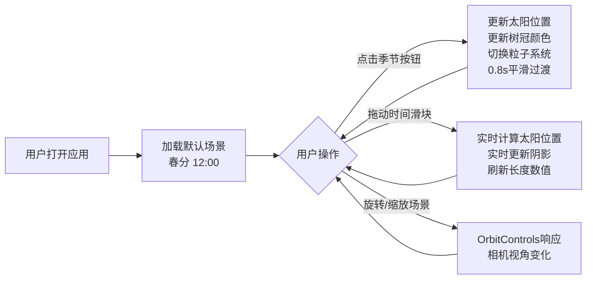

## 1. 产品概述

3D季节光照可视化应用，帮助城市规划和景观设计师在浏览器中交互式查看不同季节光照变化对建筑阴影与植被投影的影响。解决传统渲染软件调整季节参数后需重新渲染才能预览阴影效果、效率低且无法实时调节的痛点。

- 目标用户：城市规划师、景观设计师、建筑设计师
- 核心价值：实时、交互式、高性能的季节光照阴影预览工具

## 2. 核心功能

### 2.1 功能模块

1. **3D场景渲染**：建筑、树木、地面网格的实时3D渲染
2. **季节光照系统**：春分、夏至、秋分、冬至四季太阳方位角与高度角切换
3. **时间滑块控制**：6:00-18:00精细时间调节，实时更新太阳位置
4. **植被季节变化**：树冠颜色、透明度随季节动态变化
5. **粒子系统**：落叶、雪花粒子效果模拟季节特征
6. **阴影测量**：红色虚线标注阴影长度，实时显示数值

### 2.2 页面详情

| 页面名称 | 模块名称 | 功能描述 |
|-----------|-------------|---------------------|
| 主页面 | 3D场景区域 | Three.js渲染建筑、树木、地面，支持轨道控制旋转缩放 |
| 主页面 | 右侧控制面板 | 季节选择按钮、时间滑块、参数显示区、展开收起按钮 |
| 主页面 | 阴影测量指示 | 红色虚线从建筑底部延伸至阴影末端，显示长度数值 |
| 主页面 | 太阳光晕指示 | 黄色半透明小球沿半圆弧标记太阳位置 |

## 3. 核心流程

用户打开应用 → 默认显示春分季节12:00的3D场景 → 用户点击季节按钮切换季节（太阳位置、树冠颜色、粒子系统平滑过渡）→ 用户拖动时间滑块调节时间（太阳实时移动、阴影实时更新、长度数值实时显示）→ 用户可旋转/缩放场景查看不同角度阴影效果

## 4. 用户界面设计

### 4.1 设计风格
- **主色调**：深色科技感主题，背景#1a1a2e，卡片#16213e
- **强调色**：#00b894（选中状态）、#00b4d8（滑块轨道）
- **文字颜色**：#e0e0e0
- **按钮样式**：圆角矩形，选中背景从#2d3436变为#00b894，0.3秒过渡
- **字体**：无衬线字体，现代简约风格
- **布局**：左侧70%场景区域，右侧30%控制面板，可滑入滑出
- **视觉效果**：场景边缘暗角（CSS radial-gradient叠加）

### 4.2 页面设计概览

| 页面名称 | 模块名称 | UI元素 |
|-----------|-------------|-------------|
| 主页面 | 3D场景区域 | Three.js画布、边缘暗角效果、黄色太阳指示球、红色阴影测量虚线 |
| 主页面 | 控制面板头部 | 展开/收起按钮（左箭头图标），0.3s ease-out滑入滑出 |
| 主页面 | 季节选择区 | 四个季节卡片按钮，间距12px，选中高亮，0.3s颜色过渡 |
| 主页面 | 时间滑块区 | 6:00-18:00滑块，#00b4d8轨道，白色圆形滑块，渐变填充 |
| 主页面 | 参数显示区 | 当前季节名称、时间、阴影长度（米，保留一位小数） |

### 4.3 响应式设计
- 桌面端优先设计
- 右侧面板可收起以适应小屏幕
- 最小支持宽度1024px

### 4.4 3D场景指导
- **环境**：深色背景，配合场景边缘暗角营造科技氛围
- **光照**：方向光模拟太阳光（开启阴影贴图2048x2048，柔和度0.5），低强度环境光提供基础照明
- **相机**：PerspectiveCamera，初始位置(10, 8, 10)，OrbitControls控制
- **场景元素**：
  - 现代建筑：多个长方体组合，浅灰色#C0C0C0外墙
  - 树木：球体树冠+圆柱体树干，树冠颜色随季节变化
  - 地面：20x20淡灰色网格
- **动画**：太阳位置0.8s ease-in-out缓动，颜色0.6s线性插值，透明度0.4s ease-out
- **性能目标**：60Hz显示器45FPS+，粒子200个时50FPS+，加载<2秒
