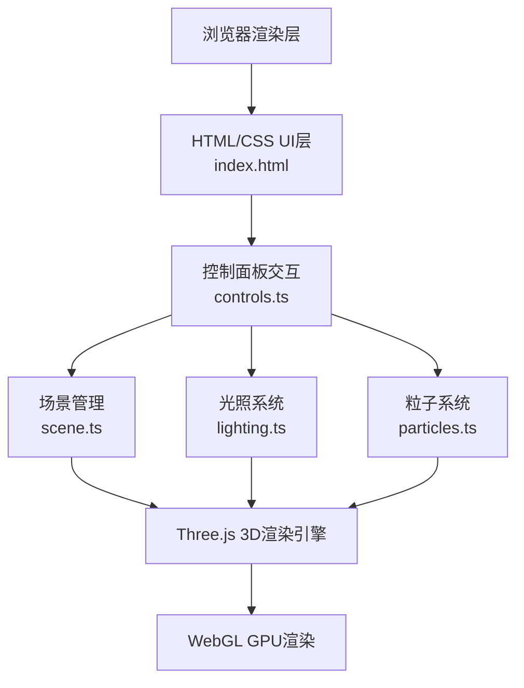

## 1. 架构设计



## 2. 技术说明

- **前端框架**：TypeScript + Three.js@0.160（原生实现，无React/Vue）
- **构建工具**：Vite@5（TypeScript支持，devServer端口3000）
- **类型定义**：@types/three
- **模块拆分**：
  - `src/scene.ts` - 3D场景初始化、建筑/树木/地面模型、场景对外接口
  - `src/lighting.ts` - 太阳位置计算、方向光/环境光、阴影贴图、光晕小球
  - `src/particles.ts` - 落叶/雪花粒子创建、更新、销毁、季节切换
  - `src/controls.ts` - DOM事件绑定、季节按钮、时间滑块、UI状态更新

## 3. 模块接口定义

### 3.1 scene.ts 接口

```typescript
export interface SceneAPI {
  scene: THREE.Scene;
  camera: THREE.PerspectiveCamera;
  renderer: THREE.WebGLRenderer;
  building: THREE.Group;
  tree: {
    trunk: THREE.Mesh;
    leaves: THREE.Mesh;
  };
  ground: THREE.GridHelper;
  shadowLine: THREE.Line;
  shadowLengthLabel: THREE.Sprite;
  setSeason(season: Season, duration?: number): void;
  setTime(hours: number, minutes?: number): void;
  updateLeavesColor(color: THREE.Color, opacity: number, duration?: number): void;
  updateShadowMeasurement(): void;
  animate(): void;
}

export type Season = 'spring' | 'summer' | 'autumn' | 'winter';
```

### 3.2 lighting.ts 接口

```typescript
export interface LightingAPI {
  sunLight: THREE.DirectionalLight;
  ambientLight: THREE.AmbientLight;
  sunGlow: THREE.Mesh;
  setSunPosition(azimuth: number, altitude: number, duration?: number): void;
  calculateSunPosition(season: Season, hours: number, minutes: number): { azimuth: number; altitude: number };
}
```

### 3.3 particles.ts 接口

```typescript
export interface ParticlesAPI {
  setSeasonParticles(season: Season): void;
  update(delta: number): void;
  dispose(): void;
}
```

### 3.4 季节参数常量

```typescript
export const SEASON_CONFIG = {
  spring: {
    azimuth: 90,
    altitude: 45,
    leavesColor: '#8BC34A',
    leavesOpacity: 0.9,
    particleType: 'none' as const
  },
  summer: {
    azimuth: 0,
    altitude: 75,
    leavesColor: '#388E3C',
    leavesOpacity: 0.95,
    particleType: 'greenLeaves' as const
  },
  autumn: {
    azimuth: 270,
    altitude: 45,
    leavesColor: '#FF9800',
    leavesOpacity: 0.85,
    particleType: 'orangeLeaves' as const
  },
  winter: {
    azimuth: 180,
    altitude: 25,
    leavesColor: '#757575',
    leavesOpacity: 0.3,
    particleType: 'snow' as const
  }
};
```

## 4. 性能优化策略

- **阴影贴图**：2048x2048分辨率，PCFSoftShadowMap柔和阴影
- **粒子系统**：最多200个粒子，使用Points材质，批量渲染
- **动画优化**：使用requestAnimationFrame，deltaTime控制动画速度
- **材质复用**：相同属性物体共享材质，减少draw call
- **懒加载**：Vite默认ES模块懒加载，入口轻量
- **缓动动画**：参数插值使用lerp，避免跳变同时减少计算量

## 5. 项目文件结构

```
├── package.json
├── vite.config.js
├── tsconfig.json
├── index.html
└── src/
    ├── scene.ts
    ├── lighting.ts
    ├── particles.ts
    └── controls.ts
```
