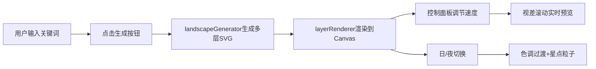

## 1. 产品概述
视差滚动背景生成与预览工具，帮助前端开发者根据文本关键词自动生成多层SVG矢量景观，并实时预览不同层滚动速度组合下的视差效果。
- 解决问题：无需手动寻找和切图，快速生成可定制的视差滚动背景素材
- 目标用户：前端开发者、UI设计师
- 市场价值：提升视差滚动效果开发效率，降低设计成本

## 2. 核心功能

### 2.1 用户角色
| 角色 | 注册方式 | 核心权限 |
|------|----------|----------|
| 访客用户 | 无需注册 | 使用所有生成、预览、调节功能 |

### 2.2 功能模块
1. **景观自动生成模块**：关键词输入、SVG分层生成、淡入动画
2. **视差速度调节模块**：每层速度滑块、实时拖拽/滚轮预览
3. **时间动态演替模块**：日/夜切换、色调过渡、星点粒子、月亮淡入

### 2.3 页面详情
| 页面名称 | 模块名称 | 功能描述 |
|---------|---------|---------|
| 主页面 | 关键词输入区 | 输入3-5个景观描述关键词，触发生成 |
| 主页面 | Canvas预览区 | 中央80%宽度，深灰背景，展示多层视差滚动效果 |
| 主页面 | 图层控制面板 | 左侧220px毛玻璃面板，图层列表+速度滑块 |
| 主页面 | 日/夜切换按钮 | 星球图标，切换整体色调和星点粒子 |

## 3. 核心流程
用户输入关键词 → 点击生成按钮 → 系统生成4-6层SVG景观元素 → 图层淡入动画 → Canvas实时渲染各层 → 用户拖动滑块调节速度 / 拖拽预览区 / 滚轮滚动 → 各层以对应速度偏移产生景深感 → 点击日/夜按钮 → 色调平滑过渡、星点淡入、月亮淡入

## 4. 用户界面设计

### 4.1 设计风格
- 主色调：深灰(#2c3e50)背景、半透明白色毛玻璃面板
- 按钮风格：圆形生成按钮带波纹扩散动画，星球图标日夜切换按钮
- 字体：现代无衬线字体，标题16px，正文13px
- 布局风格：左侧220px控制面板 + 中央80% Canvas预览区
- 图标风格：简洁矢量图标，彩色圆点标识图层

### 4.2 页面设计概述
| 页面名称 | 模块名称 | UI元素 |
|---------|---------|--------|
| 主页面 | 关键词输入区 | 输入框+圆形生成按钮(波纹动画+颜色反转) |
| 主页面 | 图层控制区 | 彩色圆点+图层名称+渐变轨道滑块(0.0-2.0) |
| 主页面 | Canvas预览区 | 深灰背景Canvas，支持水平拖拽和滚轮 |
| 主页面 | 日夜切换区 | 星球图标按钮，切换时星点粒子淡入 |

### 4.3 响应性
- Desktop-first设计，固定布局
- 预览区Canvas自适应容器宽度

### 4.4 视觉动效
- 景观生成：各层从底部淡入上移0.8秒(错位延迟)
- 日夜切换：2秒色调平滑过渡，月亮从右侧淡入，云朵透明度0.6→0.2
- 生成按钮：点击波纹扩散0.4秒，颜色反转
- 星点粒子：20颗小圆点随机位置淡入
