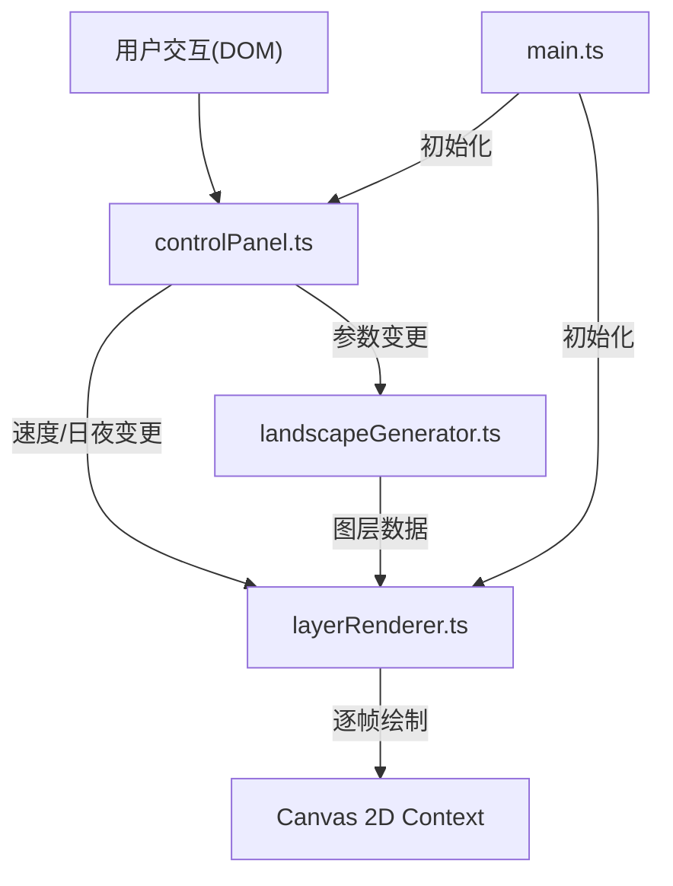

## 1. 架构设计
纯前端单页应用，分层架构，核心逻辑与UI解耦。



## 2. 技术描述
- 前端：TypeScript + Vite 5 + Canvas 2D API + SVG
- 工具库：lodash
- 构建工具：Vite 5 (devServer端口3000)
- 后端：无，纯前端应用
- 数据库：无

## 3. 项目文件结构
```
├── package.json              # 依赖配置(typescript, vite@5, lodash)
├── vite.config.js            # Vite构建配置
├── tsconfig.json             # TypeScript严格模式配置
├── index.html                # 入口HTML页面
└── src/
    ├── main.ts               # 应用入口，初始化并连接各模块
    ├── core/
    │   ├── landscapeGenerator.ts   # 关键词→多层SVG景观生成
    │   └── layerRenderer.ts        # Canvas渲染、动画循环、视差偏移
    └── ui/
        └── controlPanel.ts         # DOM交互、参数读取、事件通知
```

## 4. 模块调用关系与数据流

### 4.1 landscapeGenerator.ts
- **输入**：关键词数组(string[])、日夜模式(boolean)
- **输出**：LandscapeLayer[]
  ```typescript
  interface LandscapeLayer {
    id: string;
    name: string;
    svgString: string;
    primaryColor: string;
    depth: number;           // 0=最远, 1=最近
    defaultSpeed: number;    // 默认视差速度
    zIndex: number;
    opacity: number;
  }
  ```
- **职责**：根据关键词抽象生成4-6层SVG元素，每层风格(山脉锯齿多边形、森林三角形+圆形、云朵椭圆、月亮圆形、河流贝塞尔曲线等)，颜色从远到近渐变(亮灰→深绿/土黄)。

### 4.2 layerRenderer.ts
- **输入**：LandscapeLayer[]、速度配置、滚动偏移、日夜模式
- **输出**：Canvas逐帧渲染
- **职责**：SVG转ImageBitmap、按zIndex分层绘制、根据偏移量和速度计算每层位移、requestAnimationFrame动画循环、日夜色调混合、透明度控制、星点粒子管理。

### 4.3 controlPanel.ts
- **输入**：DOM元素引用
- **输出**：事件回调(onGenerate、onSpeedChange、onDayNightToggle)
- **职责**：关键词输入框、生成按钮(波纹动画)、图层速度滑块(渐变轨道)、日夜切换按钮(星球图标)，读取UI值并通知监听者。

### 4.4 main.ts
- **职责**：创建DOM结构引用，实例化controlPanel和layerRenderer，建立事件通道：
  - 用户输入关键词→点击生成→调用landscapeGenerator→结果传给layerRenderer
  - 滑块拖动→更新layerRenderer速度映射
  - 日/夜切换→通知layerRenderer过渡色调
  - Canvas鼠标拖拽/滚轮→更新layerRenderer偏移量

## 5. 数据模型

### 5.1 核心类型定义
```typescript
interface GenerateParams {
  keywords: string[];
  isNight: boolean;
}

interface LayerSpeed {
  layerId: string;
  speed: number;  // 0.0 ~ 2.0
}

interface RenderState {
  layers: LandscapeLayer[];
  speeds: Record<string, number>;
  offsetX: number;
  offsetY: number;
  isNight: boolean;
  transitionProgress: number; // 0=日, 1=夜
  stars: Star[];
}

interface Star {
  x: number;
  y: number;
  radius: number;
  opacity: number;
  twinkleSpeed: number;
}
```

## 6. 性能约束实现策略
- Canvas帧率60fps：使用requestAnimationFrame，计算逻辑<16ms
- 滚动延迟<50ms：速度计算为简单乘法，无复杂运算
- 生成耗时<200ms：SVG字符串拼接，lodash辅助，避免DOM操作
- SVG预渲染：生成后立即转为Image缓存，避免每帧解析SVG
- 日夜过渡：使用lerp线性插值，progress参数0-1过渡
