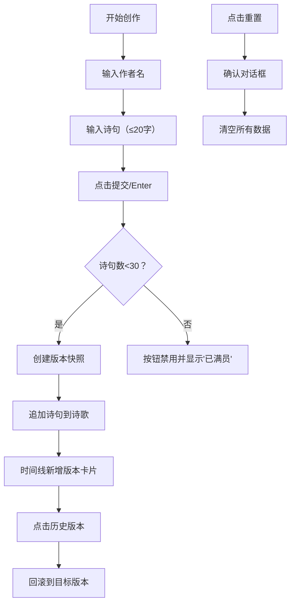

## 1. 产品概述
诗链是一款在线协作诗歌接龙创作与时间线回溯应用，让多位作者能接力完成一首诗歌，并随时回退到任意历史版本。
- 主要目标：提供优雅的多人协作诗歌创作体验，支持完整的版本管理与回溯功能
- 目标用户：文学爱好者、创意写作者、教育场景中的师生

## 2. 核心特性

### 2.1 功能模块
1. **导航栏**：应用logo、在线作者数量显示、重置按钮
2. **创作区**：作者名输入、诗句输入、提交按钮
3. **诗歌展示区**：横排卡片流展示所有诗句，带行号和作者信息
4. **时间线面板**：纵向时间轴展示所有版本，支持点击回退

### 2.2 页面详情
| 页面名称 | 模块名称 | 功能描述 |
|-----------|-------------|---------------------|
| 主页面 | 导航栏 | 固定顶部，显示应用名"诗链"渐变logo、在线作者数、重置按钮 |
| 主页面 | 创作区 | 作者名输入框、诗句输入框（限20字）、提交按钮，Enter键快捷提交 |
| 主页面 | 诗歌展示区 | 横排卡片流展示，悬停动效，虚拟列表优化（最多渲染10张） |
| 主页面 | 时间线面板 | 固定右侧320px宽，纵向时间轴，版本卡片高亮和脉冲动画，点击回退 |

## 3. 核心流程
用户输入作者名和诗句 → 点击提交或按Enter → 创建新版本快照 → 诗歌展示区追加新诗句 → 时间线面板新增版本卡片 → 用户可点击任意历史版本卡片 → 诗歌回滚到该版本状态 → 用户可随时点击重置按钮清空所有数据

## 4. 用户界面设计

### 4.1 设计风格
- **主色调**：深灰(#2d3436)与紫(#764ba2)
- **背景色**：白色(#fff)，时间线背景浅灰(#f5f5f5)
- **按钮**：紫色按钮悬停变深紫(#5a2d8a)，浅色按钮悬停变浅灰(#e0e0e0)
- **字体**：系统无衬线字体
- **布局**：顶部导航栏60px高，中间创作区左右留白20%，右侧固定时间线面板320px宽

### 4.2 页面设计概述
| 页面名称 | 模块名称 | UI元素 |
|-----------|-------------|-------------|
| 主页面 | 导航栏 | 渐变文字logo(#667eea→#764ba2)、绿色在线状态圆点、重置按钮带阴影分隔 |
| 主页面 | 创作区 | 输入框聚焦外发光(青色#00cec9)、边框颜色渐变动画(0.3s ease)、提交后闪烁效果(0.2s) |
| 主页面 | 诗歌展示区 | 白色圆角卡片(8px)带阴影、深灰细线连接、悬停上移3px加深阴影、行号+浅灰作者名 |
| 主页面 | 时间线面板 | 浅灰背景、版本卡片（作者加粗/诗句斜体/相对时间）、最新版淡紫高亮(#e8d5f5)、点击脉冲动画(0.5s scale 1.05→1)、紫色自定义滚动条 |
| 主页面 | 重置模态框 | 半透明黑色遮罩、居中模态框、淡入缩放动画(Framer Motion AnimatePresence)、淡出过渡(0.3s) |

### 4.3 响应式
桌面端优先设计，时间线面板固定在右侧。移动端可考虑将时间线改为底部抽屉形式。

### 4.4 性能要求
- 版本管理使用不可变数据结构，版本切换时间≤50ms
- 诗句渲染使用虚拟列表，最多同时渲染10张卡片
- 页面首次加载时间≤2秒
