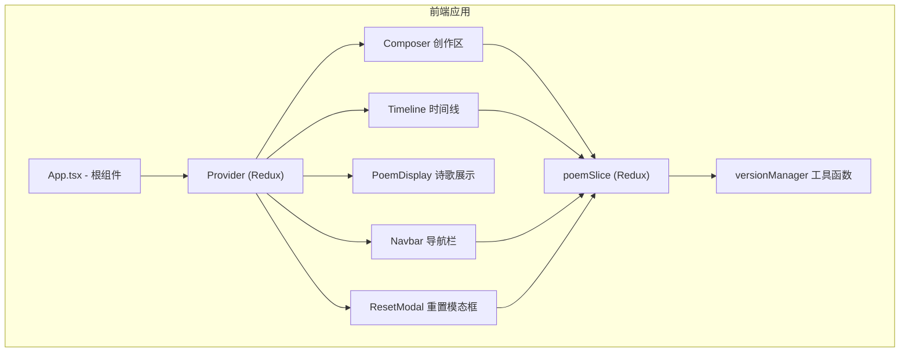
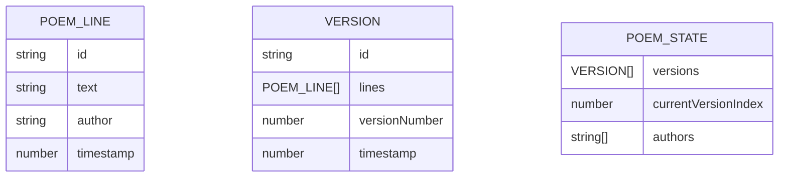

## 1. 架构设计


## 2. 技术说明
- **前端框架**：React@18 + TypeScript + Vite@5
- **状态管理**：Redux + react-redux
- **动画库**：framer-motion
- **工具库**：uuid、lodash
- **初始化工具**：vite-init
- **后端**：无（纯前端应用）
- **数据持久化**：内存存储（版本快照）

## 3. 路由定义
| Route | Purpose |
|-------|---------|
| / | 主页面，包含所有功能模块 |

## 4. 数据模型

### 4.1 数据模型定义


### 4.2 TypeScript 类型定义
```typescript
interface PoemLine {
  id: string;
  text: string;
  author: string;
  timestamp: number;
}

interface Version {
  id: string;
  lines: PoemLine[];
  versionNumber: number;
  timestamp: number;
}

interface PoemState {
  versions: Version[];
  currentVersionIndex: number;
  authors: string[];
}
```

## 5. 项目结构
```
├── package.json
├── vite.config.js
├── tsconfig.json
├── index.html
└── src/
    ├── App.tsx
    ├── store/
    │   └── poemSlice.ts
    ├── components/
    │   ├── Composer.tsx
    │   └── Timeline.tsx
    └── utils/
        └── versionManager.ts
```

## 6. 核心算法
- **版本快照生成**：每次提交诗句时，深拷贝当前lines数组，追加新诗句，创建新Version对象
- **版本差异计算**：对比相邻版本的lines数组长度和内容差异
- **版本回退重建**：根据目标版本索引，从versions数组中获取对应版本的lines，重建当前状态
- **虚拟列表渲染**：根据滚动位置计算可见区域，只渲染视口内最多10张诗句卡片
