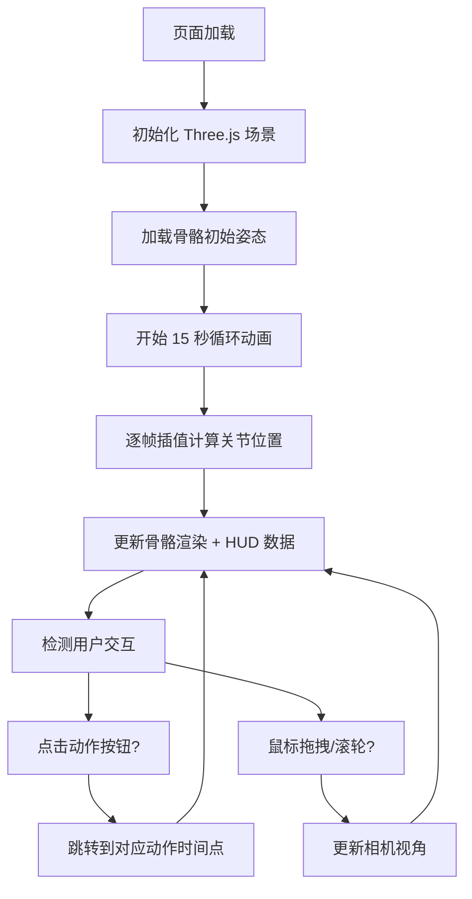

## 1. 产品概述

3D 骨骼动画健身可视化工具，为健身爱好者和教练提供直观的交互体验，通过观察标准深蹲、俯卧撑和仰卧起坐三个动作的骨骼运动轨迹，帮助纠正健身姿势。

- 核心价值：将抽象的健身动作用 3D 骨骼模型直观呈现，便于理解和纠正动作标准度
- 目标用户：健身爱好者、私人教练、健身初学者

## 2. 核心功能

### 2.1 功能模块

1. **3D 骨骼动画场景**：展示简化人体骨骼模型（关节点 + 连线），循环播放三个健身动作
2. **动作切换控制**：三个按钮分别对应深蹲、俯卧撑、仰卧起坐，点击可跳转到对应动作起始时间
3. **实时数据面板**：显示当前动作名称、完成进度、髋关节和膝关节角度数值
4. **视角交互**：鼠标拖拽旋转场景、滚轮缩放，自由观察动作细节
5. **关节高亮**：运动时高亮显示当前主要受力关节（红色高光）

### 2.2 页面详情

| 页面名称 | 模块名称 | 功能描述 |
|---------|---------|---------|
| 主页面 | 3D 场景区域 | 占页面 70% 宽度，展示骨骼动画，支持鼠标交互 |
| 主页面 | 左侧信息面板 | 半透明毛玻璃效果，显示动作名称、进度条、关节角度 |
| 主页面 | 动作切换按钮组 | 左上角圆角胶囊按钮，三个动作快捷切换 |

## 3. 核心流程

## 4. 用户界面设计

### 4.1 设计风格

- **整体风格**：仿 X 光科技感，深灰色背景搭配霓虹蓝绿色骨骼
- **主色调**：深灰背景 `#1a1a2e`，骨骼蓝绿 `#00f5d4`，受力关节红 `#ff3366`
- **按钮样式**：圆角胶囊按钮，悬停变色 + 轻微上浮动画，200ms 过渡
- **面板效果**：半透明毛玻璃（背景模糊 8px，圆角 12px）
- **布局比例**：左侧面板窄，右侧 3D 场景占 70%，整体保持 16:9 自适应

### 4.2 页面设计概览

| 页面名称 | 模块名称 | UI 元素 |
|---------|---------|--------|
| 主页面 | 3D 场景 | 深灰背景、霓虹色骨骼、关节球体、骨骼连线、红色高亮点 |
| 主页面 | 信息面板 | 动作名称标题、进度条、髋关节角度、膝关节角度 |
| 主页面 | 按钮组 | 三个胶囊按钮（深蹲/俯卧撑/仰卧起坐），悬停上浮效果 |

### 4.3 响应式

- 桌面端优先，整体保持 16:9 比例自适应窗口大小
- 窗口缩放时按比例调整，确保布局不变形

### 4.4 3D 场景指引

- **环境**：深灰色纯色背景，营造科技感/X 光风格
- **光照**：环境光 + 点光源，确保关节点和连线清晰可见
- **相机**：PerspectiveCamera，初始视角为斜 45 度，便于观察 3D 结构
- **交互**：OrbitControls，支持拖拽旋转、滚轮缩放、右键平移
- **性能**：目标 60FPS，单帧计算 < 8ms，使用 requestAnimationFrame
