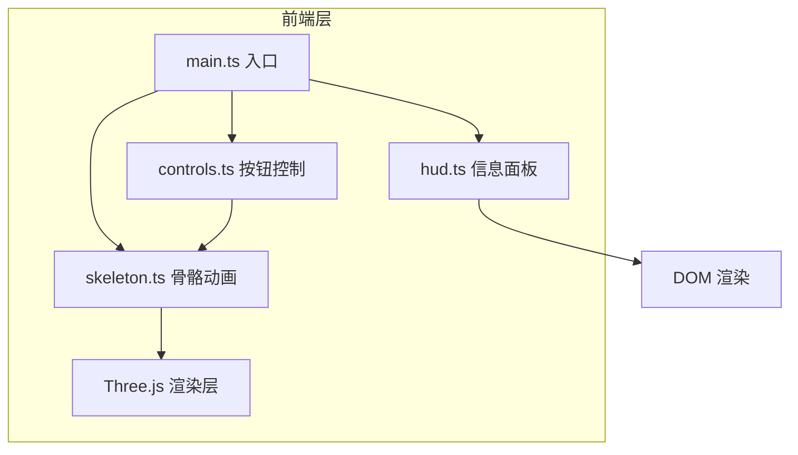

## 1. 架构设计



## 2. 技术栈说明

- **前端框架**：原生 TypeScript（无 React/Vue），轻量级 DOM 操作
- **3D 引擎**：Three.js r150+，用于骨骼模型渲染和动画
- **构建工具**：Vite 4.x，快速开发和热更新
- **语言**：TypeScript 5.x，严格模式，目标 ES2020

## 3. 文件结构

```
├── index.html              # 入口 HTML
├── package.json            # 项目依赖和脚本
├── vite.config.js          # Vite 配置
├── tsconfig.json           # TypeScript 配置
└── src/
    ├── main.ts             # 主入口：场景初始化、动画循环管理
    ├── skeleton.ts         # 骨骼数据：关节定义、关键帧插值、角度计算
    ├── hud.ts              # HUD 面板：DOM 创建、数据更新接口
    └── controls.ts         # 控制按钮：事件绑定、动作跳转
```

## 4. 核心模块设计

### 4.1 skeleton.ts 骨骼模块

**数据结构**：
- `Joint` 接口：关节名称、初始位置、当前位置
- `SkeletonData`：12 个关节点的集合
- `ActionKeyframes`：每个动作的关键帧数据（时间点 + 关节位置）

**核心函数**：
- `initJoints()`：初始化 12 个关节点的初始坐标
- `getSquatFrame(t: number)`：深蹲动作插值
- `getPushupFrame(t: number)`：俯卧撑动作插值
- `getSitupFrame(t: number)`：仰卧起坐动作插值
- `getJointAngles(joints)`：计算髋关节和膝关节角度
- `getHighlightJoints(actionName)`：返回当前受力关节名称列表

**关节点定义（12个）**：
- 头、颈、左肩、左肘、左腕、右肩、右肘、右腕、髋、左膝、左踝、右膝、右踝

### 4.2 hud.ts 信息面板模块

**功能**：
- 创建左侧面板 DOM 元素
- 提供 `update(action, progress, hipAngle, kneeAngle)` 接口
- 进度条动画、数值更新带 200ms 过渡

**样式**：
- 毛玻璃效果：`backdrop-filter: blur(8px)`
- 半透明背景：`rgba(255,255,255,0.08)`
- 圆角 12px

### 4.3 controls.ts 按钮控制模块

**功能**：
- 创建三个动作切换按钮
- 绑定点击事件，跳转到对应动作时间
- 悬停/点击样式处理
- 当前激活按钮高亮

**样式**：
- 圆角胶囊按钮
- 悬停：背景色变化 + translateY(-2px) 上浮
- 激活状态：霓虹蓝绿边框 + 发光效果

### 4.4 main.ts 主入口

**职责**：
- 初始化 Three.js 场景、相机、渲染器
- 创建 OrbitControls 视角控制
- 创建骨骼网格（球体关节 + 线条连线）
- 管理动画循环（requestAnimationFrame）
- 时间线管理（15秒循环，0-5深蹲，5-10俯卧撑，10-15仰卧起坐）
- 每帧调用 skeleton 更新关节位置，更新网格和 HUD

**性能优化**：
- 位置插值使用简单线性插值（lerp）
- 避免每帧创建新对象，复用 Vector3
- 角度计算使用 Math.atan2，避免复杂运算

## 5. 动画时间线

| 时间段 | 动作 | 主要受力关节 |
|-------|------|-------------|
| 0s - 5s | 深蹲 | 髋关节、膝关节 |
| 5s - 10s | 俯卧撑 | 肩关节、肘关节 |
| 10s - 15s | 仰卧起坐 | 髋关节、脊柱（颈） |

## 6. 性能指标

- 目标帧率：60 FPS
- 单帧逻辑计算：< 8ms
- 单帧渲染：由 Three.js 处理，保证流畅
- 内存：稳定无泄漏，对象复用
