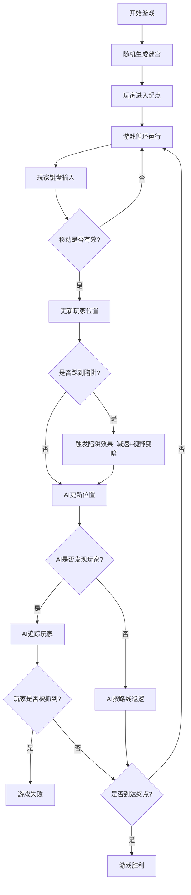

## 1. 产品概述

实时迷宫导航与陷阱规避游戏，玩家在随机生成的15x15网格迷宫中探索，躲避AI敌人追踪和隐藏陷阱，借助A*路径辅助到达终点。

- 核心目标：提供沉浸式迷宫探索体验，解决玩家在迷宫中缺乏方向感的问题
- 目标用户：休闲游戏玩家、迷宫探索爱好者
- 产品价值：通过动态AI敌人、隐藏陷阱和智能路径辅助，提升探索的紧张感和策略性

## 2. 核心功能

### 2.1 用户角色
| 角色 | 注册方式 | 核心权限 |
|------|----------|----------|
| 玩家 | 无需注册，直接游戏 | 进行游戏、查看状态、使用路径辅助 |

### 2.2 功能模块
1. **迷宫生成模块**：随机生成迷宫拓扑、墙壁、通道、陷阱和终点
2. **玩家控制模块**：键盘输入处理、移动逻辑、朝向管理
3. **AI敌人模块**：巡逻逻辑、视野检测、追踪行为
4. **陷阱系统模块**：隐藏陷阱、触发效果、减速惩罚
5. **路径辅助模块**：A*算法计算最短路径、冷却机制
6. **游戏状态管理**：生命值、时间、游戏结束判定

### 2.3 页面详情
| 页面名称 | 模块名称 | 功能描述 |
|---------|----------|----------|
| 游戏主界面 | 迷宫画布 | Canvas 2D渲染15x15迷宫网格，实时更新玩家、AI、路径 |
| 游戏主界面 | 玩家状态面板 | 显示生命值、当前位置、已用时间 |
| 游戏主界面 | 小地图 | 缩小版迷宫，显示已探索区域 |
| 游戏主界面 | 游戏控制 | 重新开始、路径辅助触发 |

## 3. 核心流程

玩家启动游戏 → 随机生成迷宫 → 玩家使用方向键移动 → AI敌人巡逻/追踪 → 玩家触发陷阱（减速+视野变暗）→ 玩家按空格显示最短路径 → 到达终点胜利 / 被AI抓到失败

## 4. 用户界面设计

### 4.1 设计风格
- 整体风格：暗色调游戏风格，神秘紧张氛围
- 主色调：深灰背景(#1a1a2e)、深紫墙壁(#4a0e4e)、浅灰通道(#e0e0e0)
- 强调色：蓝色(玩家)、红色(AI和陷阱警告)、绿色(路径辅助)
- 布局：迷宫居中，左侧状态面板，右侧小地图
- 动画：玩家光晕、AI脉冲、陷阱红色闪烁、路径淡入

### 4.2 页面设计概览
| 页面名称 | 模块名称 | UI元素 |
|---------|----------|--------|
| 游戏主界面 | 迷宫画布 | Canvas渲染、网格绘制、角色动画、路径高亮 |
| 游戏主界面 | 状态面板 | 生命值图标、坐标显示、计时器、冷却进度 |
| 游戏主界面 | 小地图 | 缩小迷宫、已探索区域高亮、玩家位置标记 |
| 游戏主界面 | 响应式布局 | 大屏并排显示、小屏底部横条 |

### 4.3 响应式
- 桌面优先设计，断点768px
- 屏幕宽度>768px：左右面板与迷宫并排布局
- 屏幕宽度<768px：面板折叠到底部横条，CSS过渡动画实现滑入滑出

### 4.4 视觉特效
- 玩家移动：淡蓝色径向渐变光晕动画
- AI追踪：脉冲红色光晕效果
- 陷阱触发：屏幕边缘红色闪烁动画(0.5秒)
- 路径显示：0.3秒淡入过渡效果
- 视野变暗：陷阱触发后3秒内屏幕暗化
