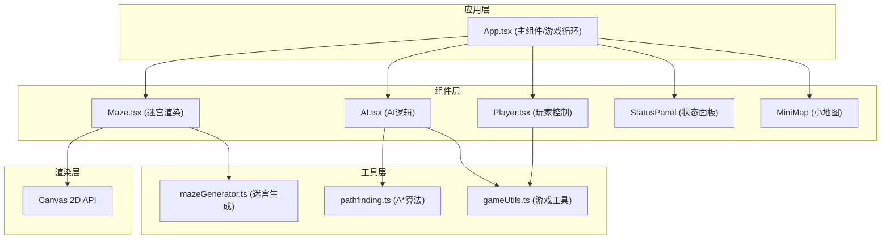

## 1. 架构设计



**数据流向：**
- App.tsx 管理全局游戏状态和游戏循环
- Player组件接收键盘输入 → 输出玩家坐标和朝向 → App传递给Maze和AI
- AI组件接收玩家坐标和网格状态 → 计算巡逻路线 → 输出AI位置 → App传递给Maze
- Maze组件接收玩家坐标和AI列表 → 更新网格状态 → 输出Canvas绘制指令

## 2. 技术描述

- 前端框架：React@18 + TypeScript
- 构建工具：Vite@5 + @vitejs/plugin-react
- 渲染技术：Canvas 2D API
- 状态管理：React useState/useRef (轻量级游戏状态)
- 样式方案：CSS Modules / 原生CSS + CSS变量
- 无后端，纯前端实现

## 3. 文件结构

```
src/
├── components/
│   ├── Maze.tsx          # 迷宫网格生成与Canvas渲染
│   ├── Player.tsx        # 玩家控制器（输入处理）
│   ├── AI.tsx            # AI巡逻与追踪逻辑
│   ├── StatusPanel.tsx   # 玩家状态面板
│   └── MiniMap.tsx       # 小地图组件
├── utils/
│   ├── mazeGenerator.ts  # 迷宫生成算法
│   ├── pathfinding.ts    # A*路径搜索算法
│   └── gameTypes.ts      # TypeScript类型定义
├── App.tsx               # 主应用组件
├── main.tsx              # 入口文件
└── index.css             # 全局样式
```

## 4. 核心数据模型

### 4.1 类型定义

```typescript
// 格子类型
type CellType = 'wall' | 'path' | 'trap' | 'start' | 'end';

// 坐标
interface Position {
  x: number;
  y: number;
}

// 迷宫格子
interface Cell {
  type: CellType;
  explored: boolean;
}

// 玩家状态
interface PlayerState {
  position: Position;
  direction: 'up' | 'down' | 'left' | 'right';
  speed: number;           // 移动间隔(ms)
  isSlowed: boolean;       // 是否处于减速状态
  slowTimer: number;       // 减速剩余时间
  health: number;          // 生命值
}

// AI状态
interface AIState {
  id: number;
  position: Position;
  state: 'patrol' | 'chase';
  patrolPath: Position[];
  currentPathIndex: number;
  visionRange: number;     // 视野范围(格)
}

// 游戏状态
interface GameState {
  maze: Cell[][];
  player: PlayerState;
  ais: AIState[];
  startPos: Position;
  endPos: Position;
  traps: Position[];
  gameStatus: 'playing' | 'won' | 'lost';
  elapsedTime: number;     // 已用时间(秒)
  showPath: boolean;       // 是否显示路径
  pathCooldown: number;    // 路径冷却剩余时间
  shortestPath: Position[];
  trapFlash: boolean;      // 陷阱闪烁效果
  darkVision: boolean;     // 视野变暗
}
```

## 5. 核心算法

### 5.1 迷宫生成算法
- 使用深度优先搜索(DFS)回溯算法生成完美迷宫
- 迷宫尺寸：15x15网格
- 随机放置5个陷阱在通道上
- 起点固定在左上角附近，终点固定在右下角附近

### 5.2 A*路径搜索算法
- 启发函数：曼哈顿距离
- 支持墙壁碰撞检测
- 性能目标：20ms内完成计算
- 用于玩家路径辅助和AI追踪

### 5.3 AI行为算法
- 巡逻模式：右手沿墙法则(Right-Hand Rule)
- 追踪模式：A*算法实时计算到玩家的最短路径
- 视野检测：曼哈顿距离≤3格时触发追踪
- AI不会触发陷阱，路径规划时自动避开

### 5.4 游戏循环
- 60fps渲染循环 (requestAnimationFrame)
- Canvas每帧渲染时间≤8ms
- 固定时间步长处理游戏逻辑更新

## 6. 性能约束

- 游戏循环：60fps更新
- Canvas渲染：每帧≤8ms
- A*计算：玩家按下空格后≤20ms完成
- 内存占用：单页应用，无需特殊优化

## 7. 响应式设计

- 断点：768px
- 大屏(>768px)：左面板 + 迷宫 + 右面板 三栏布局
- 小屏(<768px)：面板折叠为底部横条，CSS过渡动画
