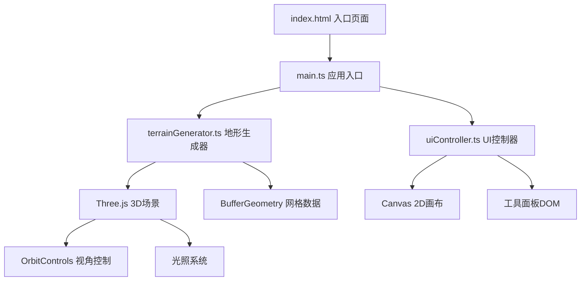

## 1. 架构设计

本项目为纯前端单页应用，采用模块化架构设计，各模块职责清晰、低耦合高内聚。



## 2. 技术描述

- **前端框架**：原生 TypeScript + Vite 构建
- **3D引擎**：Three.js（含 OrbitControls）
- **画布绘制**：原生 Canvas 2D API
- **构建工具**：Vite 5.x
- **语言规范**：TypeScript 5.x 严格模式
- **目标环境**：ES2020，现代浏览器支持

**核心依赖**：
- `three` — 3D渲染引擎
- `@types/three` — Three.js类型定义
- `typescript` — TypeScript编译器
- `vite` — 开发服务器与构建工具

## 3. 文件结构

```
project/
├── package.json           # 项目依赖与脚本
├── vite.config.js         # Vite构建配置
├── tsconfig.json          # TypeScript配置
├── index.html             # 入口HTML页面
└── src/
    ├── main.ts            # 应用入口，协调各模块
    ├── terrainGenerator.ts # 地形生成核心逻辑
    └── uiController.ts    # UI交互控制
```

## 4. 模块设计

### 4.1 terrainGenerator.ts（地形生成器）

**职责**：
- 读取Canvas 2D画布的像素灰度数据
- 将灰度值映射为高度（0-50单位）
- 生成32x32分辨率的BufferGeometry顶点和索引数据
- 计算法线向量实现平滑光照
- 更新Three.js Mesh的geometry
- 导出Wavefront OBJ格式文件

**核心方法**：
```typescript
class TerrainGenerator {
  constructor(scene: THREE.Scene)
  generateFromCanvas(canvas: HTMLCanvasElement): void
  updateGeometry(heights: number[][]): void
  exportOBJ(): string
  reset(): void
  dispose(): void
}
```

**性能优化**：
- 使用BufferGeometry而非Geometry
- 顶点数据复用，更新时仅修改position属性
- 高度图平滑处理（高斯模糊）避免锯齿断层
- 绘制结束后300ms内完成更新

### 4.2 uiController.ts（UI控制器）

**职责**：
- 管理Canvas 2D画布的绘制交互
- 处理笔刷大小调节
- 管理光照模式切换
- 处理清除画布和导出按钮
- 通过事件回调与主模块通信

**核心事件**：
```typescript
interface UIControllerEvents {
  onDrawingEnd: (canvas: HTMLCanvasElement) => void
  onBrushSizeChange: (size: number) => void
  onLightModeChange: (mode: string) => void
  onClear: () => void
  onExport: () => void
}
```

### 4.3 main.ts（应用入口）

**职责**：
- 初始化Three.js场景、相机、渲染器
- 初始化OrbitControls
- 创建TerrainGenerator和UIController实例
- 绑定模块间的事件回调
- 实现光照系统与平滑过渡动画
- 处理窗口大小变化
- 启动渲染循环

## 5. 关键技术实现

### 5.1 高度图转地形算法

1. 从Canvas获取ImageData，采样32x32网格点
2. 将灰度值(0-255)线性映射为高度(0-50)
3. 应用高斯模糊平滑高度图，消除锯齿断层
4. 生成顶点位置数组（x, y, z）
5. 生成三角形索引（四边形拆分）
6. 计算顶点法线（用于平滑光照）
7. 更新BufferGeometry的position和normal属性

### 5.2 光照平滑过渡

1. 使用THREE.Clock记录时间
2. 记录目标光照参数（颜色、强度、位置）
3. 在渲染循环中使用线性插值（lerp）逐步过渡
4. 过渡时长1.5秒
5. 过渡完成后停止插值计算

### 5.3 OBJ导出格式

```
v x y z
...
vn nx ny nz
...
f v1//vn1 v2//vn2 v3//vn3
...
```

### 5.4 性能指标

- 地形更新延迟：≤ 300ms（从鼠标松开到3D视口更新）
- 渲染帧率：≥ 30fps（主流笔记本）
- 内存占用：< 100MB

## 6. 样式实现

- 使用CSS变量定义主题色
- 毛玻璃效果：`backdrop-filter: blur(12px)` + 半透明白色背景
- 按钮渐变：`linear-gradient(135deg, #415a77, #778da9)`
- 过渡动画：CSS `transition` 属性
- 响应式布局：CSS Grid + Media Queries
- 分割条拖拽：原生JavaScript鼠标事件
