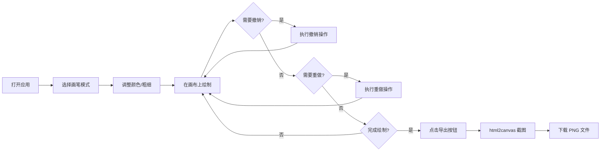

## 1. 产品概述

屏幕标注叠加层是一款基于 Canvas 的纯前端标注工具，允许用户在任意网页内容上方自由绘制、添加标注，并一键导出截图。专为网课教学、直播讲解、代码评审等场景设计，解决传统白板工具无法与屏幕内容结合的痛点。

- **核心价值**：在屏幕内容上直接标注，提升讲解效率和沟通效果
- **目标用户**：在线教育讲师、技术分享者、设计评审人员
- **使用场景**：网课直播、代码讲解、设计稿评审、远程协作

## 2. 核心功能

### 2.1 功能模块

1. **画布层**：全屏透明 Canvas 覆盖层，透出下层网页内容
2. **绘制引擎**：支持三种画笔模式，处理鼠标事件和历史记录
3. **工具栏**：浮动工具栏，包含模式切换、颜色选择、粗细调节、撤销/重做、清空、导出
4. **截图导出**：使用 html2canvas 将页面+标注合成导出为 PNG

### 2.2 功能详情

| 模块名称 | 功能点 | 功能描述 |
|---------|--------|---------|
| 绘制引擎 | 自由铅笔 | 1-5px 实线，颜色可调，跟随鼠标轨迹绘制 |
| 绘制引擎 | 高亮标记 | 20px 半透明黄色（可自定义），模拟荧光笔效果 |
| 绘制引擎 | 直线绘制 | 点击起点和终点生成直线，Shift 键约束水平/垂直 |
| 历史记录 | 撤销操作 | 最多 50 步撤销，显示剩余可撤销步数 |
| 历史记录 | 重做操作 | 最多 10 步重做，显示剩余可重做步数 |
| 历史记录 | 清空画布 | 一键清空所有绘制内容，清空历史记录 |
| 工具栏 | 模式切换 | 铅笔/荧光笔/直尺三种模式图标切换，高亮当前模式 |
| 工具栏 | 颜色选择 | 颜色拾取器，支持 16 进制颜色输入 |
| 工具栏 | 粗细调节 | 滑块调节画笔粗细，范围 1-20px |
| 导出功能 | 截图导出 | 一键导出 PNG，文件名包含时间戳 |

## 3. 核心流程

### 3.1 主流程描述

用户打开页面 → 选择画笔模式 → 调整颜色和粗细 → 在画布上绘制 → 可随时撤销/重做 → 完成后导出截图

### 3.2 流程图

## 4. 用户界面设计

### 4.1 设计风格

- **整体风格**：极简扁平，半透明毛玻璃效果
- **主色调**：白色半透明背景 + 黑色图标文字
- **强调色**：蓝色（#3b82f6）用于当前模式高亮
- **字体**：系统无衬线字体，简洁清晰
- **动效**：所有交互元素 0.3s ease 过渡，hover 缩放 1.1 倍

### 4.2 布局设计

| 区域 | 位置 | 样式 |
|------|------|------|
| 画布层 | 全屏覆盖 | position: fixed, top:0, left:0, 100vw × 100vh, 背景透明 |
| 工具栏 | 底部居中 | 圆角矩形，半透明白色毛玻璃，backdrop-filter: blur(8px) |

### 4.3 工具栏元素

| 元素 | 类型 | 说明 |
|------|------|------|
| 铅笔图标 | 按钮 | 切换自由铅笔模式，Unicode: ✏️ |
| 荧光笔图标 | 按钮 | 切换高亮标记模式，Unicode: 🖍️ |
| 直尺图标 | 按钮 | 切换直线绘制模式，Unicode: 📏 |
| 颜色拾取器 | 圆形按钮 | 点击展开颜色选择面板 |
| 粗细滑块 | range input | 1-20px 范围调节 |
| 撤销按钮 | 按钮 | 显示"撤销(N步)"，不可用时置灰 |
| 重做按钮 | 按钮 | 显示"重做(N步)"，不可用时置灰 |
| 清空按钮 | 按钮 | 一键清空画布 |
| 导出按钮 | 按钮 | 导出 PNG 截图 |

### 4.4 交互细节

- 模式切换：当前模式图标高亮显示蓝色背景
- Hover 效果：所有按钮 hover 时 transform: scale(1.1)
- 过渡动画：颜色、透明度、缩放均有 0.3s ease 过渡
- 光标样式：绘制模式下显示 crosshair 光标

### 4.5 响应式

- 桌面端优先设计
- 工具栏在小屏幕上自动换行或缩小间距
- 触摸设备支持触摸绘制（touch 事件）
