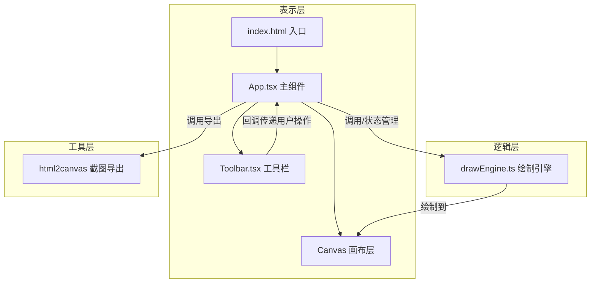

## 1. 架构设计



**数据流说明：**
1. App.tsx 管理全局状态（模式、颜色、粗细、历史栈）
2. Toolbar.tsx 通过 props 接收状态，通过回调向上传递用户操作
3. drawEngine.ts 接收 App 传来的配置，处理鼠标事件，输出绘制结果到 Canvas
4. 导出功能由 App.tsx 调用 html2canvas，捕获整个页面（含标注层）

## 2. 技术描述

- **前端框架**：React 18 + TypeScript
- **构建工具**：Vite 5
- **React 插件**：@vitejs/plugin-react
- **截图库**：html2canvas
- **样式方案**：原生 CSS（CSS Modules 可选），不依赖 UI 库
- **图标方案**：Unicode 符号 + 纯 CSS 绘制，不依赖图标库
- **无后端**：纯前端工具，所有逻辑在浏览器端运行

### 2.1 依赖清单

| 包名 | 版本 | 用途 |
|------|------|------|
| react | ^18.2.0 | UI 框架 |
| react-dom | ^18.2.0 | React DOM 渲染 |
| typescript | ^5.0.0 | 类型系统 |
| vite | ^5.0.0 | 构建工具 |
| @vitejs/plugin-react | ^4.0.0 | Vite React 插件 |
| html2canvas | ^1.4.1 | 页面截图导出 |

## 3. 文件结构

```
.
├── package.json              # 项目依赖和脚本
├── vite.config.js            # Vite 构建配置
├── tsconfig.json             # TypeScript 配置
├── index.html                # 入口 HTML
└── src/
    ├── main.tsx              # React 入口
    ├── App.tsx               # 主组件（状态管理、撤销/重做、导出）
    ├── App.css               # 主组件样式
    ├── drawEngine.ts         # 绘制引擎（核心逻辑）
    ├── toolbar.tsx           # 工具栏组件
    ├── toolbar.css           # 工具栏样式
    └── index.css             # 全局样式
```

### 文件职责和调用关系

| 文件 | 职责 | 被谁调用 | 调用谁 |
|------|------|---------|--------|
| index.html | 页面入口，提供根节点 | 浏览器 | - |
| main.tsx | React 入口，渲染 App | index.html | App.tsx |
| App.tsx | 主组件，管理状态、撤销栈、导出逻辑 | main.tsx | drawEngine.ts, toolbar.tsx |
| drawEngine.ts | 绘制核心，处理鼠标事件、历史记录、绘制算法 | App.tsx | - |
| toolbar.tsx | 浮动工具栏，模式切换、颜色粗细调节、操作按钮 | App.tsx | - |

## 4. 核心模块设计

### 4.1 drawEngine.ts 绘制引擎

**类型定义：**
```typescript
export type DrawMode = 'pencil' | 'highlighter' | 'line';

export interface DrawConfig {
  mode: DrawMode;
  color: string;
  lineWidth: number;
}

export interface HistoryItem {
  // 存储 ImageData 用于撤销重做
  imageData: ImageData;
}
```

**核心方法：**
- `init(canvas: HTMLCanvasElement, config: DrawConfig)`: 初始化引擎和事件监听
- `setConfig(config: DrawConfig)`: 更新绘制配置
- `undo()`: 撤销一步
- `redo()`: 重做一步
- `clear()`: 清空画布
- `getUndoCount(): number`: 获取可撤销步数
- `getRedoCount(): number`: 获取可重做步数
- `destroy()`: 清理事件监听

**历史记录设计：**
- 撤销栈：最多 50 步，使用数组存储 ImageData
- 重做栈：最多 10 步，使用数组存储 ImageData
- 每次绘制开始（mousedown）前保存当前状态到撤销栈
- 撤销时将当前状态推入重做栈，从撤销栈弹出恢复
- 新绘制操作清空重做栈

### 4.2 App.tsx 主组件

**状态管理：**
- `drawMode`: 当前画笔模式
- `color`: 当前颜色
- `lineWidth`: 当前画笔粗细
- `undoCount`: 可撤销步数
- `redoCount`: 可重做步数

**核心逻辑：**
- 初始化 canvas ref 并传递给 drawEngine
- 管理绘制配置状态
- 处理撤销/重做/清空/导出操作
- 响应工具栏的用户操作回调

### 4.3 toolbar.tsx 工具栏组件

**Props 定义：**
```typescript
interface ToolbarProps {
  mode: DrawMode;
  color: string;
  lineWidth: number;
  undoCount: number;
  redoCount: number;
  onModeChange: (mode: DrawMode) => void;
  onColorChange: (color: string) => void;
  onLineWidthChange: (width: number) => void;
  onUndo: () => void;
  onRedo: () => void;
  onClear: () => void;
  onExport: () => void;
}
```

## 5. 性能优化

### 5.1 绘制性能
- 使用 `requestAnimationFrame` 优化绘制帧率，确保 30FPS+
- 鼠标移动事件节流，避免过度绘制
- 分层绘制：草稿层（实时显示）+ 正式层（提交后保存）

### 5.2 历史记录性能
- 仅在绘制开始前保存快照，而非每帧保存
- 使用 `getImageData` / `putImageData` 进行像素级快照
- 限制历史栈大小（撤销 50 步 / 重做 10 步）

### 5.3 导出性能
- 使用 html2canvas 的优化选项（useCORS, scale 等）
- 导出前停止绘制事件，避免干扰

## 6. 类型定义

### 6.1 画笔模式枚举
```typescript
type DrawMode = 'pencil' | 'highlighter' | 'line';
```

### 6.2 绘制配置
```typescript
interface DrawConfig {
  mode: DrawMode;
  color: string;
  lineWidth: number;
}
```

### 6.3 历史记录项
```typescript
interface HistoryItem {
  imageData: ImageData;
}
```
