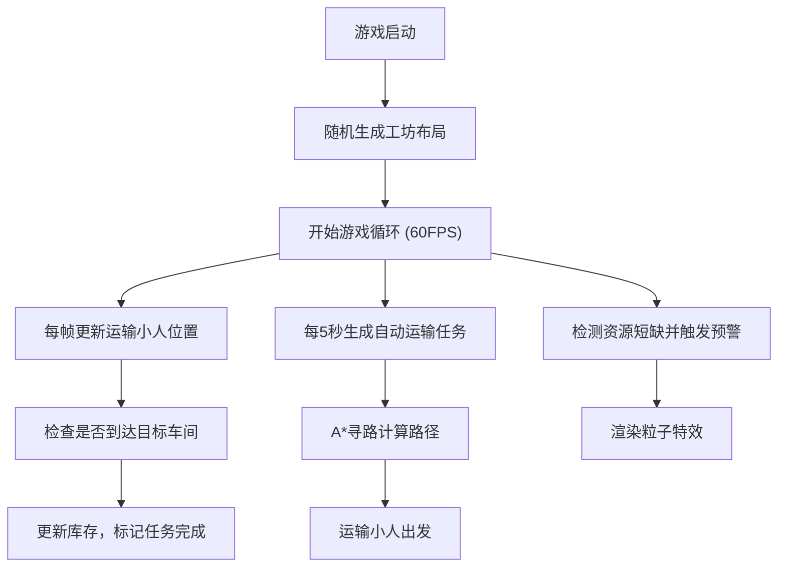
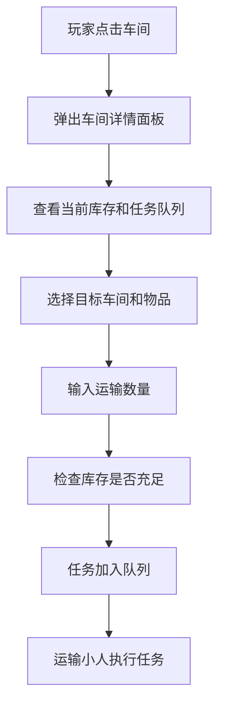

## 1. 产品概述

炼金工坊物流模拟器是一款像素风格的2D模拟经营小游戏，玩家管理一座拥有多个生产车间的炼金工坊，通过运输小人在车间之间调度原料和半成品。游戏采用Canvas 2D实时渲染，提供空间感十足的物流可视化体验。

- 核心玩法：观察自动运输调度、手动发起运输任务、管理车间库存
- 目标用户：像素游戏爱好者、模拟经营游戏玩家
- 产品价值：将枯燥的物流调度转化为可视化、有沉浸感的游戏体验

## 2. 核心特性

### 2.1 功能模块

1. **工坊地图系统**：22x16像素网格，石头墙边界，随机分布6个2x2车间，通道连接
2. **运输调度系统**：自动生成运输任务，A*寻路，运输小人沿路径移动
3. **车间管理系统**：库存管理、任务队列、资源短缺预警
4. **玩家交互系统**：点击车间查看详情、手动发起运输任务
5. **游戏控制系统**：暂停/继续、重置、实时统计面板

### 2.2 页面详情

| 页面名称 | 模块名称 | 功能描述 |
|---------|---------|---------|
| 主游戏页面 | Canvas游戏画布 | 渲染工坊地图、车间、运输小人、粒子特效 |
| 主游戏页面 | 左侧控制面板 | 显示游戏时间、任务统计、暂停/重置按钮 |
| 主游戏页面 | 车间详情弹窗 | 显示车间名称、库存列表、任务队列、手动运输操作 |

## 3. 核心流程

### 3.1 游戏主循环

### 3.2 玩家手动运输流程

## 4. 用户界面设计

### 4.1 设计风格

- **整体风格**：复古像素艺术风格，8x8像素格对齐
- **主色调**：
  - 网格线条：深灰色 `#2a2a2a`
  - 通道底色：米色 `#d4c9a8`
  - 车间建筑：砖红色 `#8b4513` + 木纹边框
  - 运输小人：白色 `#ffffff` 点阵，带2像素黑色阴影
  - 控制面板：半透黑色 `rgba(0,0,0,0.7)`
  - 按钮：亮绿色 `#4caf50`，悬停深绿色 `#388e3c`
- **字体**：Pixelify Sans（Google Fonts像素字体）
- **动画风格**：波浪式淡入、轨迹拖尾、弹性缩放弹窗

### 4.2 页面设计概述

| 页面名称 | 模块名称 | UI元素 |
|---------|---------|--------|
| 主游戏页面 | Canvas画布 | 22x16网格、6个车间建筑、运输小人、粒子特效、波浪加载动画 |
| 主游戏页面 | 左侧控制面板 | 游戏时间、总任务数、完成数、失败数、暂停按钮、重置按钮 |
| 主游戏页面 | 车间详情弹窗 | 车间名称、库存列表、任务队列、目标选择、数量输入、确认按钮 |

### 4.3 响应式适配

- **桌面端（>=768px）**：Canvas居中，控制面板在左侧
- **移动端（<768px）**：Canvas自适应缩放，控制面板变窄置于底部
- 支持触摸操作，点击车间触发详情面板

### 4.4 动画与特效

1. **地图加载动画**：从中心向四周扩散淡入，每格间隔20ms波浪效果
2. **运输小人**：身后半透明白色轨迹（2帧消失），4x4像素点阵
3. **资源短缺预警**：红色闪烁角标（每秒1次），4个向上飘散粒子
4. **车间弹窗**：从车间位置向上弹入，0.8→1.0缩放（ease-out），背景蒙版渐显
5. **按钮交互**：悬停颜色变化，点击反馈

## 5. 性能指标

- 游戏循环稳定60FPS（requestAnimationFrame驱动）
- A*寻路单次执行 ≤ 2ms（22x16地图）
- Canvas单帧绘制 ≤ 8ms
- 内存稳定，1小时运行无泄漏
