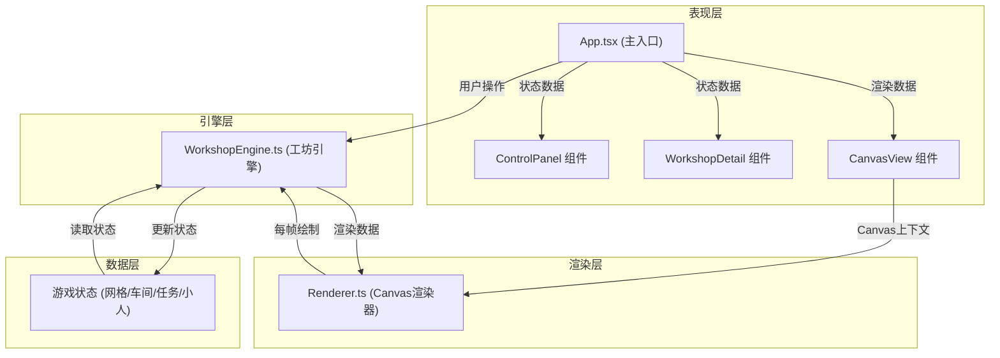

## 1. 架构设计



**数据流向说明：**
1. 用户操作 → App.tsx → WorkshopEngine → 更新游戏状态
2. 游戏循环 → WorkshopEngine → 每帧更新 → 生成渲染数据
3. 渲染数据 → Renderer → Canvas 2D绘制
4. UI组件 → 从App.tsx获取状态 → React渲染

## 2. 技术描述

- **前端框架**：React 18 + TypeScript
- **构建工具**：Vite 5 + @vitejs/plugin-react
- **渲染技术**：Canvas 2D API
- **状态管理**：React useState/useRef + 游戏引擎内部状态
- **第三方依赖**：
  - `react` / `react-dom`：UI框架
  - `typescript`：类型系统
  - `vite`：构建工具
  - `@vitejs/plugin-react`：React插件
  - `pako`：压缩工具（可选用于状态序列化）
- **字体**：Google Fonts - Pixelify Sans
- **目标**：ES2020

## 3. 核心模块定义

### 3.1 文件结构

```
src/
├── App.tsx              # 主入口组件，状态管理，游戏循环
├── WorkshopEngine.ts    # 核心引擎：网格、车间、寻路、任务调度
├── Renderer.ts          # Canvas渲染：像素绘制、动画、特效
├── types.ts             # 类型定义
└── index.css            # 全局样式
```

**文件调用关系：**
- `App.tsx` → 引用 `WorkshopEngine`、`Renderer`、类型定义
- `WorkshopEngine.ts` → 引用类型定义，不依赖React
- `Renderer.ts` → 引用类型定义和引擎渲染数据，不依赖React

### 3.2 模块职责

| 模块 | 职责 | 关键数据结构 |
|------|------|-------------|
| WorkshopEngine | 网格地图管理、车间对象、A*寻路、任务调度、每帧更新 | Grid, Workshop, TransportTask, Mover |
| Renderer | Canvas初始化、网格绘制、车间绘制、小人动画、粒子特效 | RenderContext, Particle, Trail |
| App.tsx | React组件树、游戏循环驱动、UI面板、用户交互 | gameState, engineRef |

## 4. 核心数据模型

### 4.1 类型定义

```typescript
// 物品类型
type ItemType = 'ore' | 'herb' | 'melt' | 'powder';

// 物品名称映射
const ITEM_NAMES: Record<ItemType, string> = {
  ore: '矿石',
  herb: '草药',
  melt: '熔液',
  powder: '粉末',
};

// 网格单元格类型
type CellType = 'wall' | 'path' | 'workshop';

// 坐标
interface Position {
  x: number;  // 列
  y: number;  // 行
}

// 车间类型
type WorkshopType = 'furnace' | 'grinder' | 'distiller' | 'mixer' | 'press' | 'fermenter';

// 车间对象
interface Workshop {
  id: string;
  type: WorkshopType;
  name: string;
  position: Position;  // 左上角格子坐标
  size: { width: number; height: number };  // 2x2
  inventory: Record<ItemType, number>;
  taskQueue: TransportTask[];
  maxQueueSize: number;
}

// 运输任务
interface TransportTask {
  id: string;
  sourceId: string;
  targetId: string;
  item: ItemType;
  quantity: number;
  status: 'pending' | 'in_progress' | 'completed' | 'failed';
  createdAt: number;
}

// 运输小人
interface Mover {
  id: string;
  position: { x: number; y: number };  // 精确位置（可以是小数）
  path: Position[];
  pathIndex: number;
  speed: number;  // 每帧移动格数
  currentTask: TransportTask | null;
  trail: { x: number; y: number; age: number }[];
}

// 粒子
interface Particle {
  x: number;
  y: number;
  vx: number;
  vy: number;
  color: string;
  life: number;
  maxLife: number;
}

// 渲染数据
interface RenderData {
  grid: CellType[][];
  workshops: Workshop[];
  movers: Mover[];
  particles: Particle[];
  time: number;
  alerts: string[];  // 有资源短缺的车间ID
}

// 游戏统计
interface GameStats {
  totalTasks: number;
  completedTasks: number;
  failedTasks: number;
  elapsedTime: number;
}
```

## 5. 核心算法

### 5.1 A*寻路算法

- **网格大小**：22列 x 16行
- **可行走区域**：通道（path）格子
- **启发函数**：曼哈顿距离
- **性能目标**：单次寻路 ≤ 2ms

### 5.2 地图生成算法

1. 初始化：全图填充石头墙
2. 挖通道：从中心向外扩展通道网络
3. 放置车间：随机选择6个位置，确保2x2空间且有通道连接
4. 验证：确保所有车间之间可达

### 5.3 游戏循环

- 使用 `requestAnimationFrame` 驱动
- 固定逻辑步长？或可变步长（按delta time）
- 每帧更新：
  1. 运输小人移动
  2. 粒子更新
  3. 检查任务完成
  4. 自动任务生成（基于时间累计）

## 6. 性能优化策略

1. **Canvas分层**：静态层（网格、车间）与动态层（小人、粒子）分离
2. **脏矩形**：仅重绘变化区域
3. **对象池**：粒子和小人对象复用
4. **寻路缓存**：相同起点终点的路径缓存
5. **节流**：UI状态更新不与渲染同频

## 7. 响应式设计

- CSS媒体查询 + Canvas缩放
- 像素比适配（devicePixelRatio）
- 触摸事件支持
