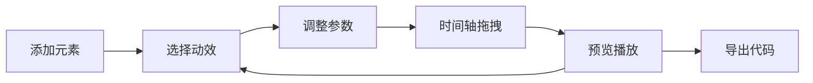

## 1. 产品概述

Web Animation Sandbox 是一款基于浏览器原生 Web Animations API 的动画编排与预览沙盒应用。用户通过拖拽和配置动画关键帧，实时预览动画效果并导出 CSS 或 JSON 格式的代码片段。

- **目标用户**：前端开发者、UI/UX 设计师、动画爱好者
- **核心价值**：可视化编排动画、实时预览、一键导出代码，提升动画开发效率
- **产品定位**：纯前端工具，无需后端，轻量高效

## 2. 核心功能

### 2.1 功能模块

1. **元素管理**：添加/删除可移动、可缩放的矩形元素
2. **动画配置**：8种预设动效，支持持续时间、延迟、缓动函数配置
3. **时间轴面板**：可视化时间条，拖拽调整持续时间和延迟
4. **预览面板**：实时动画预览，播放/暂停/重置/循环控制
5. **多片段编排**：每个元素最多5个动画片段，串联执行
6. **代码导出**：支持 CSS @keyframes 和 JSON 格式导出，一键复制

### 2.2 页面详情

| 页面名称 | 模块名称 | 功能描述 |
|---------|---------|---------|
| 主页面 | 左侧配置面板 | 元素列表、选中元素展开配置、动效选择、参数滑块 |
| 主页面 | 中间预览区 | 网格背景、动画元素渲染、播放控制栏 |
| 主页面 | 右侧时间轴 | 时间刻度、动画片段条、进度指示线、拖拽交互 |
| 主页面 | 导出面板 | 格式选择、导出按钮、成功提示 Toast |

## 3. 核心流程

用户添加元素 → 选择动效 → 调整参数 → 时间轴拖拽微调 → 预览播放 → 导出代码

## 4. 用户界面设计

### 4.1 设计风格

- **主色调**：深灰蓝 #2c3e50
- **辅助色**：白色 #ffffff、浅灰 #f0f0f0
- **片段色**：红、蓝、绿、橙、紫（半透明 opacity 0.7）
- **按钮风格**：悬停上抬效果（translateY(-2px) + 阴影增强）
- **字体**：现代无衬线字体，清晰的层级关系
- **布局**：桌面端三栏布局，移动端上下布局

### 4.2 页面设计概述

| 页面名称 | 模块名称 | UI 元素 |
|---------|---------|---------|
| 主页面 | 左侧配置面板 | 卡片式布局、展开收起动画、下拉菜单、滑块控件 |
| 主页面 | 中间预览区 | 浅灰网格背景、矩形元素、底部控制栏 |
| 主页面 | 右侧时间轴 | 时间刻度、彩色片段条、垂直进度线 |
| 主页面 | 导出面板 | 单选按钮组、导出按钮、绿色成功提示 |

### 4.3 响应式

- 桌面端（≥768px）：三栏布局（左-中-右）
- 移动端（<768px）：上下布局（元素列表-预览区-时间轴）
- 触摸优化：增大拖拽区域，支持手势操作

### 4.4 动效设计

- 配置面板展开/收起：高度 0→auto，0.3s 过渡
- 按钮悬停：translateY(-2px) + 阴影增强
- Toast 提示：淡入淡出，2s 自动消失
- 时间轴进度线：requestAnimationFrame 平滑滚动
