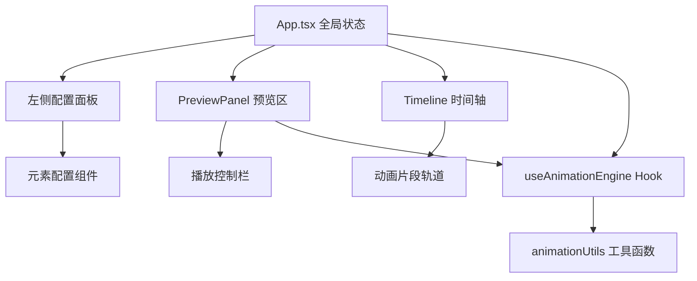

## 1. 架构设计



## 2. 技术描述

- **前端框架**：React 18 + TypeScript
- **构建工具**：Vite 5
- **动画引擎**：浏览器原生 Web Animations API
- **状态管理**：React useState / useRef（轻量场景）
- **唯一标识**：uuid
- **纯前端**：无后端，无数据库

## 3. 核心数据结构

### 3.1 动画元素

```typescript
interface AnimationElement {
  id: string;
  x: number;
  y: number;
  width: number;
  height: number;
  color: string;
  clips: AnimationClip[];
}
```

### 3.2 动画片段

```typescript
interface AnimationClip {
  id: string;
  type: AnimationType;
  duration: number;
  delay: number;
  easing: string;
}

type AnimationType = 
  | 'translateRight'
  | 'rotate360'
  | 'scaleUp'
  | 'fadeOut'
  | 'bounce'
  | 'shake'
  | 'pulse'
  | 'spiral';
```

## 4. 核心模块说明

### 4.1 useAnimationEngine Hook

- 封装 Web Animations API 的创建、更新、播放控制
- 管理所有动画实例的生命周期
- 使用 useRef 缓存动画实例，避免频繁重渲染
- 提供 play/pause/reset/seek 等控制方法

### 4.2 animationUtils 工具函数

- `presetToKeyframes`：预设动效转标准 Keyframe
- `exportToCSS`：导出 CSS @keyframes 字符串
- `exportToJSON`：导出 JSON 格式动画配置
- `calculateTotalDuration`：计算元素总动画时长

### 4.3 Timeline 组件

- requestAnimationFrame 驱动进度更新
- 拖拽片段边缘调整 duration/delay
- 时间刻度与片段按比例渲染
- 重叠片段半透明叠加显示

### 4.4 PreviewPanel 组件

- SVG 渲染动画元素与网格背景
- 播放/暂停/重置/循环控制
- 与 useAnimationEngine 联动

## 5. 性能优化策略

- 使用 useRef 缓存 DOM 引用和动画实例
- requestAnimationFrame 驱动动画循环，避免 setState 频繁更新
- 时间轴拖拽使用 Pointer Events + ref 直接操作 DOM
- 减少 React 重渲染范围，拆分细粒度组件
