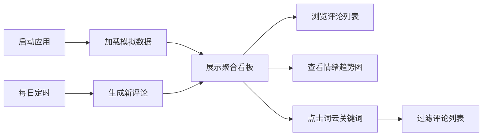

## 1. 产品概述

多平台评论聚合分析应用，帮助自媒体运营者统一查看和分析来自多个平台的用户评论，提升回评效率和用户洞察能力。

- 解决运营人员手动切换平台查看回评、分析用户情绪和提取热点话题时效率过低的问题
- 目标用户为自媒体运营者、社区管理员和内容创作者

## 2. 核心功能

### 2.1 用户角色
| 角色 | 注册方式 | 核心权限 |
|------|---------|----------|
| 运营人员 | 无需注册（纯前端应用） | 查看评论聚合、情绪分析、关键词提取 |

### 2.2 功能模块
1. **聚合看板**：总览统计、评论流列表、分页控件
2. **情绪趋势图**：7天情绪分布变化折线图
3. **热点关键词**：词云展示、点击过滤

### 2.3 页面详情
| 页面名称 | 模块名称 | 功能描述 |
|---------|----------|----------|
| 聚合看板 | 统计概览 | 总评论数、正面/负面/中性比例三色进度条 |
| 聚合看板 | 评论流列表 | 多平台评论按时间倒序排列，平台图标+情绪色块，点击展开详情 |
| 聚合看板 | 分页控件 | 每页20条，简易分页 |
| 情绪趋势 | 折线图表 | 7天情绪分布，绿/红/灰三色折线，平滑曲线+渐变填充 |
| 热点关键词 | 词云组件 | Top20高频词，大小与频率成正比，点击过滤评论 |

## 3. 核心流程

用户打开应用后，自动加载模拟数据并展示聚合看板。用户可以滚动浏览评论、切换分页、查看情绪趋势图、点击词云关键词过滤评论列表。应用每日自动生成新评论模拟实时更新。

## 4. 用户界面设计

### 4.1 设计风格
- **主色调**：蓝灰色调（底色#2d3436，文字色#dfe6e9）
- **情绪色**：正面绿色、负面红色、中性灰色
- **卡片风格**：圆角12px，轻微阴影，扁平+毛玻璃效果
- **动画**：评论卡片淡入+上移0.3秒，进度条1秒缓动动画
- **字体**：现代无衬线字体，清晰的层级结构

### 4.2 页面设计概览
| 页面名称 | 模块名称 | UI元素 |
|---------|----------|--------|
| 聚合看板 | 统计概览 | 大数字、三色渐变进度条、卡片容器 |
| 聚合看板 | 评论列表 | 平台图标、情绪色条、评论文本、时间戳、展开动画 |
| 情绪趋势 | 折线图 | 平滑曲线、渐变填充、悬停提示、图例 |
| 热点关键词 | 词云 | 不同字号、颜色渐变、悬停效果、点击态 |

### 4.3 响应式
- 桌面端：左右布局（左侧评论列表，右侧图表+词云）
- 移动端（<768px）：纵向堆叠布局
- 触摸优化：增大点击区域，适配移动端交互

### 4.4 动画与动效
- 评论卡片入场：淡入+向上位移0.3s，交错延迟
- 进度条数值变化：1秒缓动动画
- 图表渲染：平滑过渡
- 悬停交互：轻微放大+阴影加深
