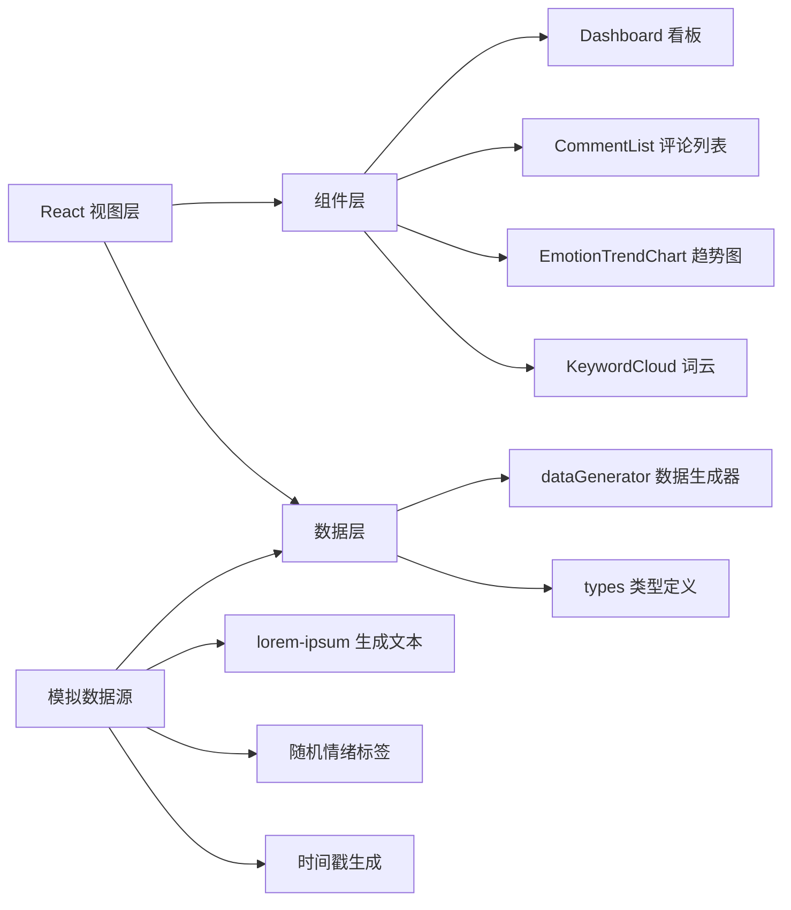

## 1. 架构设计

纯前端单页应用，所有数据存储于内存，无需后端服务。



## 2. 技术描述

- **前端框架**：React 18 + TypeScript
- **构建工具**：Vite
- **图表库**：Chart.js + react-chartjs-2
- **词云库**：d3-cloud
- **数据模拟**：lorem-ipsum
- **状态管理**：React useState/useEffect（轻量级，无需额外状态库）
- **样式方案**：原生 CSS + CSS Modules/内联样式

## 3. 项目文件结构

| 文件路径 | 用途 |
|---------|------|
| package.json | 项目依赖与脚本配置 |
| vite.config.js | Vite 构建配置 |
| tsconfig.json | TypeScript 配置 |
| index.html | 入口页面 |
| src/types.ts | 类型定义（Comment, Platform, Emotion 等） |
| src/dataGenerator.ts | 模拟数据生成与查询函数 |
| src/components/Dashboard.tsx | 聚合看板主组件 |
| src/components/CommentList.tsx | 评论流列表组件 |
| src/components/EmotionTrendChart.tsx | 情绪趋势图组件 |
| src/components/KeywordCloud.tsx | 词云组件 |
| src/App.tsx | 根组件 |
| src/index.css | 全局样式 |
| src/main.tsx | 入口文件 |

## 4. 数据模型

### 4.1 核心类型

```typescript
type Emotion = 'positive' | 'negative' | 'neutral';

type Platform = 'weibo' | 'douyin' | 'bilibili';

interface Comment {
  id: string;
  text: string;
  timestamp: number;
  platform: Platform;
  emotion: Emotion;
}

interface EmotionTrendItem {
  date: string;
  positive: number;
  negative: number;
  neutral: number;
}

interface KeywordItem {
  word: string;
  count: number;
}
```

### 4.2 数据生成规则
- 三个虚拟平台，每平台至少200条评论
- 评论文本由 lorem-ipsum 生成（英文）
- 情绪标签随机分配，比例约 4:3:3（正:中:负）
- 时间戳分布在过去7天内
- 每日自动随机生成新评论（模拟实时更新）

### 4.3 核心函数
- `generateInitialComments(): Comment[]` - 生成初始评论数据
- `getPageComments(page: number, pageSize: number, keyword?: string): { comments: Comment[], total: number }` - 分页获取评论
- `getEmotionStats(): { total: number, positive: number, negative: number, neutral: number }` - 获取情绪统计
- `getEmotionTrend(): EmotionTrendItem[]` - 获取7天情绪趋势
- `getKeywords(): KeywordItem[]` - 获取高频关键词Top20
- `addNewComments(count: number): void` - 添加新评论

## 5. 性能优化

- 评论列表虚拟滚动/分页（每页20条），保证滚动流畅
- 图表数据缓存，避免重复计算
- 词云布局计算防抖（<200ms）
- 使用 CSS 动画而非 JS 动画
- 组件懒渲染/按需更新

## 6. 启动方式

```bash
npm install
npm run dev
```
