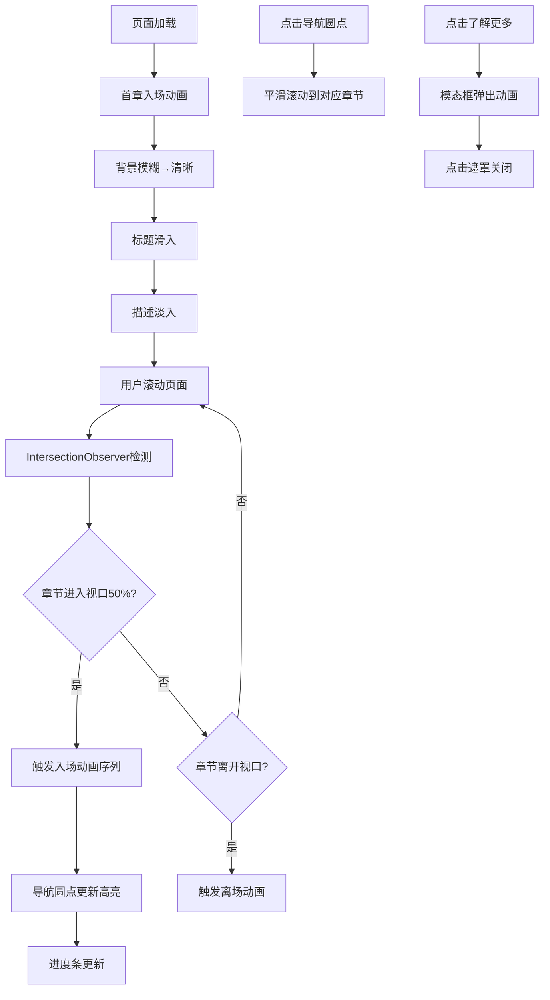

## 1. 产品概述

滚动驱动故事叙述页面应用，用户通过上下滚动页面触发章节图片、文字和动画的自动展示与切换，营造沉浸式叙事体验。

- 主要用途：以视觉叙事方式展示故事内容，通过滚动交互增强用户沉浸感
- 目标用户：追求高品质视觉体验的内容消费者、品牌展示页面访客
- 产品价值：将传统静态阅读转变为动态沉浸式体验，提升内容传播效果和用户停留时长

## 2. 核心功能

### 2.1 用户角色

| 角色 | 注册方式 | 核心权限 |
|------|----------|----------|
| 访客用户 | 无需注册 | 浏览故事内容、交互查看详情 |

### 2.2 功能模块

1. **故事主页**：全屏章节滚动、入场/离场动画、背景视差效果
2. **导航系统**：右侧圆点导航、顶部进度条、章节自动定位
3. **内容详情**：模态框扩展内容、平滑弹出动画
4. **性能优化**：图片懒加载、GPU 加速动画、滚动帧率稳定

### 2.3 页面详情

| 页面名称 | 模块名称 | 功能描述 |
|----------|----------|----------|
| 故事主页 | 章节容器 | 5个全屏章节，每章包含背景图、标题、描述、按钮 |
| 故事主页 | 滚动动画 | IntersectionObserver 检测，触发入场/离场动画序列 |
| 故事主页 | 导航指示 | 右侧垂直圆点导航，点击平滑滚动，自动高亮当前章 |
| 故事主页 | 进度条 | 顶部4px细线，随滚动进度渐变填充 |
| 故事主页 | 模态详情 | 点击"了解更多"弹出扩展内容，背景模糊遮罩 |
| 故事主页 | 背景系统 | 深色渐变背景、滚动时色值缓慢变化、视差固定背景 |

## 3. 核心流程

用户打开页面 → 首章背景从模糊渐清晰 → 标题从下方滑入 → 描述文字延迟淡入 → 用户向下滚动 → 下一章进入视口50% → 触发入场动画 → 上一章触发离场动画 → 点击导航圆点 → 平滑滚动到对应章节 → 点击"了解更多" → 模态框弹出 → 点击遮罩关闭 → 继续滚动浏览

## 4. 用户界面设计

### 4.1 设计风格

- **主色调**：深色主题，背景从 #1a1a2e 渐变至 #16213e，滚动时循环过渡到紫黑色
- **强调色**：主题色 #ff6b6b，标题渐变 #f7971e → #ffd200，进度条渐变 #667eea → #764ba2
- **文字主色**：#ffffff
- **按钮风格**：扁平设计，透明背景白色边框，悬停反色（白底黑字）
- **字体**：使用现代无衬线字体，标题大号带渐变和阴影，描述小号半透明
- **布局风格**：全屏沉浸式，内容垂直居中，右侧固定导航
- **动效风格**：所有动画0.8秒，ease-out 缓动，CSS transform + opacity 触发 GPU 合成
- **过渡效果**：章节间使用 CSS clip-path 多边形斜线切割动画

### 4.2 页面设计概述

| 页面名称 | 模块名称 | UI 元素 |
|----------|----------|---------|
| 故事主页 | 背景层 | 深色渐变 + 视差固定背景图 + 滚动色值变化 |
| 故事主页 | 章节内容 | 背景图（blur→清晰）、渐变标题、半透明描述衬底、了解更多按钮 |
| 故事主页 | 导航条 | 右侧垂直5个圆点，灰→主题色高亮 |
| 故事主页 | 进度条 | 顶部4px细线，左→右渐变填充 |
| 故事主页 | 模态框 | 居中白色卡片、模糊遮罩、扩展文本+小图 |
| 故事主页 | 过渡效果 | 章节间斜线切割、背景色缓慢渐变 |

### 4.3 响应式

桌面端优先设计，移动端自适应：
- 导航条在移动端可缩小或改为底部水平
- 标题字号响应式缩放
- 模态框宽度自适应
- 触摸滚动优化

### 4.4 性能指标

- 滚动帧率稳定在 60FPS
- IntersectionObserver 回调不进行繁重 DOM 操作
- 背景图片懒加载，仅预加载视口附近两章
- 动画全部使用 CSS transform 和 opacity，避免 layout 和 paint
