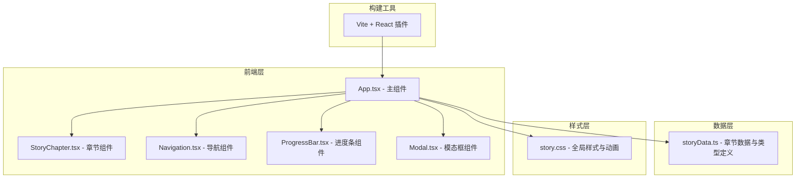

## 1. 架构设计



## 2. 技术描述

- **前端框架**：React 18 + TypeScript
- **构建工具**：Vite 5 + @vitejs/plugin-react
- **样式方案**：原生 CSS（含 CSS 变量、动画、clip-path）
- **核心 API**：IntersectionObserver（滚动检测）、requestAnimationFrame（性能优化）
- **后端**：无，纯前端应用
- **数据来源**：本地静态 mock 数据

## 3. 路由定义

| 路由 | 用途 |
|------|------|
| / | 故事主页，包含全部5个章节及所有交互功能 |

## 4. 类型定义

```typescript
interface StoryChapterData {
  id: number;
  title: string;
  description: string;
  backgroundImage: string;
  extendedContent: string;
  extendedImage: string;
  animationType: 'fade-up' | 'fade-in' | 'scale-in';
  animationDuration: number;
}

interface ChapterAnimationState {
  isVisible: boolean;
  hasAnimated: boolean;
  isEntering: boolean;
  isLeaving: boolean;
}
```

## 5. 核心组件结构

### 5.1 App.tsx
- 管理当前激活章节索引
- 管理滚动进度百分比
- 管理模态框显示状态
- 背景色渐变计算与应用
- 注册全局滚动监听（使用 requestAnimationFrame 节流）
- 渲染章节列表、导航、进度条、模态框

### 5.2 StoryChapter.tsx
- 使用 useRef 获取 DOM 元素引用
- 使用 useEffect 注册 IntersectionObserver
- 管理章节内部动画状态
- 处理入场动画序列（背景模糊→清晰、标题滑入、描述淡入）
- 处理离场动画（内容缩小淡出）
- 渲染背景图、标题、描述、了解更多按钮

### 5.3 Navigation.tsx
- 渲染垂直圆点导航条
- 接收当前激活索引
- 处理点击滚动到对应章节
- 圆点高亮状态切换动画

### 5.4 ProgressBar.tsx
- 渲染顶部进度条
- 接收滚动进度百分比
- 渐变填充动画

### 5.5 Modal.tsx
- 渲染背景模糊遮罩
- 居中内容卡片
- 入场/离场动画
- 点击遮罩关闭

## 6. 性能优化策略

### 6.1 IntersectionObserver 优化
- 阈值设置为 0.5（50% 可见触发）
- 回调中仅修改状态变量，不直接操作 DOM
- 使用 useRef 存储 observer 实例，避免重复创建

### 6.2 动画性能
- 所有动画使用 transform 和 opacity，触发 GPU 合成层
- 动画元素设置 will-change: transform, opacity
- 统一使用 0.8s ease-out 缓动

### 6.3 图片懒加载
- 使用 IntersectionObserver 预加载视口附近 2 章图片
- 图片设置 loading="lazy" 作为后备
- 背景图通过动态设置 style 实现按需加载

### 6.4 滚动性能
- 滚动监听使用 requestAnimationFrame 节流
- 避免在滚动回调中触发重排重绘
- 进度条更新使用 transform 而非 width

## 7. 文件结构

```
auto40/
├── .trae/documents/
│   ├── PRD-滚动叙事故事页面.md
│   └── 技术架构-滚动叙事故事页面.md
├── index.html
├── package.json
├── tsconfig.json
├── vite.config.js
└── src/
    ├── main.tsx
    ├── App.tsx
    ├── data/
    │   └── storyData.ts
    ├── components/
    │   ├── StoryChapter.tsx
    │   ├── Navigation.tsx
    │   ├── ProgressBar.tsx
    │   └── Modal.tsx
    └── styles/
        └── story.css
```
