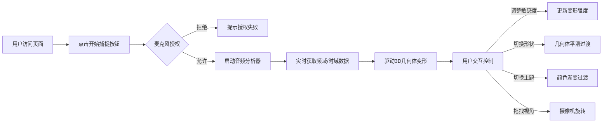

## 1. 产品概述

声之形 (SoundShape) - 一款基于语音输入的实时3D抽象艺术生成器。用户通过麦克风输入语音或环境声音，系统将音频波形实时转化为不断演变的3D抽象几何体，创造沉浸式的视听联动体验。

- **核心价值**：将声音视觉化，让用户直观感受声音的形态之美
- **目标用户**：艺术爱好者、音乐创作者、视觉设计师、冥想爱好者
- **使用场景**：音乐可视化、语音艺术创作、氛围营造、创意展示

## 2. 核心功能

### 2.1 用户角色
| 角色 | 注册方式 | 核心权限 |
|------|----------|----------|
| 普通用户 | 无需注册，浏览器直接访问 | 使用所有可视化功能，调整参数，切换形状和主题 |

### 2.2 功能模块
1. **音频捕捉模块**：麦克风权限请求、实时音频流获取、音频分析
2. **3D可视化模块**：几何体生成、顶点动画、形状演变、颜色渲染
3. **交互控制模块**：视角拖拽、敏感度调节、形状切换、主题切换
4. **实时波形预览**：左上角时域波形显示

### 2.3 页面详情
| 页面名称 | 模块名称 | 功能描述 |
|----------|----------|----------|
| 主页面 | 开始捕捉按钮 | 点击请求麦克风权限，启动音频分析 |
| 主页面 | 3D画布容器 | 全屏展示动态3D几何体，支持鼠标拖拽旋转视角 |
| 主页面 | 波形预览 | 左上角实时显示时域波形，绿色线条黑色背景 |
| 主页面 | 控制面板 | 右上角毛玻璃效果面板，包含敏感度滑块、形状切换、主题切换 |

## 3. 核心流程

用户打开页面 → 点击"开始捕捉"按钮 → 浏览器请求麦克风权限 → 授权后开始音频捕捉 → 实时分析音频频域与时域数据 → 驱动3D几何体顶点变形 → 用户可调整敏感度、切换形状、更换主题 → 拖拽鼠标旋转视角

## 4. 用户界面设计

### 4.1 设计风格
- **主色调**：深灰背景 (#1a1a2e)，营造沉浸式暗色氛围
- **强调色**：根据主题动态变化（极光蓝绿紫、熔岩红橙黑、海洋蓝白青）
- **按钮风格**：圆角按钮，毛玻璃质感，悬停缩放1.05倍
- **字体**：现代无衬线字体，清晰易读
- **布局风格**：全屏沉浸式布局，浮动控制面板，空间层次感强
- **整体调性**：科技感与艺术感结合，极简主义与动态视觉并存

### 4.2 页面设计概述
| 页面名称 | 模块名称 | UI元素 |
|----------|----------|--------|
| 主页面 | 3D场景 | 全屏Three.js画布，动态几何体，环境光与点光源 |
| 主页面 | 波形预览 | 左上角悬浮，300×80px，黑底绿线，实时绘制 |
| 主页面 | 控制面板 | 右上角毛玻璃面板，圆角12px，半透明白色背景 |
| 主页面 | 开始按钮 | 居中显示，大按钮，脉冲动画吸引点击 |
| 主页面 | 移动端抽屉 | 底部全屏抽屉，点击悬浮图标展开 |

### 4.3 响应式设计
- **桌面端**：右上角悬浮控制面板，波形预览左上角
- **移动端**（宽度<768px）：控制面板折叠为悬浮图标，点击展开为底部全屏抽屉，波形预览调整尺寸适配
- **触摸优化**：支持触摸拖拽旋转视角，按钮尺寸增大便于触摸操作

### 4.4 3D场景设计
- **环境**：纯深色背景，营造星空宇宙感，几何体自发光效果
- **光照**：环境光 + 两盏点光源，突出几何体的立体感和材质质感
- **摄像机**：PerspectiveCamera，初始距离适中，支持OrbitControls拖拽旋转
- **构图**：几何体居中，占据视觉中心，留有充足负空间
- **动画**：几何体自动缓慢旋转，顶点实时变形，颜色渐变过渡
- **材质**：MeshStandardMaterial，金属质感配合适当粗糙度，呈现高级感
- **性能**：帧率稳定55FPS以上，顶点更新每帧<5ms
