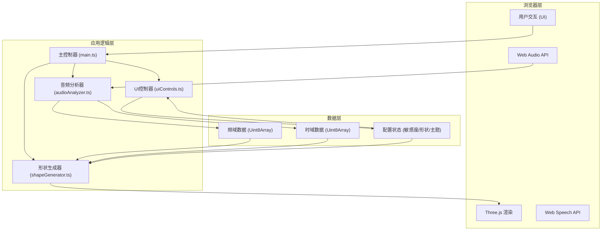

## 1. 架构设计



## 2. 技术选型

- **前端框架**：原生 TypeScript + Vite（轻量高效，无额外框架负担）
- **3D渲染**：Three.js (r160+)，功能强大的WebGL库
- **音频处理**：Web Audio API (AnalyserNode)，实时频域/时域分析
- **语音识别**：Web Speech API (SpeechRecognition)，仅用于语音触发
- **构建工具**：Vite 5.x，ESBuild 编译 TypeScript，开发体验佳
- **类型系统**：TypeScript 5.x，严格模式，目标 ES2020
- **样式方案**：原生 CSS + CSS 变量，毛玻璃效果，动画过渡

## 3. 文件结构

```
project/
├── package.json              # 项目依赖与脚本
├── vite.config.js            # Vite构建配置
├── tsconfig.json             # TypeScript配置
├── index.html                # 入口HTML
└── src/
    ├── main.ts               # 主入口，协调各模块
    ├── audioAnalyzer.ts      # 音频分析器
    ├── shapeGenerator.ts     # 3D形状生成器
    └── uiControls.ts         # UI控制面板
```

### 模块职责

| 文件 | 职责 | 核心方法/属性 |
|------|------|--------------|
| main.ts | 应用启动、场景初始化、动画循环、模块协调 | init(), animate(), onWindowResize() |
| audioAnalyzer.ts | 麦克风音频捕捉、频域/时域分析 | init(), getFrequencyArray(), getTimeDomainArray() |
| shapeGenerator.ts | 几何体创建、顶点变形、形状过渡、主题颜色 | createGeometry(), updateGeometry(), setSensitivity(), setShape(), setTheme() |
| uiControls.ts | UI面板创建、事件绑定、波形绘制 | createControls(), bindEvents(), drawWaveform() |

## 4. 核心数据结构

### 4.1 音频数据
```typescript
// 频域数据 - 1024个频点的能量值 (0-255)
type FrequencyData = Uint8Array;
// 时域数据 - 1024个采样点的波形值 (0-255)
type TimeDomainData = Uint8Array;
// 8个频带的平均能量
interface FrequencyBands {
  subBass: number;      // 超低频
  bass: number;         // 低频
  lowMid: number;       // 中低频
  mid: number;          // 中频
  highMid: number;      // 中高频
  treble: number;       // 高频
  highTreble: number;   // 超高频
  air: number;          // 空气感
}
```

### 4.2 配置状态
```typescript
type ShapeType = 'torusKnot' | 'sphere' | 'torus';
type ThemeType = 'aurora' | 'lava' | 'ocean';

interface AppState {
  sensitivity: number;    // 敏感度 0.1-2.0
  shape: ShapeType;       // 当前形状
  theme: ThemeType;       // 颜色主题
  isCapturing: boolean;   // 是否正在捕捉音频
}
```

### 4.3 颜色主题
```typescript
interface ColorTheme {
  primary: string;    // 主色
  secondary: string;  // 次色
  accent: string;     // 强调色
  background: string; // 背景色
  emissive: string;   // 自发光色
}
```

## 5. 核心算法

### 5.1 频带划分算法
将1024个频点（对应0-20kHz）划分为8个频带，采用对数分布（人耳对低频更敏感）：
- 超低频：0-60Hz
- 低频：60-250Hz
- 中低频：250-500Hz
- 中频：500-2kHz
- 中高频：2-4kHz
- 高频：4-8kHz
- 超高频：8-12kHz
- 空气感：12-20kHz

### 5.2 几何体变形算法
每个频带能量映射到不同的变形参数：
- 低频 → 整体缩放（呼吸效果）
- 中低频 → Y轴波浪扭曲
- 中频 → X/Z轴扭曲
- 中高频 → 顶点随机抖动
- 高频 → 表面细节扰动

变形公式：`vertexOffset = basePosition * (1 + bandEnergy * sensitivity * factor)`

### 5.3 平滑过渡算法
形状切换使用线性插值（Lerp）实现0.8秒平滑过渡：
- 保存原始顶点位置与目标顶点位置
- 每帧更新进度：`progress += deltaTime / duration`
- 插值计算：`current = start * (1 - progress) + end * progress`

颜色主题切换同样使用颜色插值实现1秒渐变。

## 6. 性能优化

- **几何体复用**：使用BufferGeometry，直接操作顶点数组，避免频繁创建销毁
- **顶点缓存**：保存原始顶点位置，变形基于原始位置计算，避免误差累积
- **按需更新**：仅当音频数据有明显变化时更新顶点，降低计算量
- **材质共享**：同一几何体使用同一材质实例，减少Draw Call
- **帧率控制**：使用requestAnimationFrame，与显示器刷新率同步
- **内存管理**：及时释放不再使用的几何体和材质，避免内存泄漏

## 7. 性能指标

| 指标 | 目标值 |
|------|--------|
| 渲染帧率 | ≥ 55 FPS (Chrome笔记本) |
| 音频分析延迟 | ≤ 50ms |
| 顶点更新耗时 | ≤ 5ms/帧 |
| 首屏加载 | ≤ 2s |
| 内存占用 | ≤ 200MB |
