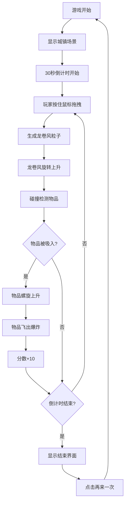

## 1. 产品概述

像素龙卷风是一款基于鼠标轨迹交互的2D像素风格休闲小游戏。玩家在像素化城镇场景中按住鼠标拖拽画圈，生成旋转的龙卷风粒子流，吸走地上的小物件并制造混乱，在30秒内获取尽可能高的分数。

- 核心玩法：鼠标画圈生成龙卷风，吸入物品得分
- 目标用户：休闲游戏玩家，像素风格爱好者
- 产品价值：提供简单有趣、解压放松的游戏体验

## 2. 核心功能

### 2.1 用户角色

| 角色 | 注册方式 | 核心权限 |
|------|----------|----------|
| 玩家 | 无需注册，直接游玩 | 进行游戏、查看分数、重新开始 |

### 2.2 功能模块

1. **游戏主界面**：城镇场景、龙卷风特效、可拾取物品
2. **分数系统**：分数面板、物品吸入计数
3. **倒计时系统**：30秒倒计时条、颜色渐变提示
4. **结束界面**：最终分数展示、再来一次按钮

### 2.3 页面详情

| 页面名称 | 模块名称 | 功能描述 |
|----------|----------|----------|
| 游戏主界面 | 城镇场景 | 像素风格建筑、树木、路灯、地面 |
| 游戏主界面 | 龙卷风系统 | 鼠标拖拽生成、粒子旋转上升、速度联动 |
| 游戏主界面 | 物品系统 | 随机散落物品、吸入动画、抛落爆炸 |
| 游戏主界面 | UI面板 | 分数显示、倒计时条、像素字体 |
| 结束界面 | 结算面板 | 最终分数、再来一次按钮、hover动效 |

## 3. 核心流程

玩家进入游戏 → 查看初始场景和30秒倒计时 → 按住鼠标左键拖拽画圈 → 龙卷风生成并旋转 → 龙卷风经过物品将其吸入 → 物品螺旋上升后飞出并爆炸 → 分数增加 → 倒计时结束 → 显示最终分数 → 点击再来一次重新开始

## 4. 用户界面设计

### 4.1 设计风格

- **主色调**：深蓝色天空背景 (#1a1a3e)、棕色建筑 (#8b4513)、灰色建筑 (#4a4a5a)
- **龙卷风**：白色 (#ffffff) 和浅灰色 (#cccccc) 半透明粒子
- **物品**：多彩像素块，被吸入时闪红色轮廓
- **UI面板**：深色半透明背景、像素字体、黄绿色文字
- **按钮**：像素风格边框，hover时放大1.1倍并闪烁边框

- **字体**：Press Start 2P（像素字体）
- **布局**：游戏区域居中，保持4:3比例，响应式适配
- **风格**：复古像素风格，8-bit游戏美感

### 4.2 页面设计概览

| 页面名称 | 模块名称 | UI元素 |
|----------|----------|--------|
| 游戏主界面 | 城镇场景 | 深蓝色天空、棕色地面、矩形建筑、树木、路灯、散落物品 |
| 游戏主界面 | 龙卷风特效 | 旋转粒子流、虚线圆环轨迹、半透明效果 |
| 游戏主界面 | 顶部UI | 分数面板、倒计时条（绿→红渐变） |
| 结束界面 | 结算面板 | GAME OVER文字、最终分数、再来一次按钮 |

### 4.3 响应式

- 桌面端优先，游戏区域保持4:3宽高比
- 自适应浏览器窗口大小，居中显示
- 鼠标交互为主，不支持触屏操作

### 4.4 性能要求

- 游戏全程维持60FPS
- 粒子数峰值不超过500个
- 使用requestAnimationFrame驱动游戏循环
- Canvas 2D渲染所有元素
