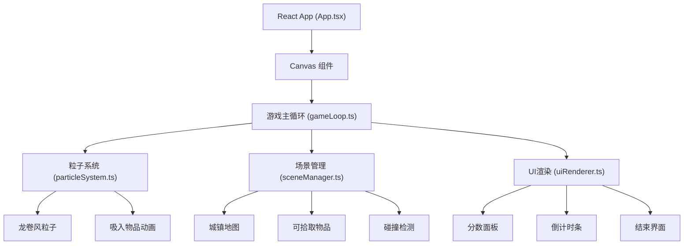

## 1. 架构设计



## 2. 技术描述

- **前端框架**：React 18 + TypeScript
- **构建工具**：Vite 5 + @vitejs/plugin-react
- **渲染技术**：Canvas 2D API
- **游戏循环**：requestAnimationFrame
- **字体**：Press Start 2P（Google Fonts）
- **状态管理**：React useState/useRef（简单游戏场景，无需额外状态库）

## 3. 文件结构

```
src/
├── main.tsx          # React入口文件
├── App.tsx           # 根组件，Canvas挂载和游戏启动
├── gameLoop.ts       # 游戏主循环，管理update和render
├── particleSystem.ts # 龙卷风粒子系统、吸入逻辑
├── sceneManager.ts   # 城镇场景、物品管理、碰撞检测
└── uiRenderer.ts     # UI面板、分数、倒计时、结束界面
```

## 4. 核心数据结构

### 4.1 粒子 (Particle)
```typescript
interface Particle {
  x: number;
  y: number;
  vx: number;
  vy: number;
  radius: number;
  color: string;
  alpha: number;
  life: number;
  maxLife: number;
  angle: number;
  angularSpeed: number;
  height: number;
}
```

### 4.2 可拾取物品 (PickupItem)
```typescript
interface PickupItem {
  id: number;
  x: number;
  y: number;
  width: number;
  height: number;
  color: string;
  type: 'trash' | 'sign' | 'pedestrian';
  state: 'idle' | 'sucking' | 'flying' | 'exploding';
  suckProgress: number;
  flyVelocity: { x: number; y: number };
  explosionFrame: number;
}
```

### 4.3 游戏状态 (GameState)
```typescript
interface GameState {
  score: number;
  timeLeft: number;
  isPlaying: boolean;
  isGameOver: boolean;
  tornadoActive: boolean;
  tornadoCenter: { x: number; y: number };
  tornadoRadius: number;
  tornadoSpeed: number;
  mouseTrail: { x: number; y: number }[];
}
```

## 5. 游戏循环流程

1. **requestAnimationFrame** 触发每帧更新
2. **update阶段**：
   - 更新粒子位置和生命周期
   - 更新物品状态（吸入、飞行、爆炸）
   - 更新倒计时
   - 碰撞检测（龙卷风中心 vs 物品）
3. **render阶段**：
   - 绘制背景和城镇场景
   - 绘制可拾取物品
   - 绘制龙卷风粒子
   - 绘制鼠标轨迹虚线圆环
   - 绘制UI面板
   - 游戏结束时绘制结算界面

## 6. 性能优化

- **对象池模式**：粒子对象复用，避免频繁GC
- **粒子上限**：峰值不超过500个
- **增量生成**：根据拖拽速度动态调整粒子生成速率
- **离屏画布**：静态场景预渲染到离屏canvas
- **碰撞优化**：空间分区，减少碰撞检测计算量
