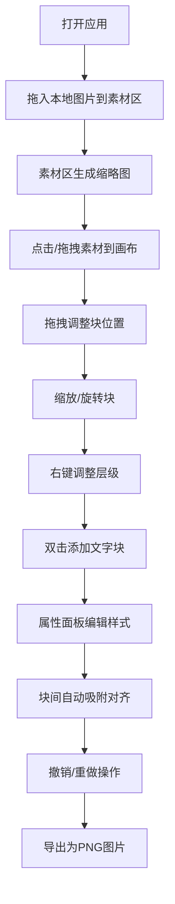

## 1. 产品概述

交互式拼贴画板是一款面向创意工作者和设计师的轻量级在线拼贴创作工具。用户可以在浏览器中自由拖拽图片和文字片段，组合出独特的拼贴作品，支持丰富的编辑操作和导出功能。

- 核心价值：提供零门槛、高自由度的数字拼贴创作体验
- 目标用户：设计师、创意工作者、艺术爱好者
- 使用场景：灵感收集、海报设计、情绪板制作、社交内容创作

## 2. 核心功能

### 2.1 用户角色
| 角色 | 注册方式 | 核心权限 |
|------|---------|---------|
| 访客用户 | 无需注册 | 完整使用所有拼贴创作和导出功能 |

### 2.2 功能模块
1. **素材面板**：本地图片拖入、缩略图展示、素材选择
2. **画布区域**：图片块渲染、文字块渲染、拖拽交互、吸附对齐、选中状态
3. **属性面板**：字体编辑、字号调整、颜色设置、透明度调节
4. **历史管理**：撤销操作、重做操作、最多记录 20 步
5. **导出功能**：导出为 1920x1080 分辨率 PNG 图片

### 2.3 页面详情
| 页面名称 | 模块名称 | 功能描述 |
|---------|---------|---------|
| 主页面 | 左侧素材区 | 支持本地图片拖入上传，自动生成缩略图，点击或拖拽添加到画布 |
| 主页面 | 中间画布区 | 1920x1080 固定尺寸画布，渲染所有图片/文字块，支持拖拽、缩放、旋转、层级调整，块间自动吸附对齐（10px 阈值） |
| 主页面 | 右侧属性面板 | 展示选中块属性，提供字体、字号、颜色、透明度编辑控件 |
| 主页面 | 顶部工具栏 | 撤销/重做按钮、导出按钮 |

## 3. 核心流程

用户打开应用 → 从本地拖入图片到素材区 → 点击素材或拖拽到画布 → 调整块的位置、大小、旋转角度 → 添加文字块并编辑样式 → 通过右键菜单调整层级 → 块间自动吸附对齐 → 使用撤销/重做修正操作 → 导出为 PNG 图片

## 4. 用户界面设计

### 4.1 设计风格
- **设计主题**：复古暗色调
- **主色调**：深灰背景 (#1e1e1e)，营造沉浸式创作氛围
- **强调色**：暖黄色 (#f5a623) 用于选中描边和交互提示，暗红色 (#c0392b) 用于危险操作和装饰
- **中性色**：不同深浅的灰色构成界面层次
- **画布背景**：轻微纸质纹理，增添复古质感
- **字体风格**：标题使用复古衬线字体，正文使用清晰易读的无衬线字体
- **交互反馈**：选中态亮黄色描边动画（0.3s 淡入），拖拽时投影加深并轻微放大（1.05 倍）

### 4.2 页面设计概述
| 页面名称 | 模块名称 | UI 元素 |
|---------|---------|---------|
| 主页面 | 左侧素材区 (240px) | 深色面板、上传提示区、缩略图网格、hover 高亮效果 |
| 主页面 | 中间画布区 (自适应) | 纸质纹理画布背景、可拖拽的块、选中描边动画、右键菜单 |
| 主页面 | 右侧属性面板 (280px) | 深色面板、属性分组、滑块控件、颜色选择器、字体下拉 |
| 主页面 | 响应式布局 | < 900px 时侧面板折叠为浮动图标按钮 |

### 4.3 响应式
- 桌面优先设计，支持浏览器宽度自适应
- 三栏布局：左 240px + 中间自适应 + 右 280px
- 断点：900px 宽度以下，左右面板折叠为浮动图标，点击展开
- 画布区域始终保持 16:9 比例，在视口内等比缩放显示

### 4.4 动效设计
- 块选中：亮黄色描边 0.3s 淡入动画
- 拖拽状态：投影加深 + 1.05 倍缩放过渡
- 面板展开/折叠：平滑滑入滑出动画
- 按钮交互：hover 状态颜色渐变过渡
