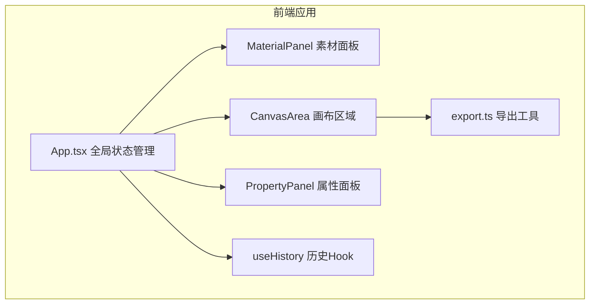

## 1. 架构设计



## 2. 技术描述

- **前端框架**：React 18 + TypeScript
- **构建工具**：Vite 5.x
- **状态管理**：React useState + useReducer + 自定义 useHistory Hook
- **唯一标识**：uuid 库生成块 ID
- **导出方案**：原生 Canvas API 绘制并导出 PNG
- **纯前端项目**：无需后端服务，所有数据存储在内存中

## 3. 文件结构

```
src/
├── App.tsx              # 主组件，全局状态管理
├── components/
│   ├── MaterialPanel.tsx   # 左侧素材区组件
│   ├── CanvasArea.tsx      # 中间画布组件
│   └── PropertyPanel.tsx   # 右侧属性面板组件
├── hooks/
│   └── useHistory.ts       # 撤销/重做 Hook
└── utils/
    └── export.ts           # PNG 导出工具
```

## 4. 数据模型

### 4.1 素材项 (MaterialItem)
```typescript
interface MaterialItem {
  id: string;
  name: string;
  url: string;       // 本地 blob URL
  width: number;
  height: number;
}
```

### 4.2 画布块 (CanvasBlock)
```typescript
interface CanvasBlock {
  id: string;
  type: 'image' | 'text';
  x: number;
  y: number;
  width: number;
  height: number;
  rotation: number;  // 角度
  zIndex: number;
  opacity: number;
  
  // 图片块特有
  imageUrl?: string;
  
  // 文字块特有
  text?: string;
  fontFamily?: string;
  fontSize?: number;
  fontColor?: string;
}
```

## 5. 核心技术方案

### 5.1 拖拽交互
- 使用原生鼠标事件 (mousedown/mousemove/mouseup) 实现高性能拖拽
- 拖拽时通过 transform 进行 GPU 加速渲染，保持 60FPS
- 拖拽计算在 requestAnimationFrame 中执行

### 5.2 吸附对齐
- 拖拽过程中实时计算当前块与其他所有块的边缘距离
- 当任意边缘距离小于 10px 时触发吸附
- 吸附时显示辅助对齐线

### 5.3 撤销/重做
- 自定义 useHistory Hook 管理状态快照栈
- 每次画布块变化时推入新快照
- 最多保留 20 步历史记录
- 使用深拷贝确保快照独立性

### 5.4 PNG 导出
- 使用原生 Canvas API 按 1920x1080 尺寸绘制
- 依次绘制所有块（按 zIndex 排序）
- 支持图片和文字的正确渲染
- 通过 canvas.toDataURL 导出 PNG

### 5.5 性能优化
- 使用 CSS transform 而非 top/left 进行定位
- 拖拽时使用 will-change: transform 提示浏览器优化
- 避免不必要的重渲染，使用 memo 优化组件
- 缩放和旋转操作使用 transform 组合实现
