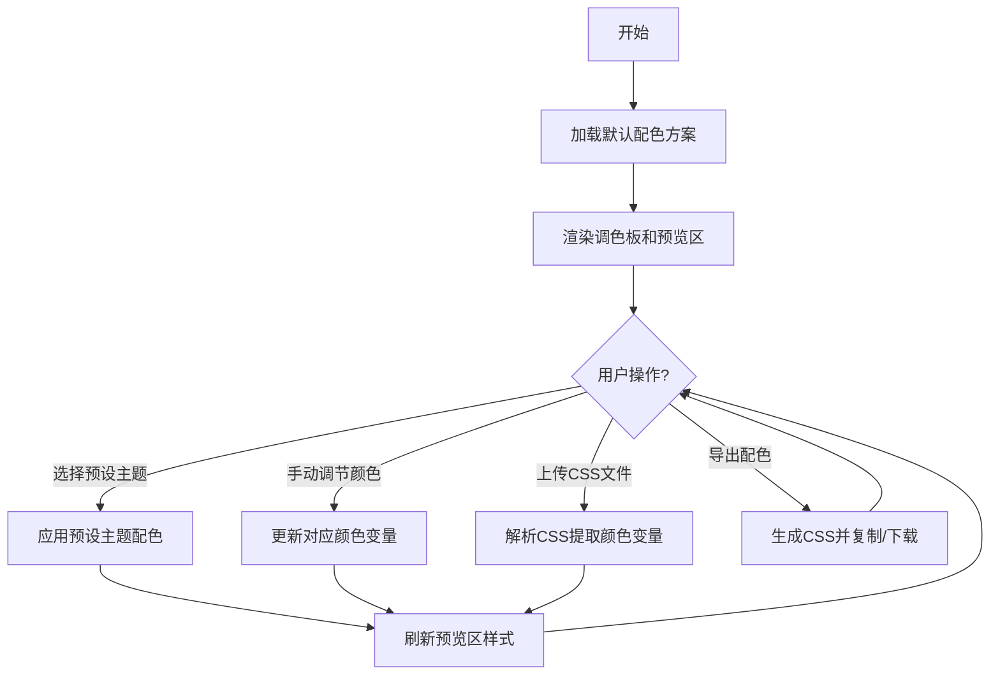

## 1. 产品概述

ColorTheme Studio 是一款面向设计师和前端开发者的实时颜色主题切换与预览工具，解决在频繁切换和对比不同配色方案时效率低下、缺乏直观预览的问题。

- 核心价值：让配色方案的设计、调整、对比和导出变得高效直观
- 目标用户：UI 设计师、前端开发者、产品经理

## 2. 核心功能

### 2.1 功能模块
1. **调色板面板**：颜色变量列表展示与编辑、预设主题切换、手动拾色调节
2. **实时预览区**：典型页面布局渲染、颜色变化即时响应、"已修改"状态标记
3. **导出功能**：CSS 自定义属性格式导出、复制到剪贴板、下载为文件

### 2.2 页面详情
| 页面名称 | 模块名称 | 功能描述 |
|---------|---------|----------|
| 主页面 | 调色板面板 | 解析 CSS 颜色变量、展示可编辑颜色选择器列表、预设主题切换按钮、导出按钮 |
| 主页面 | 预览页面 | 渲染导航栏、卡片、按钮、输入框、进度条、表格等典型组件，实时响应颜色变化 |

## 3. 核心流程

用户上传 CSS 或使用样例 → 系统解析颜色变量 → 用户选择预设主题或手动调节 → 预览区实时更新 → 用户导出修改后的配色方案

## 4. 用户界面设计

### 4.1 设计风格
- 整体风格：简洁专业的工具型界面，左右分栏布局
- 主色调：左侧深灰 (#2d2d2d)，右侧纯白，形成鲜明对比
- 卡片风格：圆角 + 柔和阴影
- 动效：颜色过渡 0.3s ease，组件过渡 0.2s
- 字体：现代无衬线字体，清晰可读

### 4.2 页面设计概述
| 页面名称 | 模块名称 | UI 元素 |
|---------|---------|---------|
| 主页面 | 调色板面板 | 深色背景、颜色变量卡片（变量名+颜色圆点+拾色器）、主题切换按钮组、导出按钮 |
| 主页面 | 预览页面 | 白色背景、导航栏、卡片网格、表单元素、进度条、数据表格、"已修改"标记 |

### 4.3 响应式设计
- 桌面端（≥768px）：左右分栏布局，左侧固定宽度调色板，右侧自适应预览区
- 移动端（<768px）：调色板折叠为可展开的浮动面板，预览区全屏显示
- 触控优化：增大按钮点击区域，适配移动端操作

### 4.4 动画与交互
- 颜色变量卡片悬停效果：轻微上浮 + 阴影加深
- 主题切换：颜色圆点和卡片背景 0.3s ease 平滑过渡
- 预览区组件：所有颜色属性 0.2s 过渡动画
- "已修改"标记：右上角淡入显示，带脉冲提示效果
