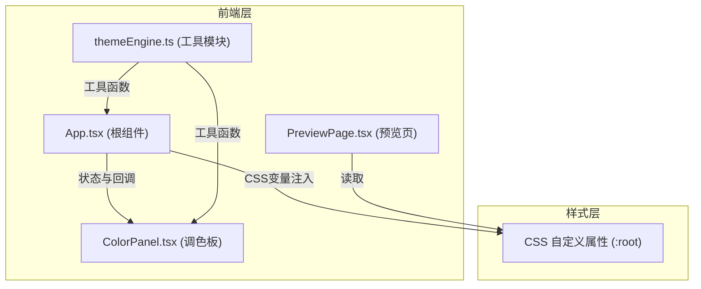

## 1. 架构设计

纯前端单页应用，采用 React 组件化架构，状态通过 Props 传递，颜色变量通过 CSS 自定义属性注入文档根元素实现实时预览。



## 2. 技术描述

- **前端框架**：React 18 + TypeScript
- **构建工具**：Vite 5 + @vitejs/plugin-react
- **状态管理**：React useState（轻量级，无需复杂状态管理）
- **样式方案**：原生 CSS + CSS 自定义属性（无需 Tailwind，保持简洁）
- **包管理器**：npm

## 3. 文件结构

| 文件路径 | 职责 |
|---------|------|
| `package.json` | 项目依赖与脚本 |
| `vite.config.js` | Vite 构建配置 |
| `tsconfig.json` | TypeScript 编译配置 |
| `index.html` | 入口 HTML |
| `src/App.tsx` | 根组件，布局管理 + 全局状态 + CSS变量注入 |
| `src/ColorPanel.tsx` | 左侧调色板，颜色变量编辑 + 主题切换 + 导出 |
| `src/PreviewPage.tsx` | 右侧预览页，渲染典型组件布局 |
| `src/themeEngine.ts` | 工具模块，解析/应用/导出主题颜色 |

## 4. 核心数据结构

```typescript
interface ColorVariable {
  name: string;    // 变量名，如 "--primary"
  value: string;   // 颜色值，如 "#3b82f6"
}

interface ThemePreset {
  name: string;           // 主题名称
  colors: ColorVariable[]; // 主题颜色变量列表
}
```

## 5. 关键技术点

1. **CSS 变量实时注入**：通过 `document.documentElement.style.setProperty()` 实时更新 CSS 自定义属性，实现 <100ms 预览更新
2. **CSS 解析**：正则表达式匹配 `:root {}` 块中的 `--name: value;` 模式，提取颜色变量
3. **颜色选择器**：使用原生 `<input type="color">` 保证性能和兼容性
4. **响应式布局**：使用 CSS Flexbox + Media Queries 实现桌面/移动端适配
5. **平滑过渡**：统一使用 CSS transition 实现颜色变化动画
