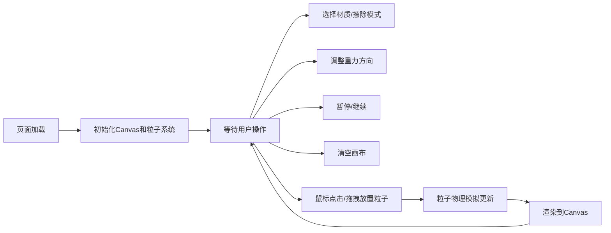

## 1. 产品概述
基于重力模拟的沙盒物理游戏，玩家通过鼠标放置不同材质的粒子（沙子、水、石头），观察它们之间的物理交互。
- 核心目的：提供一个轻松有趣的物理模拟沙盒，让用户体验粒子堆积、流动和碰撞的视觉效果
- 目标用户：休闲游戏爱好者、物理模拟爱好者、教育场景用户

## 2. 核心功能

### 2.1 功能模块
1. **主画布区域**：粒子渲染、物理模拟、鼠标交互
2. **材质工具栏**：沙子/水/石头三种画笔切换、擦除模式
3. **控制面板**：重力方向滑块、清空画布、暂停/继续
4. **状态显示**：粒子总数、实时FPS

### 2.2 功能详情

| 模块名称 | 功能点 | 功能描述 |
|---------|--------|---------|
| 主画布 | 粒子放置 | 鼠标左键点击或拖拽连续放置粒子，每帧最多5个 |
| 主画布 | 粒子擦除 | 鼠标右键擦除半径15px内的所有粒子 |
| 主画布 | 物理模拟 | 重力、碰撞、堆积、流动等物理行为 |
| 材质工具栏 | 沙子材质 | 黄色、松散、易堆积的粒子 |
| 材质工具栏 | 水材质 | 蓝色、流动性强、受重力下落的粒子 |
| 材质工具栏 | 石头材质 | 灰色、不可移动、充当障碍的粒子 |
| 材质工具栏 | 擦除模式 | 红色高亮，切换到擦除模式 |
| 控制面板 | 重力方向 | -90度到90度滑块，实时改变重力方向 |
| 控制面板 | 清空画布 | 一键清除所有粒子 |
| 控制面板 | 暂停/继续 | 冻结或恢复粒子运动 |
| 状态显示 | 粒子计数 | 左上角显示实时粒子总数 |
| 状态显示 | FPS显示 | 右上角显示帧率，低于30时自动降低粒子生成上限 |

## 3. 核心流程

玩家打开页面 → 选择材质画笔 → 在画布上点击/拖拽放置粒子 → 观察物理交互效果 → 可调整重力方向/暂停/清空

## 4. 用户界面设计

### 4.1 设计风格
- 主背景色：深灰色 #2d2d2d
- 沙子色：#d4a373，水蓝色：#84a98c，石灰色：#6c757d
- 擦除按钮：红色 #e74c3c
- 控件背景：半透明白色 rgba(255,255,255,0.15)
- 悬停效果：0.2s亮度提升动画
- 字体：等宽字体显示数字状态

### 4.2 页面布局
- 顶部：左上角粒子计数，右上角FPS显示
- 中部：主画布区域（响应式，至少800x600）
- 底部：工具栏（材质按钮、重力滑块、操作按钮）

| 区域 | 模块 | UI元素 |
|-----|-----|--------|
| 顶部左 | 粒子计数 | 白色等宽字体数字显示 |
| 顶部右 | FPS显示 | 白色等宽字体，低于30时变黄色 |
| 中部 | Canvas画布 | 深灰色背景，粒子渲染区域 |
| 底部左 | 材质选择 | 三个材质按钮 + 擦除按钮，等宽排列 |
| 底部中 | 重力滑块 | 水平滑块，带角度指示 |
| 底部右 | 操作按钮 | 清空、暂停/继续按钮 |

### 4.3 响应式
- Desktop-first设计
- 画布最小尺寸800x600
- 浏览器窗口小于600px宽度时，底部工具栏自动调整为纵向排列
- 粒子放置时有0.1s的扩散动画效果
