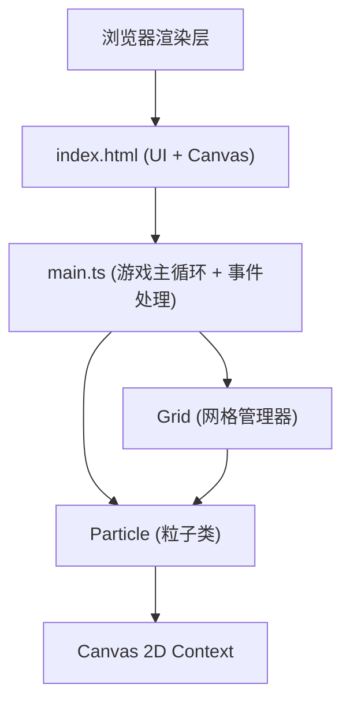

## 1. 架构设计



## 2. 技术栈说明

- **构建工具**：Vite 5.x
- **编程语言**：TypeScript 5.x（严格模式，ESNext模块）
- **渲染引擎**：HTML5 Canvas 2D API
- **代码规范**：ESLint + @typescript-eslint
- **依赖包**：
  - vite
  - typescript
  - @typescript-eslint/parser
  - @typescript-eslint/eslint-plugin

## 3. 项目文件结构

```
auto10/
├── package.json              # 项目依赖和脚本
├── vite.config.js            # Vite构建配置
├── tsconfig.json             # TypeScript配置
├── index.html                # HTML入口，Canvas + UI控制面板
└── src/
    ├── main.ts               # 游戏主循环、Canvas初始化、鼠标事件处理
    ├── particle.ts           # 粒子类：位置、速度、材质、渲染
    └── grid.ts               # 网格管理器：碰撞检测、粒子交换、重力模拟
```

## 4. 核心模块设计

### 4.1 Particle 类 (src/particle.ts)

```typescript
export enum MaterialType {
  SAND = 'sand',
  WATER = 'water',
  STONE = 'stone'
}

export interface Particle {
  x: number;
  y: number;
  vx: number;
  vy: number;
  material: MaterialType;
  updated: boolean;
  createdAt: number;
}
```

- **属性说明**：
  - `x, y`：粒子网格坐标
  - `vx, vy`：速度（主要用于初始扩散动画）
  - `material`：材质类型（沙/水/石）
  - `updated`：标记本帧是否已更新，避免重复处理
  - `createdAt`：创建时间，用于扩散动画

- **方法**：
  - `getColor()`：根据材质返回颜色
  - `isStatic()`：石头返回true，不参与物理更新

### 4.2 Grid 类 (src/grid.ts)

```typescript
export class Grid {
  private cells: (Particle | null)[][];
  private width: number;
  private height: number;
  private cellSize: number;
  private gravityAngle: number; // -90 ~ 90 度

  constructor(width: number, height: number, cellSize: number);
  
  // 获取/设置粒子
  getParticle(x: number, y: number): Particle | null;
  setParticle(x: number, y: number, particle: Particle | null): void;
  
  // 核心物理更新
  update(): void;
  
  // 重力方向设置
  setGravityAngle(angle: number): void;
  getGravityVector(): { gx: number; gy: number };
  
  // 粒子管理
  addParticle(particle: Particle): boolean;
  removeParticlesInRadius(cx: number, cy: number, radius: number): void;
  clear(): void;
  getParticleCount(): number;
  getAllParticles(): Particle[];
}
```

- **核心算法**：
  - **网格碰撞检测**：O(n) 复杂度，每个粒子只检查相邻格子
  - **沙子物理**：优先下落，其次左下/右下滑动
  - **水物理**：下落 + 左右扩散流动
  - **石头**：静态不移动，作为障碍物
  - **重力方向**：通过角度计算重力向量，决定粒子移动方向

### 4.3 main.ts 游戏主循环

```typescript
// 状态管理
let currentMaterial: MaterialType;
let isErasing: boolean;
let isPaused: boolean;
let particlesPerFrame: number; // 动态调整，默认5

// 主循环
function gameLoop(): void {
  handleMouseInput();
  if (!isPaused) grid.update();
  render();
  updateFPS();
  requestAnimationFrame(gameLoop);
}

// 渲染
function render(): void;
function updateFPS(): void;

// 鼠标事件
function handleMouseDown(e: MouseEvent): void;
function handleMouseMove(e: MouseEvent): void;
function handleMouseUp(e: MouseEvent): void;
function handleContextMenu(e: MouseEvent): void;
```

## 5. 性能优化策略

1. **网格空间划分**：粒子存储在二维网格中，碰撞检测只需检查相邻格子，O(n)复杂度
2. **逐帧更新标志**：每个粒子有 `updated` 标记，防止一帧内重复移动
3. **方向交替**：每帧交替左右检查方向，避免粒子偏向一侧
4. **动态粒子生成**：FPS低于30时自动降低 `particlesPerFrame`
5. **ImageData批量渲染**：使用 `putImageData` 一次性绘制所有粒子，减少draw call
6. **惰性清除**：只重绘变化区域，或全屏简单背景覆盖

## 6. 物理规则明细

| 材质 | 颜色 | 密度 | 流动性 | 可移动 | 行为描述 |
|-----|------|------|--------|--------|---------|
| 沙子 | #d4a373 | 高 | 低 | 是 | 垂直下落，斜面堆积成45度角 |
| 水 | #84a98c | 低 | 高 | 是 | 下落，水平扩散，填充低洼 |
| 石头 | #6c757d | - | - | 否 | 静态障碍，不参与移动 |

- **重力向量计算**：`gx = sin(angle)`, `gy = cos(angle)`（angle=0为垂直向下）
- **擦除半径**：15px
- **粒子扩散动画**：0.1s内从中心向外随机偏移
