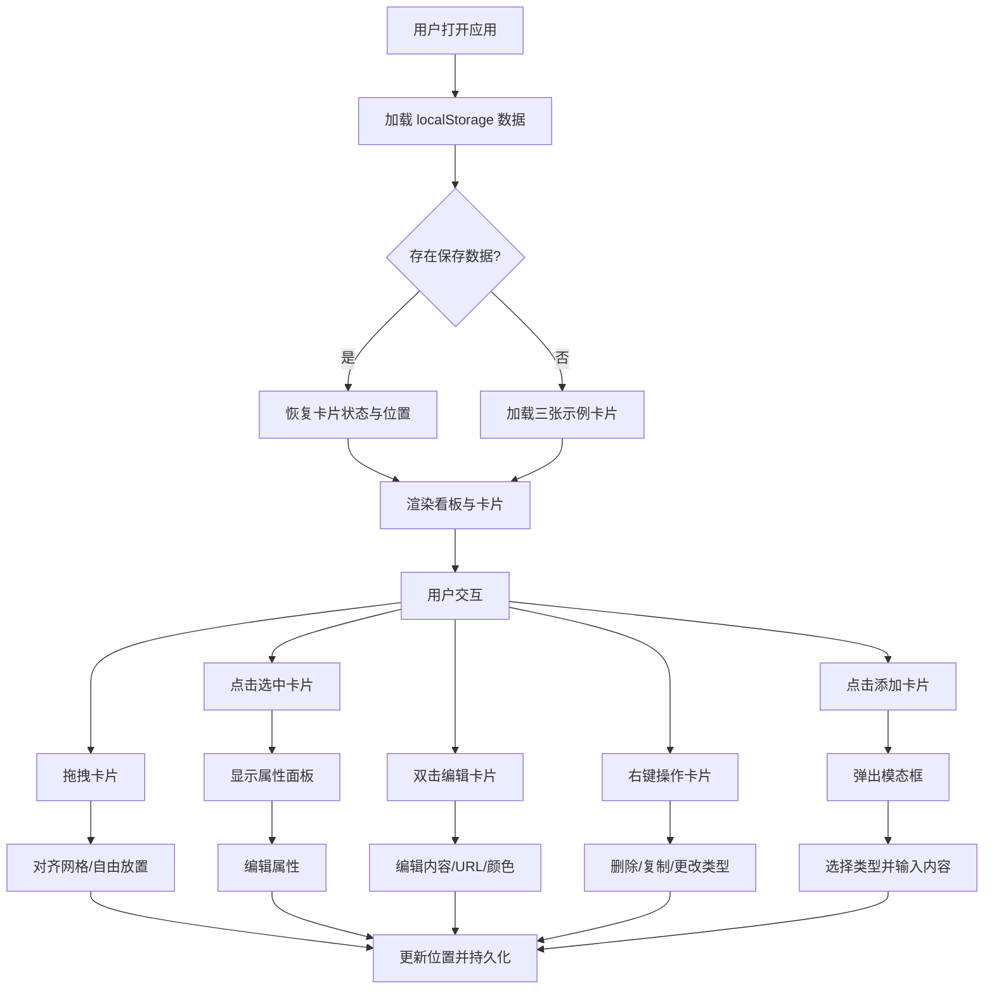

## 1. 产品概述
灵感看板（Mood Board）是一款基于CSS网格布局的可视化灵感收集工具，让用户像使用实体软木板一样自由组织创意素材。
- 主要用途：设计师、创作者用于收集和组织图片、色彩、文字等灵感素材，形成视觉化的创意集合
- 目标用户：设计师、艺术家、内容创作者及任何需要视觉化灵感整理的用户
- 产品价值：提供直观、灵活的数字化软木板体验，降低灵感整理的门槛，提升创意工作效率

## 2. 核心功能

### 2.1 用户角色
| 角色 | 注册方式 | 核心权限 |
|------|----------|----------|
| 普通用户 | 无需注册，直接使用 | 创建、编辑、删除、拖拽卡片，调整卡片层级和属性 |

### 2.2 功能模块
1. **看板主界面**：网格背景画布、卡片容器、层级信息显示
2. **卡片系统**：图片卡片、色块卡片、文字卡片三种类型，支持拖拽、缩放、编辑
3. **属性面板**：选中卡片的属性编辑（坐标、尺寸、层级、类型）
4. **添加卡片**：模态框表单选择卡片类型并输入初始内容
5. **右键菜单**：删除、复制、更改卡片类型快捷操作
6. **数据持久化**：localStorage 自动保存和恢复卡片位置与状态

### 2.3 页面详情
| 页面名称 | 模块名称 | 功能描述 |
|----------|----------|----------|
| 主页面 | 看板网格背景 | 1000x700px 浅色网格背景（#F7F3E8），网格间距20px，作为卡片容器的绝对定位父级 |
| 主页面 | 卡片组件 | 支持三种类型（图片/色块/文字），默认尺寸150x120px，可拖拽、可选中高亮、双击编辑、右键菜单操作 |
| 主页面 | 添加卡片按钮 | 右上角圆角按钮（#4A90D9），点击弹出模态框选择卡片类型 |
| 主页面 | 添加卡片模态框 | 半透明遮罩（rgba(0,0,0,0.4)），居中400x300px表单，选择类型并输入初始内容 |
| 主页面 | 属性面板 | 右侧浮动面板（宽220px），显示选中卡片类型、坐标、尺寸、层级，支持实时编辑 |
| 主页面 | 层级信息栏 | 看板右上角显示当前选中卡片的层级编号 |
| 主页面 | 右键上下文菜单 | 卡片右键提供删除、复制、更改类型操作，类型切换带0.3s过渡动画 |

## 3. 核心流程
用户打开应用后，页面自动加载三张示例卡片（图片、色块、文字各一张），用户可以通过拖拽自由排列卡片，点击卡片选中后可在右侧属性面板调整尺寸、坐标和层级，双击卡片可编辑内容，右键可进行快捷操作，所有操作自动保存到 localStorage，刷新页面后自动恢复。

## 4. 用户界面设计

### 4.1 设计风格
- **主色调**：暖色调米白背景 #F7F3E8，搭配蓝色按钮 #4A90D9 形成冷暖对比
- **辅助色**：网格线 #E0DCD0，卡片边框 #D4CFC4，选中高亮 #FFD700，删除/警示色 #FF6B6B
- **按钮风格**：圆角20px的胶囊形按钮，悬停颜色加深（#357ABD），过渡0.2s ease
- **字体**：使用系统无衬线字体，响应式字号，正文14px，标题16px
- **布局风格**：绝对定位的卡片在网格画布上自由浮动，右侧属性面板固定定位
- **视觉风格**：实体软木板质感，卡片带轻微阴影，悬停时阴影加深，所有交互带平滑过渡动画（0.2s-0.3s ease）

### 4.2 页面设计概览
| 页面名称 | 模块名称 | UI 元素 |
|----------|----------|---------|
| 主页面 | 看板画布 | 1000x700px 米白背景（#F7F3E8），20px 间距网格线（#E0DCD0），居中显示 |
| 主页面 | 卡片组件 | 白色背景，1px 边框（#D4CFC4），圆角6px，阴影 0 2px 8px rgba(0,0,0,0.1)，悬停阴影加深至0.3透明度 |
| 主页面 | 图片卡片 | 无背景色，图片填充卡片区域，淡入动画 |
| 主页面 | 色块卡片 | 100% 填充纯色，双击打开颜色选择器 |
| 主页面 | 文字卡片 | 上下内边距12px，左右16px，居中显示文字，默认"双击编辑" |
| 主页面 | 添加卡片按钮 | 右上角固定，圆角20px，背景#4A90D9，白色文字，悬停背景#357ABD |
| 主页面 | 属性面板 | 右侧固定定位，距顶部100px，宽220px，毛玻璃半透明背景 rgba(247,243,232,0.9)，边框1px solid #D4CFC4 |
| 主页面 | 层级按钮 | 圆角8px，边框#C0BAA6，透明背景，悬停背景#E8E2D4，箭头图标 |
| 主页面 | 拖拽状态 | 透明度0.8，z-index 100，平滑过渡 |
| 主页面 | 选中状态 | 4px 内发光边框 #FFD700，z-index 200 |

### 4.3 响应式设计
- **桌面端（≥768px）**：看板 1000x700px，卡片默认 150x120px，属性面板右侧固定（宽220px，距顶部100px）
- **移动端（<768px）**：看板宽95vw、高60vh，卡片默认120x96px，属性面板变为底部浮动栏（高80px，宽度100%）
- **触控优化**：拖拽区域足够大，按钮最小点击区域44x44px

### 4.4 动效设计
- 卡片淡入：初次加载时图片卡片淡入效果
- 拖拽过渡：跟随鼠标实时移动，松开后0.15s ease-out 网格对齐动画
- 类型切换：0.3s 背景色过渡动画
- 悬停反馈：阴影加深、背景色变化，过渡0.2s ease
- 选中高亮：边框发光效果，平滑过渡
