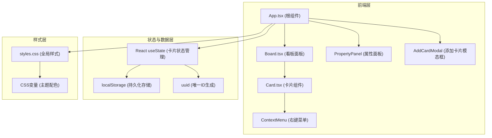

## 1. 架构设计



## 2. 技术说明
- **前端框架**：React 18 + TypeScript
- **构建工具**：Vite 5.x
- **状态管理**：React 内置 useState（无外部状态管理库）
- **路由**：无（单页面应用，无外部路由库）
- **唯一ID**：uuid v4
- **持久化**：localStorage
- **样式方案**：原生 CSS + CSS 变量

## 3. 项目文件结构
```
auto100/
├── index.html                    # 入口HTML，包含挂载点和CSS变量
├── package.json                  # 项目依赖与脚本
├── vite.config.js                # Vite构建配置
├── tsconfig.json                 # TypeScript配置
└── src/
    ├── App.tsx                   # 根组件，状态管理
    ├── styles.css                # 全局样式
    └── components/
        ├── Board.tsx             # 看板面板组件
        ├── Card.tsx              # 卡片组件（图片/色块/文字）
        ├── PropertyPanel.tsx     # 属性面板组件
        ├── AddCardModal.tsx      # 添加卡片模态框
        └── ContextMenu.tsx       # 右键菜单组件
```

## 4. 数据模型

### 4.1 卡片数据类型定义

```typescript
type CardType = 'image' | 'color' | 'text';

interface BoardCard {
  id: string;
  type: CardType;
  content: string;
  x: number;
  y: number;
  width: number;
  height: number;
  zIndex: number;
}
```

### 4.2 状态定义
| 状态 | 类型 | 说明 |
|------|------|------|
| cards | BoardCard[] | 所有卡片数组 |
| selectedCardId | string \| null | 当前选中卡片的ID |
| isModalOpen | boolean | 添加卡片模态框是否打开 |
| contextMenu | { visible: boolean, x: number, y: number, cardId: string } \| null | 右键菜单状态 |

### 4.3 localStorage 存储键
- `moodboard_cards`：存储所有卡片的 JSON 字符串

## 5. 核心组件说明

### 5.1 App.tsx（根组件）
- 初始化状态：从 localStorage 读取或加载默认示例卡片
- 管理所有卡片状态（增删改查、位置、尺寸、层级）
- 管理选中状态、模态框、右键菜单状态
- 将状态和回调函数通过 props 传递给子组件
- 监听卡片变化并自动同步到 localStorage

### 5.2 Board.tsx（看板面板）
- 渲染 1000x700px 网格背景（CSS linear-gradient 实现网格线）
- 作为卡片容器的绝对定位父级
- 渲染层级信息显示（右上角）
- 渲染添加卡片按钮（右上角）
- 监听看板空白区域点击，取消选中状态

### 5.3 Card.tsx（卡片组件）
- 三种卡片类型渲染：
  - image： 标签，淡入动画
  - color：纯色背景填充
  - text：文本显示，padding 12px 16px
- 拖拽功能：mousedown/mousemove/mouseup 事件，实时跟随鼠标
- 网格对齐：松开鼠标时自动对齐到最近的20px网格交叉点（Shift键禁用对齐）
- 选中状态：点击选中，4px内发光边框，z-index 200
- 双击编辑：编辑文字内容、图片URL，色块打开颜色选择器
- 右键菜单：contextmenu 事件触发
- 类型切换：0.3s 背景色过渡动画

### 5.4 PropertyPanel.tsx（属性面板）
- 桌面端：右侧固定定位，宽220px，距顶部100px
- 移动端：底部浮动栏，高80px，宽度100%
- 显示和编辑：
  - 卡片类型（只读显示）
  - 坐标 x/y（整数输入框）
  - 宽高 width/height（两位小数输入框）
  - 层级 zIndex（数字输入框，范围 -10 到 10）
- 层级调整按钮：上移一层、下移一层

### 5.5 AddCardModal.tsx（添加卡片模态框）
- 半透明遮罩：rgba(0,0,0,0.4)
- 表单区域：400x300px，圆角12px，居中显示
- 类型选择：单选按钮组（图片/色块/文字）
- 内容输入：根据类型显示不同输入框（URL/颜色选择器/文本域）
- 提交后在看板随机位置创建新卡片

### 5.6 ContextMenu.tsx（右键菜单）
- 跟随鼠标位置显示
- 菜单项：删除、复制、更改类型（三个子菜单）
- 点击空白区域或执行操作后自动关闭

## 6. 性能优化策略
- **拖拽性能**：使用 transform 而非 top/left 进行实时位置更新，最后提交时更新 top/left
- **事件委托**：在看板级别统一处理部分事件
- **requestAnimationFrame**：拖拽过程中使用 rAF 节流更新频率，保证 60fps
- **防抖持久化**：状态变更后防抖写入 localStorage，避免频繁IO
- **最大卡片数限制**：最多20张卡片同时存在，防止渲染性能问题
- **CSS 动画优化**：使用 transform 和 opacity 属性实现硬件加速动画

## 7. 拖拽实现细节
1. mousedown 事件：记录起始鼠标位置、卡片起始位置、设置拖拽状态、提升 z-index 至 100、降低透明度至 0.8
2. mousemove 事件（document 级别）：计算位移差，通过 transform 实时更新位置
3. mouseup 事件（document 级别）：
   - 判断是否按住 Shift 键
   - 未按住 Shift：将 x/y 对齐到最近的 20px 网格交叉点
   - 按住 Shift：使用实际位置
   - 清除 transform，更新实际 top/left 坐标（0.15s ease-out 过渡）
   - 恢复 z-index 和透明度
   - 更新状态并持久化

## 8. 示例卡片初始化数据
```typescript
const defaultCards: BoardCard[] = [
  {
    id: uuidv4(),
    type: 'image',
    content: 'https://picsum.photos/150/120?random=1',
    x: 60,
    y: 80,
    width: 150,
    height: 120,
    zIndex: 1,
  },
  {
    id: uuidv4(),
    type: 'color',
    content: '#FF6B6B',
    x: 280,
    y: 80,
    width: 150,
    height: 120,
    zIndex: 1,
  },
  {
    id: uuidv4(),
    type: 'text',
    content: '双击编辑',
    x: 500,
    y: 80,
    width: 150,
    height: 120,
    zIndex: 1,
  },
];
```
