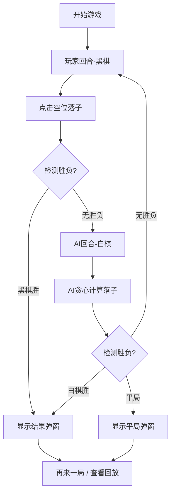

## 1. 产品概述

五子棋人机对战应用，玩家与AI对手在15x15棋盘上轮流落子，先连成五子者获胜。提供棋步回放、悔棋等辅助功能。
- 目标用户：休闲游戏玩家，对传统棋类对战感兴趣的用户
- 产品价值：提供随时随地的高质量AI五子棋对战体验，规则简化，交互流畅

## 2. 核心功能

### 2.1 用户角色
无角色区分，单用户操作

### 2.2 功能模块
1. **游戏主界面**：标题、15x15棋盘Canvas、控制按钮、状态提示
2. **对战引擎**：棋盘状态管理、回合切换、胜负判定
3. **AI对手**：基于贪心策略的落子决策
4. **辅助功能**：悔棋（最多3次）、棋步回放、重新开始

### 2.3 页面详情
| 页面名称 | 模块名称 | 功能描述 |
|-----------|-------------|---------------------|
| 主界面 | 游戏标题 | 显示"五子棋"标题，居中展示 |
| 主界面 | 棋盘区域 | 15x15网格Canvas，响应式缩放（400-640px） |
| 主界面 | 控制按钮 | "重新开始"和"悔棋"按钮，显示剩余悔棋次数 |
| 主界面 | 结果弹窗 | 胜负结果提示，"再来一局"按钮，"查看棋步回放"按钮 |
| 主界面 | 棋步回放 | 高亮回放历史棋步，每步0.8秒，闪烁高亮圆环 |

## 3. 核心流程

玩家点击棋盘空位落子→系统检测胜负→若无胜负，AI计算落子位置并落子→循环直至有一方五子连珠或棋盘满→显示结果弹窗→用户可选择再来一局或查看棋步回放

## 4. 用户界面设计

### 4.1 设计风格
- **主色调**：暖棕色系，仿木质棋盘
  - 背景渐变：#F5E6CA → #E8D5B7（从上到下线性渐变）
  - 棋盘线：#5D4037（深棕色）
  - 按钮背景：#6D4C41，hover：#8D6E63
- **按钮样式**：圆角6px，点击缩放0.95，过渡0.2s
- **字体**：'Georgia'，标题32px，弹窗36px，按钮16px，提示13px
- **布局风格**：垂直居中，标题-棋盘-按钮三段式结构
- **棋子样式**：黑棋径向渐变带高光，白棋加浅灰边框，均带投影（偏移2px，模糊3px，alpha 0.2）

### 4.2 页面设计概述
| 页面名称 | 模块名称 | UI元素 |
|-----------|-------------|-------------|
| 主界面 | 标题区域 | Georgia 32px #3E2723，居中，上间距20px下间距10px |
| 主界面 | 棋盘Canvas | 640x600px（网格600px+20px边距），居中，响应式缩放 |
| 主界面 | 控制按钮 | 80x36px，间距30px，圆角6px，深棕背景，白色文字 |
| 主界面 | 悔棋提示 | 13px #5D4037，按钮下方显示剩余次数 |
| 主界面 | 结果弹窗 | 半透明遮罩rgba(0,0,0,0.5)，白字36px Georgia |
| 主界面 | 回放高亮 | #FFD54F圆环，半径20px，闪烁0.5s |

### 4.3 响应式
- Desktop优先，Canvas根据视口宽度等比缩放（最大640px，最小400px）
- 按钮和标题字体大小跟随缩放
- 布局保持垂直居中
