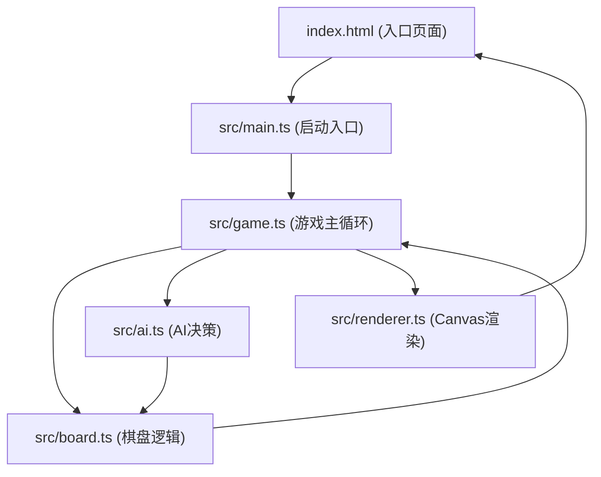

## 1. 架构设计



**数据流向**：
1. 用户点击Canvas → game.ts 接收事件 → board.ts 更新落子状态
2. board.ts 状态变更 → game.ts 触发胜负检测 → 调用 renderer.ts 重新绘制
3. AI回合：game.ts 调用 ai.ts → ai.ts 读取 board.ts 状态 → 返回落子坐标 → board.ts 更新
4. 渲染循环：renderer.ts 使用 requestAnimationFrame 基于 board.ts 当前状态绘制

## 2. 技术描述
- **前端**：TypeScript + HTML5 Canvas + Vite
- **初始化工具**：Vite vanilla-ts 模板
- **后端**：无（纯前端应用）
- **数据库**：无

## 3. 文件结构与职责

| 文件 | 职责 | 输出 | 依赖 |
|------|------|------|------|
| package.json | 依赖管理与脚本 | - | vite, typescript |
| vite.config.js | Vite构建配置 | - | - |
| tsconfig.json | TypeScript编译配置 | - | - |
| index.html | 入口页面，Canvas容器与UI | DOM结构 | - |
| src/main.ts | 应用启动入口 | 初始化Game实例 | game.ts |
| src/board.ts | 棋盘状态与逻辑 | 落子/胜负检测/克隆 | - |
| src/ai.ts | AI贪心策略 | 落子坐标{x,y} | board.ts |
| src/renderer.ts | Canvas绘制 | 棋盘/棋子/动画渲染 | board.ts |
| src/game.ts | 游戏主控 | 回合管理/事件绑定/流程控制 | board.ts, ai.ts, renderer.ts |

## 4. 核心数据模型

### 4.1 棋盘数据结构
```typescript
type Cell = 0 | 1 | 2  // 0空 1黑 2白
type Board = Cell[][]  // 15x15二维数组

interface Move {
  x: number
  y: number
  player: 1 | 2
  timestamp: number
}
```

### 4.2 游戏状态
```typescript
type GameState = 'playing' | 'black_win' | 'white_win' | 'draw' | 'replaying'

interface GameData {
  board: Board
  currentPlayer: 1 | 2
  state: GameState
  history: Move[]
  undoCount: number  // 剩余悔棋次数（初始3）
}
```

## 5. 模块接口定义

### board.ts
```typescript
createBoard(): Board
cloneBoard(board: Board): Board
placeStone(board: Board, x: number, y: number, player: 1|2): boolean
checkWin(board: Board, x: number, y: number, player: 1|2): boolean
getEmptyCells(board: Board): {x:number, y:number}[]
```

### ai.ts
```typescript
findBestMove(board: Board): {x: number, y: number}
```

### renderer.ts
```typescript
class Renderer {
  constructor(canvas: HTMLCanvasElement)
  render(board: Board, hoverPos?: {x:number,y:number}, animatingStones?: Move[])
  drawHighlight(x: number, y: number)
  resize()
}
```

### game.ts
```typescript
class Game {
  constructor(canvas: HTMLCanvasElement)
  start()
  reset()
  undo()
  startReplay()
}
```
