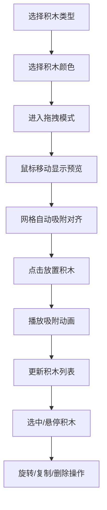

## 1. 产品概述
基于Web的3D乐高积木组装工坊，让用户在浏览器中像玩真实乐高一样自由搭建积木模型。
- 面向爱好者和创意用户，提供零门槛的3D积木搭建体验，无需安装软件即可在浏览器中完成创作
- 产品价值在于降低3D建模门槛，让普通人通过熟悉的乐高积木方式进行空间创意表达

## 2. 核心功能

### 2.1 功能模块
1. **3D场景主视图**：Three.js渲染的三维搭建空间，含网格底板、光照系统、视角控制
2. **左侧零件工具栏**：积木类型选择器、颜色选择器、拖拽预览功能
3. **右侧积木列表**：已摆放积木的实时清单、删除操作、撤销功能
4. **积木交互系统**：网格吸附、旋转、复制、删除、悬停高亮、选中迷你面板

### 2.2 页面详情
| 页面名称 | 模块名称 | 功能描述 |
|-----------|-------------|---------------------|
| 主工作台 | 3D场景渲染 | Three.js渲染浅灰-白色渐变背景、半透明网格底板(20x20单位)、OrbitControls视角控制 |
| 主工作台 | 零件工具栏 | 毛玻璃效果面板，5种积木类型下拉选择，7种颜色圆形色块，进入拖拽模式后显示抓取光标 |
| 主工作台 | 积木列表 | 按添加顺序展示积木(类型/颜色/x,y,z坐标)，垃圾桶删除图标，Ctrl+Z撤销按钮 |
| 主工作台 | 交互反馈 | 半透明放置预览(alpha 0.5)、吸附动画(0.2s ease-out)、悬停淡黄色发光、选中迷你操作面板 |

## 3. 核心流程
用户从左侧工具栏选择积木类型和颜色 → 鼠标移至3D场景出现半透明预览 → 预览自动吸附到网格位置 → 点击放置积木(0.2秒吸附动画) → 右侧列表实时更新 → 可悬停/选中已有积木进行旋转、复制、删除操作 → 支持Ctrl+Z撤销

## 4. 用户界面设计

### 4.1 设计风格
- 主色调：浅灰渐变背景(#E8E8E8→#F5F5F5)，淡蓝色网格线(#A0C4FF)
- 积木色：红#FF3333、蓝#3366FF、黄#FFD700、绿#33CC33、白#FFFFFF、黑#333333、橙#FF8800
- 面板风格：毛玻璃半透明效果(rgba(255,255,255,0.5) + 1px rgba(255,255,255,0.3)边框)
- 按钮风格：圆形图标按钮(直径32px)，半透明白色背景，悬停变实色
- 交互反馈：颜色色块选中时1.2倍缩放+边框高亮，积木悬停淡黄色外发光(0.3s过渡)

### 4.2 页面设计概述
| 页面名称 | 模块名称 | UI元素 |
|-----------|-------------|-------------|
| 主工作台 | 顶部标题栏 | 淡灰色背景，显示"Brick Workshop"标题 |
| 主工作台 | 左侧工具栏 | 宽220px，毛玻璃效果，积木类型下拉(带小图标)、7个圆形颜色色块(16px半径) |
| 主工作台 | 3D场景中心 | 半透明网格底板浮于中心，积木放置贴合表面，吸附动画流畅 |
| 主工作台 | 右侧列表 | 按添加顺序排列，每项显示类型/颜色/坐标+垃圾桶图标，顶部撤销按钮 |
| 主工作台 | 迷你操作面板 | 积木上方5单位处弹出，圆形按钮3个(删除/复制/旋转90°) |

### 4.3 响应式
- 桌面端优先：左侧工具栏220px固定宽度，右侧列表侧边显示
- 移动端(<768px)：工具栏折叠为顶部水平条，积木列表变为可滑动抽屉
- 触摸优化：支持触摸拖拽放置，双指缩放视角

### 4.4 3D场景指引
- 环境：浅灰到白色渐变背景，柔和环境光+方向光模拟室内光照
- 光照：AmbientLight(0xffffff, 0.6) + DirectionalLight(0xffffff, 0.8)带阴影
- 相机：PerspectiveCamera，OrbitControls控制，minDistance=5，maxDistance=30
- 交互：Raycaster检测鼠标与底板/积木交点，网格按1单位整数吸附
- 动画：积木放置0.2秒ease-out吸附动画，悬停发光0.3秒过渡
- 性能：最多60块积木时帧率≥45fps，吸附计算延迟≤30ms
