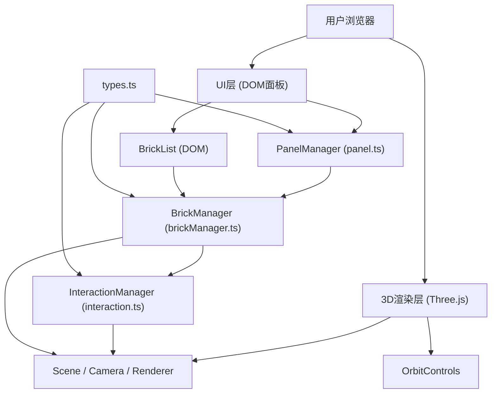

## 1. 架构设计



## 2. 技术描述
- 前端：TypeScript + Three.js@0.160 + Vite@5
- 初始化工具：Vite手动配置
- 后端：无（纯前端应用）
- 数据库：无（内存状态管理）
- UI：原生DOM + CSS（毛玻璃效果、响应式布局）
- 3D渲染：Three.js + OrbitControls

## 3. 路由定义
| 路由 | 用途 |
|-------|---------|
| / | 主工作台（单页应用，无路由） |

## 4. 数据模型

### 4.1 类型定义

```typescript
// BrickType 枚举
enum BrickType {
  BRICK_2x4 = 'brick_2x4',      // 2x4砖块
  BRICK_1x2 = 'brick_1x2',      // 1x2砖块
  SLOPE_2x2 = 'slope_2x2',      // 2x2斜面砖
  CYLINDER_1x1 = 'cylinder_1x1', // 1x1圆柱
  PLATE_2x2 = 'plate_2x2'       // 2x2圆板
}

// Brick 接口
interface Brick {
  id: string;           // 唯一标识
  type: BrickType;      // 积木类型
  color: string;        // 颜色 (hex格式)
  position: { x: number; y: number; z: number };  // 网格坐标
  rotationY: number;    // Y轴旋转角度 (弧度)
}

// 积木尺寸配置
const BRICK_DIMENSIONS: Record<BrickType, { width: number; depth: number; height: number; isSlope?: boolean; isCylinder?: boolean; isPlate?: boolean }> = {
  [BrickType.BRICK_2x4]:    { width: 2, depth: 4, height: 1 },
  [BrickType.BRICK_1x2]:    { width: 1, depth: 2, height: 1 },
  [BrickType.SLOPE_2x2]:    { width: 2, depth: 2, height: 1, isSlope: true },
  [BrickType.CYLINDER_1x1]: { width: 1, depth: 1, height: 1, isCylinder: true },
  [BrickType.PLATE_2x2]:    { width: 2, depth: 2, height: 0.33, isPlate: true }
};

// 可用颜色
const BRICK_COLORS = [
  '#FF3333', // 红
  '#3366FF', // 蓝
  '#FFD700', // 黄
  '#33CC33', // 绿
  '#FFFFFF', // 白
  '#333333', // 黑
  '#FF8800'  // 橙
];
```

## 5. 模块职责划分

| 文件 | 职责 |
|------|------|
| `src/main.ts` | 入口文件：创建Scene/Camera/Renderer，初始化OrbitControls，启动各Manager |
| `src/types.ts` | 类型定义：Brick接口、BrickType枚举、尺寸/颜色常量 |
| `src/brickManager.ts` | 核心逻辑：积木数组管理、增删改查、撤销栈、网格吸附计算、Three.js Mesh创建 |
| `src/panel.ts` | UI层：左侧工具栏DOM创建与事件绑定、右侧积木列表渲染、迷你操作面板 |
| `src/interaction.ts` | 交互层：Raycaster鼠标拾取、拖拽预览、放置动画、悬停高亮检测 |

## 6. 关键实现要点

### 6.1 网格吸附算法
- 底板区域：x∈[-10, 10]，z∈[-10, 10]，每格1单位
- 吸附公式：`snap(value) = Math.round(value) + 0.5 * direction`
  - 对于2单位宽积木，中心对齐到半个格子
- Y轴堆叠：根据下方积木顶部高度计算新积木y坐标
- 碰撞检测：遍历已有积木AABB判断位置是否被占用

### 6.2 性能优化
- 积木Geometry共享：同类型积木复用BoxGeometry/CylinderGeometry实例
- 材质实例复用：同颜色积木复用MeshStandardMaterial实例
- Raycaster优化：仅在鼠标移动时检测，不每帧检测
- 60块积木限制：达到上限时禁止添加

### 6.3 动画实现
- 吸附动画：放置积木时从y+0.5缓动到目标y，0.2秒ease-out
- 悬停发光：使用MeshBasicMaterial叠加轮廓，0.3秒opacity过渡
- 颜色选中缩放：CSS transform: scale(1.2) + transition
