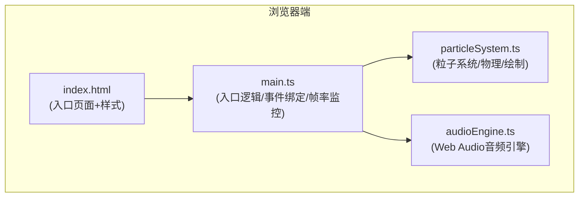

## 1. 架构设计



## 2. 技术栈说明

- **前端框架**：原生 TypeScript + HTML/CSS（无框架）
- **构建工具**：Vite 5.x
- **音频**：Web Audio API（原生浏览器支持）
- **渲染**：HTML5 Canvas 2D
- **语言版本**：TypeScript 5.x，target ES2020

## 3. 文件结构定义

| 文件路径 | 用途 |
|---------|------|
| `/package.json` | 项目依赖配置（vite、typescript），启动脚本 |
| `/vite.config.js` | Vite构建配置，端口8080，入口index.html |
| `/tsconfig.json` | TypeScript严格模式配置，ES2020 |
| `/index.html` | 入口页面，包含全屏背景、控制栏、Canvas元素 |
| `/src/main.ts` | 入口逻辑：初始化、事件绑定、动画循环、帧率监控 |
| `/src/particleSystem.ts` | 粒子系统：粒子数组管理、物理模拟、脉冲动画、绘制 |
| `/src/audioEngine.ts` | 音频引擎：Web Audio API封装、音高生成、音量控制 |

## 4. 核心模块接口定义

### 4.1 AudioEngine 接口

```typescript
class AudioEngine {
  constructor(initialVolume?: number);
  getContext(): AudioContext;
  setVolume(volume: number): void;  // 0-100
  playTone(frequency: number, duration?: number): void;
  getFrequencyFromColor(hue: number): number;  // 红色(0°)→C6, 蓝色(240°)→A4, 绿色(120°)→E3
}
```

### 4.2 ParticleSystem 接口

```typescript
interface Particle {
  x: number;
  y: number;
  originX: number;
  originY: number;
  vx: number;
  vy: number;
  radius: number;
  hue: number;
  saturation: number;
  brightness: number;
  colorTransitionStart: number;
  colorTransitionDuration: number;
  targetHue: number;
  stationarySince: number;
  breathingPhase: number;
}

interface Pulse {
  x: number;
  y: number;
  startTime: number;
  duration: number;
  maxRadius: number;
}

class ParticleSystem {
  constructor(canvas: HTMLCanvasElement, audioEngine: AudioEngine);
  triggerPulse(x: number, y: number): void;
  resetToMatrix(): void;
  randomizePositions(): void;
  setPerformanceMode(enabled: boolean): void;
  update(now: number): void;
  draw(ctx: CanvasRenderingContext2D): void;
}
```

## 5. 核心算法说明

### 5.1 颜色-音高映射
基于粒子色相(hue)进行线性插值映射：
- hue 0°（红色）→ 1046.50 Hz (C6)
- hue 120°（绿色）→ 164.81 Hz (E3)
- hue 240°（蓝色）→ 440.00 Hz (A4)
- 其他色相在三个基准点间分段线性插值

### 5.2 缓动函数
- **ease-out**: `t => 1 - (1-t)^3`
- **ease-in-out**: `t => t<0.5 ? 4t^3 : 1 - (-2t+2)^3/2`
- **sine-in-out**: `t => -(cos(π*t) - 1)/2`

### 5.3 帧率监控
- 每帧记录时间戳，计算每秒FPS
- 连续1秒 FPS < 45 → 启用性能模式
- 性能模式：粒子渲染从圆形降级为6x6像素正方形

### 5.4 粒子物理
- 摩擦力：每帧速度 × 0.92
- 脉冲影响：距离脉冲中心越近，获得的速度越大（线性衰减）
- 静止判定：速度向量模 < 0.1
