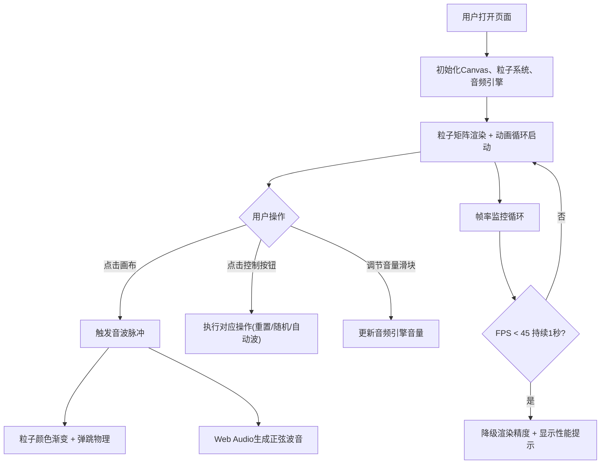

## 1. 产品概述

粒子音乐墙是一款浏览器端沉浸式交互应用，通过视觉粒子动画与音频反馈的联动，为用户提供音乐节奏与粒子运动的双重感官体验。目标用户为对音乐可视化、交互艺术感兴趣的普通用户与创意从业者。

- 解决静态网页无法提供视觉与听觉双重联动体验的问题
- 打造赛博朋克风格的沉浸式交互界面

## 2. 核心功能

### 2.1 功能模块

1. **粒子墙画布**：500个彩色圆点粒子矩阵、点击脉冲扩散、粒子弹跳与颜色渐变
2. **控制栏**：重置位置、随机排列、自动波模式、音量控制
3. **音频引擎**：Web Audio API正弦波音高生成、音量控制、颜色-音高映射
4. **性能监控**：帧率检测、自动降级渲染、性能模式提示

### 2.2 页面详情

| 页面名称 | 模块名称 | 功能描述 |
|---------|---------|---------|
| 主页面 | 粒子画布 | 1000x700px画布，500个粒子矩阵排列，黑色背景，支持点击触发脉冲 |
| 主页面 | 顶部控制栏 | 毛玻璃效果，包含三个功能按钮和音量滑块 |
| 主页面 | 性能监控 | 实时帧率检测，自动降级显示性能提示 |

## 3. 核心流程

## 4. 用户界面设计

### 4.1 设计风格

- **主色调**：黑色(#0D0D0D)、深灰(#2A2A2A)、亮紫(#8A2BE2)、青色(#00CED1)
- **按钮样式**：深灰渐变(#333333到#444444)、圆角8px、白色文字、hover亮度+20%、点击缩放0.95
- **字体**：无衬线现代字体，标题与控制文字清晰可读
- **布局风格**：画布居中，控制栏固定顶部，四周8px渐变边框
- **视觉风格**：赛博朋克/暗色科技感，毛玻璃效果，微光粒子

### 4.2 页面设计概述

| 页面名称 | 模块名称 | UI元素 |
|---------|---------|---------|
| 主页面 | 粒子画布 | 1000x700px、纯黑背景、500个彩色圆点粒子、脉冲扩散动画、粒子弹跳与颜色渐变 |
| 主页面 | 顶部控制栏 | 高度60px、半透明毛玻璃rgba(30,30,30,0.6)、模糊12px、边框1px solid rgba(255,255,255,0.15)、底部阴影0 2px 12px rgba(0,0,0,0.5) |
| 主页面 | 控制按钮 | 深灰渐变背景、圆角8px、白色文字、hover亮度提升、点击缩放反馈 |
| 主页面 | 音量滑块 | 细线样式(高4px)、圆形手柄(半径8px)、白色带微光背景 |

### 4.3 响应式设计

- **桌面端优先**：画布默认1000x700px居中显示
- **窗口宽度 < 800px**：画布宽度调整为95vw，高度等比缩放
- **移动端适配**：控制栏按钮文字隐藏，仅显示图标

### 4.4 动画与交互

- **粒子脉冲**：圆形扩散，半径0→400px，持续2秒
- **颜色渐变**：原色→随机亮色→原色，1.5秒ease-out缓出
- **粒子弹跳**：位移20-50px，ease-in-out缓动
- **粒子呼吸**：静止3秒后透明度0.7→1.0循环，2秒周期sine-in-out
- **按钮反馈**：hover亮度变化，click缩放0.95
