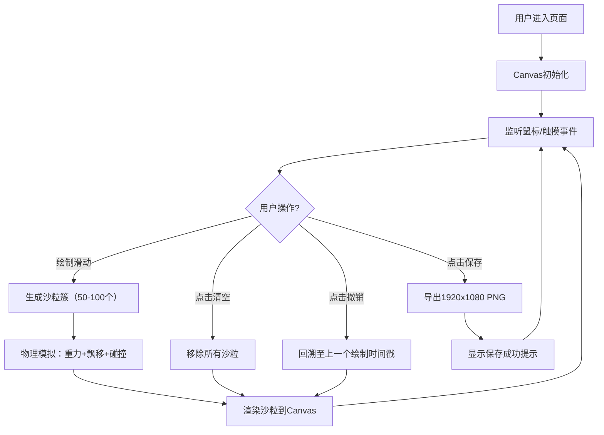

## 1. 产品概述

交互式数字沙画展台，用户通过鼠标或触摸在虚拟沙盘上绘制动态沙画，沙粒具有真实的物理塌落和流动效果。

- 主要用途：作品集网站中的互动展示元素，让访客体验沙画创作的乐趣
- 目标用户：前端开发者展示技术能力，普通访客体验创意互动
- 核心价值：融合物理模拟与视觉美学，呈现高沉浸感的数字艺术体验

## 2. 核心功能

### 2.1 功能模块

1. **沙粒绘制与物理模拟**：鼠标/触摸绘制生成沙粒，重力塌落、侧向飘移、软碰撞
2. **颜色系统**：暖色沙色调渐变，根据画笔速度动态调整颜色深浅
3. **渲染效果**：沙粒自然融合、层次阴影、底部堆积效果
4. **清空与撤销**：一键清空画布，按时间戳回溯撤销绘制簇
5. **快照保存**：导出1920x1080透明背景PNG图片
6. **性能监控**：实时显示沙粒数量和FPS，自动降级保持流畅

### 2.2 页面详情

| 页面名称 | 模块名称 | 功能描述 |
|-----------|-------------|---------------------|
| 沙画展台主页面 | Canvas绘制区 | 全屏沙画创作区域，支持鼠标和触摸交互 |
| 沙画展台主页面 | 底部工具栏 | 清空、撤销、保存三个功能按钮，毛玻璃效果 |
| 沙画展台主页面 | 性能指示器 | 右上角实时显示沙粒总数和帧率 |
| 沙画展台主页面 | 状态提示 | 粒子上限警告、保存成功提示等临时消息 |

## 3. 核心流程

用户进入页面 → 在画布上滑动绘制 → 沙粒生成并随物理规律塌落堆积 → 可选择清空/撤销/保存 → 持续创作直至满意

## 4. 用户界面设计

### 4.1 设计风格

- **主色调**：暖沙漠色系
  - 背景渐变：从 `#2C1810`（上）到 `#1A0F0A`（下）
  - 沙粒色：`#D4A574` ~ `#C28A5A`（默认），`#8B5E3C`（慢速绘制），`#E8C39E`（快速绘制）
  - 边框：`#4A2A1A`
  - 文字：`#E0D0B0`（主）、`#C0B090`（次）、`#FFB08A`（警告）

- **按钮样式**：
  - 圆形图标按钮，直径40px
  - 背景 `rgba(255,255,255,0.15)`，圆角50%
  - Hover时放大至44px，背景 `rgba(255,255,255,0.3)`
  - 过渡动画0.2s ease

- **字体**：系统无衬线字体，字号14px（指标）、13px（提示）、10px（按钮说明）

- **布局风格**：
  - 画布居中，90%宽度 × 75%高度
  - 四周10px深色边框
  - 底部工具栏毛玻璃效果（backdrop-filter: blur(6px)）
  - 画布阴影 `box-shadow: 0 4px 20px rgba(0,0,0,0.6)`

### 4.2 页面设计概述

| 页面名称 | 模块名称 | UI元素 |
|-----------|-------------|-------------|
| 沙画展台主页面 | Canvas绘制区 | 居中显示，深棕色边框，柔和阴影，绘制时沙粒自然堆积 |
| 沙画展台主页面 | 底部工具栏 | 毛玻璃背景，三个圆形按钮水平排列，按钮下方文字说明 |
| 沙画展台主页面 | 性能指示器 | 右上角固定，半透明深色背景圆角矩形，FPS颜色随性能变化 |
| 沙画展台主页面 | 状态提示 | 工具栏上方浮动提示，淡出动画0.5s，持续2秒 |

### 4.3 响应式设计

- **Desktop（≥768px）**：画布占90%宽75%高居中，工具栏高60px
- **Mobile（<768px）**：画布占满全屏宽度，工具栏高48px，图标文字缩小至80%，底部可横向滚动

### 4.4 动效设计

- 所有按钮点击/hover：0.2~0.3s ease-out过渡
- 提示消息：淡入淡出0.5s
- 沙粒物理：每帧requestAnimationFrame驱动
