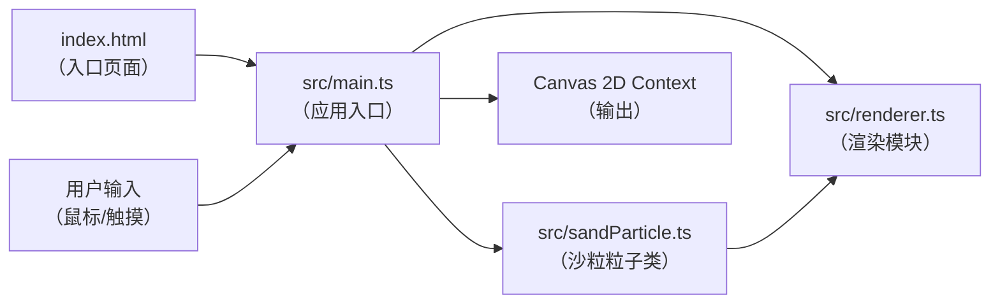

## 1. 架构设计



**调用关系与数据流向说明：**
1. `index.html` 加载并启动 `src/main.ts`
2. `main.ts` 管理全局状态、事件监听和渲染循环
3. `main.ts` 创建 `SandParticle` 实例并维护粒子数组
4. `SandParticle` 接收重力参数 → 更新自身位置速度 → 提供渲染数据
5. `main.ts` 将粒子数组传递给 `renderer.ts`
6. `renderer.ts` 接收粒子数组 → 逐帧渲染到Canvas
7. 用户输入事件 → `main.ts` → 触发粒子生成/清空/撤销/保存

## 2. 技术选型

- **前端框架**：原生 HTML/CSS + TypeScript（无框架，轻量高性能）
- **构建工具**：Vite（快速开发、原生ESM支持）
- **渲染技术**：Canvas 2D API（高效绘制大量粒子）
- **物理引擎**：自研轻量级物理模拟（重力、碰撞、飘移）

**依赖清单（package.json）：**
- `vite` — 开发构建工具
- `typescript` — 类型系统

## 3. 文件结构与职责

```
auto109/
├── index.html              # 入口页面，含Canvas容器和底部工具栏
├── package.json            # 项目依赖与启动脚本
├── vite.config.js          # Vite构建配置
├── tsconfig.json           # TypeScript配置
└── src/
    ├── main.ts             # 应用入口：初始化、事件、渲染循环
    ├── sandParticle.ts     # 沙粒粒子类：物理属性与塌落逻辑
    └── renderer.ts         # 渲染模块：粒子绘制与效果合成
```

### 3.1 各文件详细职责

**`index.html`**
- 定义页面结构：Canvas容器、底部工具栏、性能指示器、提示元素
- 引入样式和入口脚本
- 视口meta标签支持移动端响应式

**`package.json`**
- 依赖：`vite`、`typescript`
- 脚本：`npm run dev` 启动开发服务器

**`vite.config.js`**
- 入口：`index.html`
- 开发服务器端口：3000

**`tsconfig.json`**
- 严格模式开启
- target: es2020
- module: esnext

**`src/main.ts`**
- Canvas初始化与尺寸管理
- 鼠标/触摸事件监听与处理
- 粒子系统管理（创建、存储、撤销历史）
- requestAnimationFrame渲染循环驱动
- FPS计算与性能监控
- 工具栏按钮事件绑定
- 保存PNG功能实现
- 状态提示管理

**`src/sandParticle.ts`**
- `SandParticle` 类定义：
  - 属性：`x`, `y`（位置）、`vx`, `vy`（速度）、`radius`, `color`（外观）
  - 方法：`update(gravity)` — 应用重力和飘移更新位置
  - 方法：`resolveCollision(other)` — 软碰撞检测与分离

**`src/renderer.ts`**
- `Renderer` 类定义：
  - 方法：`render(particles, ctx)` — 绘制所有粒子到Canvas
  - 方法：`applyShadowEffect(ctx)` — 底部堆积层次阴影

## 4. 核心数据模型

### 4.1 SandParticle 类

```typescript
interface SandParticle {
  x: number;           // X坐标
  y: number;           // Y坐标
  vx: number;          // 水平速度（-0.5 ~ 0.5 px/帧飘移）
  vy: number;          // 垂直速度
  radius: number;      // 半径（2 ~ 5 px）
  color: string;       // 颜色（根据绘制速度决定）
  timestamp: number;   // 创建时间戳（用于撤销）
}
```

### 4.2 全局状态（main.ts内部）

```typescript
interface AppState {
  particles: SandParticle[];       // 所有活跃沙粒
  history: number[];               // 每次绘制的起始索引（用于撤销）
  isDrawing: boolean;              // 当前是否正在绘制
  lastDrawPos: { x: number; y: number; time: number };  // 上一绘制点
  fps: number;                     // 当前帧率
  frameCount: number;              // 帧数计数器
  lastFpsUpdate: number;           // 上次FPS更新时间
  gravity: number;                 // 重力加速度 0.05 px/帧²
  maxParticles: number;            // 粒子上限 12000
}
```

## 5. 物理模拟算法

### 5.1 重力与运动

每帧更新：
```
particle.vy += gravity          // 重力加速度 0.05
particle.vx += random(-0.05, 0.05)  // 微小侧向扰动
particle.x += particle.vx
particle.y += particle.vy
```

边界处理：粒子到达画布底部时停止，到达左右边界时反弹

### 5.2 软碰撞检测

采用空间网格优化（每格约2倍粒子半径），仅检查相邻格子内的粒子：
```
若两粒子距离 < (r1 + r2)：
  计算重叠量 overlap = (r1 + r2) - distance
  沿法线方向各推开 overlap * 0.3（弹力系数）
  速度衰减 0.5
```

### 5.3 性能优化策略

- 空间网格划分减少碰撞检测复杂度
- FPS < 25时，每次生成粒子从50-100降至30-50
- 粒子总数硬上限12000
- 每帧计算预算 ≤ 8ms

## 6. 颜色系统

画笔速度计算：`speed = distance / deltaTime`

颜色映射（#RRGGBB十六进制插值）：
- speed ≤ 阈值低 → `#8B5E3C`（深棕）
- speed ≥ 阈值高 → `#E8C39E`（亮沙色）
- 中间 → `#D4A574` ~ `#C28A5A` 线性插值

## 7. 渲染流程

每帧：
1. 清空画布（半透明叠加实现运动模糊效果可选）
2. 设置 `globalCompositeOperation = 'source-over'`
3. 遍历所有粒子，绘制圆形填充
4. 对底部区域应用透明度叠加，模拟层次阴影
