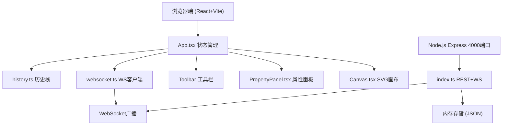
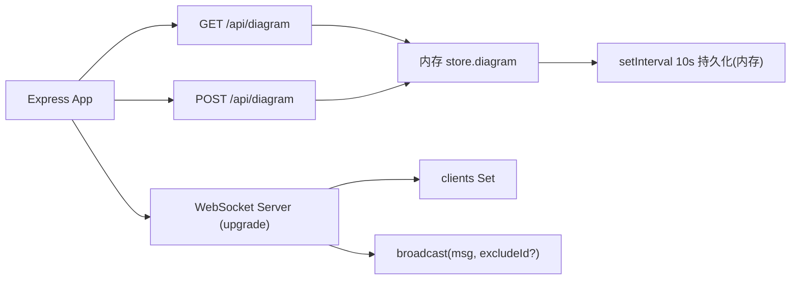
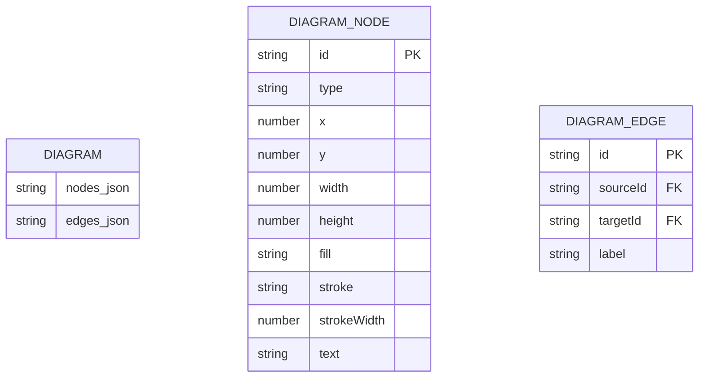

## 1. 架构设计



## 2. 技术说明

- **前端**：React 18 + TypeScript + Vite + react-router-dom 6
- **后端**：Express 4 + ws (WebSocket) + cors + uuid
- **构建工具**：Vite（端口3000，React插件）
- **状态管理**：React useState/useReducer + 自定义history栈
- **渲染层**：直接操作SVG元素，requestAnimationFrame + 16ms防抖
- **实时通信**：ws库，自动重连（3秒间隔，最多10次）
- **数据存储**：内存存储为JSON，每10秒自动持久化（内存对象）

## 3. 路由定义

| 路由 | 用途 |
|------|------|
| `/` | 编辑器主页（默认） |
| `/exit` | 退出编辑，重定向回首页（或展示简单退出页） |

## 4. API 定义

```typescript
// 节点类型
interface DiagramNode {
  id: string;
  type: 'rect' | 'diamond' | 'circle';
  x: number;
  y: number;
  width: number;
  height: number;
  fill: string;
  stroke: string;
  strokeWidth: number;
  text: string;
}

// 连线类型
interface DiagramEdge {
  id: string;
  type: 'edge';
  sourceId: string;
  targetId: string;
  label: string;
}

// 图数据
interface DiagramData {
  nodes: DiagramNode[];
  edges: DiagramEdge[];
}

// WS消息
interface WSMessage {
  type: 'init' | 'node-add' | 'node-update' | 'node-delete' | 'edge-add' | 'edge-update' | 'edge-delete' | 'cursor' | 'clear';
  payload: any;
  clientId?: string;
}

// GET /api/diagram → DiagramData
// POST /api/diagram (body: DiagramData) → { success: true }
```

## 5. 服务端架构



## 6. 数据模型

### 6.1 数据模型定义



### 6.2 初始化数据
服务端启动时初始化为空数组 `{ nodes: [], edges: [] }`，首次连接客户端自动创建默认示例节点可选。
