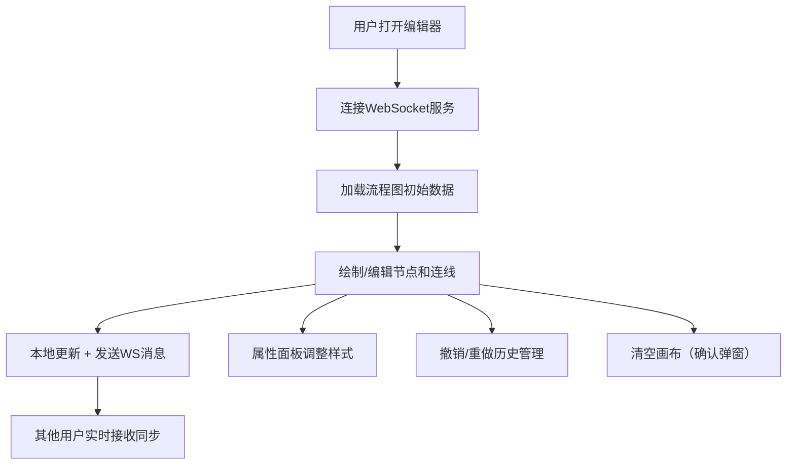

## 1. 产品概述

在线流程图编辑器全栈Web应用，为团队提供实时协作的流程图绘制能力，类似轻量版draw.io。支持拖拽节点、连线、网格吸附、缩放及多用户实时同步。

- 解决团队成员协作绘图时的版本同步问题，降低沟通成本
- 提供轻量、高性能的绘图体验，满足日常流程图、架构图绘制需求

## 2. 核心功能

### 2.1 用户角色

| 角色 | 注册方式 | 核心权限 |
|------|----------|----------|
| 普通用户 | 直接访问 | 绘制节点、连线、编辑属性、实时协作 |

### 2.2 功能模块

1. **编辑器页面**：画布区域、工具栏、属性面板
2. **节点系统**：方形/菱形/圆形三种形状，支持拖拽、缩放、文本编辑、网格吸附
3. **连线系统**：节点间连线、连线标签、选中高亮
4. **属性面板**：可折叠面板，显示位置/尺寸/颜色/文本属性
5. **实时协作**：WebSocket多用户同步，用户鼠标标签展示
6. **历史管理**：撤销/重做（深度20）

### 2.3 页面详情

| 页面名称 | 模块名称 | 功能描述 |
|----------|----------|----------|
| 编辑器页 | 顶部工具栏 | 撤销/重做按钮、清空画布按钮（带确认弹窗） |
| 编辑器页 | SVG画布 | 节点拖拽（10px网格吸附）、框选、缩放、双击编辑文本、连线创建 |
| 编辑器页 | 属性面板 | 可折叠（240px↔2px），编辑位置XY、宽高、填充色、边框色、边框粗细、文本 |
| 编辑器页 | 协作光标 | 实时显示其他用户鼠标位置及随机用户名标签 |

## 3. 核心流程

用户打开编辑器页面 → 自动连接WebSocket → 加载当前流程图数据 → 拖拽/添加节点（自动吸附网格）→ 连线并编辑标签 → 右侧面板调整属性 → 操作实时同步到其他用户 → 可撤销/重做 → 点击清空画布确认后重置。

## 4. 用户界面设计

### 4.1 设计风格
- **主色调**：暗色主题，画布背景 `#1E1E2E`，工具栏背景 `#2D2D3F`
- **强调色**：糖果色系循环分配节点填充色 `#FF6B6B` `#48C9B0` `#FFD93D` `#6C5CE7`
- **选中效果**：外发光 `box-shadow 0 0 12px #6C5CE7`
- **边框**：默认 `#FFFFFF40`
- **字体**：Inter 400/500/600，节点文本14px，标签12px
- **按钮交互**：透明度0→1过渡0.2s，颜色选项悬停放大1.1倍
- **面板动画**：折叠/展开0.3s ease
- **对话框**：圆角12px，阴影`0 8px 32px rgba(0,0,0,0.5)`，背景`#2D2D3F`

### 4.2 页面设计概述

| 页面名称 | 模块名称 | UI元素 |
|----------|----------|--------|
| 编辑器页 | 工具栏 | 高48px，右侧撤销/重做/清空按钮，悬停过渡效果 |
| 编辑器页 | 画布 | SVG背景`#1E1E2E`，10px网格线，节点圆角，选中发光 |
| 编辑器页 | 属性面板 | 宽240px，折叠为2px tab，右上角箭头切换，毛玻璃色板`#ffffff10` |
| 编辑器页 | 协作标签 | 半透明背景，圆角6px，12px白色文字，跟随其他用户鼠标 |

### 4.3 响应式
桌面端优先，最小宽度1024px，左侧留20px边距，右侧面板折叠不挤压画布。
