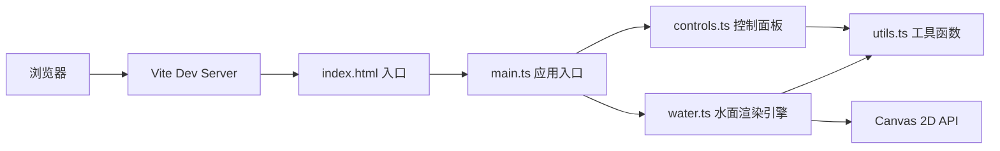

## 1. 架构设计



## 2. 技术描述

- **前端框架**：原生HTML/CSS + TypeScript（无UI框架）
- **构建工具**：Vite 5.x
- **开发语言**：TypeScript（严格模式，target esnext）
- **渲染技术**：Canvas 2D API
- **后端服务**：无（纯前端应用）
- **初始化方式**：Vite vanilla-ts 模板

## 3. 项目文件结构

```
auto115/
├── package.json          # 项目依赖与脚本
├── index.html            # 入口HTML页面
├── vite.config.js        # Vite构建配置
├── tsconfig.json         # TypeScript配置
└── src/
    ├── main.ts           # 应用入口：初始化、动画循环、事件监听
    ├── water.ts          # 水面核心：波浪生成、涟漪扩散、渲染算法
    ├── controls.ts       # 控制面板：滑块UI、参数绑定、重置功能
    └── utils.ts          # 工具函数：颜色插值、缓动函数、FPS计算
```

## 4. 核心模块设计

### 4.1 Water 渲染引擎 (water.ts)

**接口定义：**
```typescript
interface WaterParams {
  waveDensity: number;    // 波纹密度 0.5-5.0
  refractionIntensity: number;  // 折射强度 0.0-1.0
  colorDepth: number;     // 颜色深度 0.0-1.0
}

interface Ripple {
  x: number;
  y: number;
  radius: number;
  maxRadius: number;
  startTime: number;
  duration: number;
}

class WaterRenderer {
  constructor(canvas: HTMLCanvasElement);
  setParams(params: Partial<WaterParams>): void;
  createRipple(x: number, y: number): void;
  render(timestamp: number): void;
  resize(width: number, height: number): void;
}
```

**核心算法：**
- 10条正弦波叠加：每条波有独立振幅、频率、相位，每帧平移相位
- 涟漪扩散：ease-out缓动，半径从0到80px，持续1.5秒
- 像素级扰动：基于涟漪半径计算径向偏移和亮度增强
- 颜色渐变：#0A2E4A → #1B5E7A 基础渐变，涟漪处向 #7EC8E3 插值

### 4.2 Controls 控制面板 (controls.ts)

**接口定义：**
```typescript
interface SliderConfig {
  key: keyof WaterParams;
  label: string;
  min: number;
  max: number;
  step: number;
  defaultValue: number;
}

class ControlPanel {
  constructor(container: HTMLElement, onParamsChange: (params: Partial<WaterParams>) => void);
  reset(): void;
  getParams(): WaterParams;
}
```

### 4.3 Utils 工具函数 (utils.ts)

```typescript
function lerpColor(color1: string, color2: string, t: number): string;  // 颜色插值
function easeOutQuad(t: number): number;  // ease-out 缓动函数
class FPSMonitor {  // FPS 性能监控
  tick(): number;
  getFPS(): number;
}
```

## 5. 关键实现要点

1. **动画循环**：使用 `requestAnimationFrame`，使用时间戳而非帧计数保证速度一致
2. **Canvas 性能**：使用 `ImageData` 进行像素级操作减少绘制调用
3. **涟漪对象池**：复用涟漪对象避免频繁GC
4. **响应式缩放**：监听 `resize` 事件，根据视口高度动态调整画布尺寸
5. **防抖处理**：滑块 input 事件直接触发，避免额外延迟
