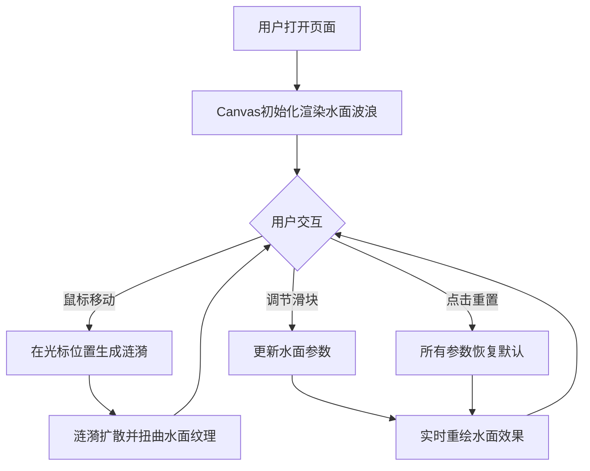

## 1. 产品概述

动态水面纹理与涟漪交互Web应用，为前端开发者和视觉爱好者提供无后端依赖的纯前端水面效果预览工具。用户可实时调节水面参数并获得即时视觉反馈。

- 核心价值：在浏览器中模拟波光粼粼水面纹理与实时交互涟漪效果
- 目标用户：前端开发者、视觉设计师、动效爱好者

## 2. 核心功能

### 2.1 功能模块

1. **主画布渲染**：Canvas 2D动态水面波浪纹理渲染
2. **涟漪交互**：鼠标滑过触发环形涟漪扩散效果
3. **参数控制面板**：波纹密度、折射强度、颜色深度三个可调节滑块
4. **重置功能**：一键恢复默认参数值

### 2.2 页面详情

| 页面名称 | 模块名称 | 功能描述 |
|-----------|-------------|---------------------|
| 主页面 | 水面画布 | 800x600px Canvas渲染深蓝色渐变连续波浪纹理，10条正弦波叠加生成流动光影效果，60fps |
| 主页面 | 涟漪交互 | 鼠标滑过在光标位置触发半径0-80px环形涟漪，持续1.5秒，ease-out缓动，径向扭曲和亮度增强 |
| 主页面 | 控制面板 | 毛玻璃半透明效果，包含三个滑块及重置按钮 |
| 主页面 | 参数滑块 | 波纹密度(0.5-5.0)、折射强度(0.0-1.0)、颜色深度(0.0-1.0)，实时数值显示 |
| 主页面 | 重置按钮 | 一键将所有参数恢复默认值 |

## 3. 核心流程

## 4. 用户界面设计

### 4.1 设计风格

- **主色调**：深蓝渐变背景（#0B1B2F 到 #1A1A2E），水面纹理深蓝渐变（#0A2E4A 到 #1B5E7A）
- **强调色**：亮蓝色（#7EC8E3）用于涟漪高亮和按钮悬停
- **文本色**：浅灰色（#CCCCCC）用于参数数值
- **按钮风格**：半透明圆角按钮，悬停时变为亮蓝色半透明，点击缩放0.95回弹
- **布局风格**：居中卡片式布局，画布+控制面板垂直堆叠
- **视觉效果**：毛玻璃（backdrop-filter）控制面板，径向渐变背景

### 4.2 页面设计概览

| 页面名称 | 模块名称 | UI元素 |
|-----------|-------------|-------------|
| 主页面 | 整体背景 | 径向渐变 #0B1B2F → #1A1A2E，全屏铺满 |
| 主页面 | 水面画布 | 800x600px，居中，圆角16px，Canvas 2D渲染 |
| 主页面 | 控制面板 | 背景rgba(255,255,255,0.08)，1px边框rgba(255,255,255,0.2)，圆角12px，内边距16px |
| 主页面 | 分隔线 | 1px solid rgba(255,255,255,0.1)，margin-bottom 12px |
| 主页面 | 滑块控件 | 细线3px高，圆形拖拽手柄半径6px，白色背景，右侧12px数值标签 |
| 主页面 | 重置按钮 | 内边距8px 16px，圆角8px，过渡0.2s ease |

### 4.3 响应式

- 桌面优先设计，画布最大宽度1200px自适应
- 视口高度小于700px时，画布高度等比缩小至500px
- 控制面板宽度跟随画布宽度
- 所有交互元素悬停0.2s ease过渡

### 4.4 性能要求

- 画布渲染稳定维持55fps以上
- 鼠标连续划动不产生明显卡顿或延迟
- 使用 requestAnimationFrame 驱动动画循环
