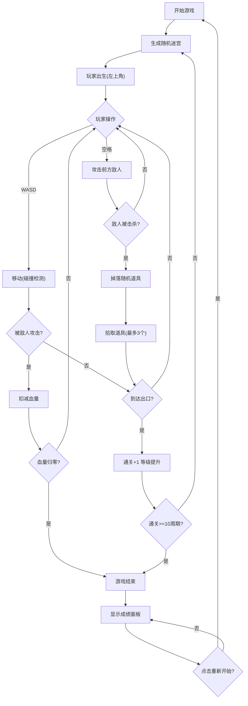

## 1. 产品概述

基于时间循环机制的 Roguelike 迷宫探索游戏，玩家在随机生成的迷宫中探索、战斗，每次失败或通关后迷宫重组，保留等级和部分道具。

- **核心玩法**：迷宫探索 + 战斗 +  Roguelike 元素
- **目标用户**：休闲游戏玩家，喜欢挑战和重复可玩性的用户
- **产品价值**：提供高重玩价值的快节奏迷宫探索体验

## 2. 核心功能

### 2.1 功能模块

1. **迷宫系统**：随机迷宫生成、周期重置、墙壁/走廊渲染
2. **玩家系统**：移动控制、攻击动作、等级属性、血量管理
3. **敌人系统**：AI 状态机（巡逻/追击/攻击）、碰撞检测、掉落机制
4. **道具系统**：生命药水、攻击力提升、护盾、道具栏管理
5. **UI 系统**：状态栏、道具栏、对话提示、成绩面板
6. **游戏循环**：帧更新、状态管理、碰撞检测、周期结算

### 2.2 页面详情

| 页面名称 | 模块名称 | 功能描述 |
|---------|---------|---------|
| 游戏主界面 | 迷宫画布 | 12x12 网格迷宫，墙壁/走廊渲染，玩家/敌人/道具绘制 |
| 游戏主界面 | 顶部状态栏 | 周期数、血量（心形图标）、等级（星形图标）、道具栏 |
| 游戏主界面 | 底部操作提示 | WASD 移动图标、空格攻击图标 |
| 游戏主界面 | 成绩面板 | 总游戏时间、通关周期数、击杀数、道具数、重新开始按钮 |
| 游戏主界面 | 对话提示 | 道具拾取/使用提示，2 秒渐隐 |

## 3. 核心流程

玩家从左上角出生，使用 WASD 在迷宫中移动，空格攻击前方敌人。击杀敌人随机掉落道具，拾取后存入道具栏（最多 3 个）。到达右下角出口完成一个周期，等级提升，迷宫重组。血量归零或通关 10 周期游戏结束，显示成绩面板。

## 4. 用户界面设计

### 4.1 设计风格

- **主题**：暗色主题，赛博朋克风格
- **主色调**：深灰 #1A1A2E、暗紫 #16213E、深灰蓝 #0F3460
- **强调色**：亮青色 #00F5D4（玩家）、红色 #FF4C4C（敌人）、金色 #FFD700（按钮 hover）
- **中性色**：浅灰 #E2E2E2（走廊）、白色（字体/高光）
- **圆角**：统一 6px（成绩面板 16px）
- **阴影**：统一 0 2px 8px rgba(0,0,0,0.4)

### 4.2 页面设计概述

| 页面名称 | 模块名称 | UI 元素 |
|---------|---------|---------|
| 游戏主界面 | 迷宫画布 | 线性渐变背景 (#1A1A2E → #16213E)，12x12 网格，墙壁深灰蓝，走廊浅灰 |
| 游戏主界面 | 玩家角色 | 亮青色圆形，半径 12px，2px 白色内发光轮廓 |
| 游戏主界面 | 敌人 | 红色圆形，半径 8px，白色高光眼睛 |
| 游戏主界面 | 顶部状态栏 | 高度 60px，背景 #1A1A2E，16px 白色字体，周期/血量/等级/道具栏 |
| 游戏主界面 | 底部操作提示 | 灰色半透明，WASD 和空格图标 |
| 游戏主界面 | 成绩面板 | 半透明毛玻璃 rgba(0,0,0,0.6) + blur(12px)，白色字体，圆角 16px，居中 |
| 游戏主界面 | 重新开始按钮 | 圆角，hover 变金色 #FFD700 |

### 4.3 响应式

- **桌面优先**，最小宽度 800px
- **画布**：保持 1:1 宽高比，根据窗口大小等比缩放并居中
- **FPS**：稳定 60fps
