## 1. 架构设计

```mermaid
graph TD
    A["index.html (入口)"] --> B["game.ts (主游戏循环)"]
    B --> C["player.ts (玩家类)"]
    B --> D["maze.ts (迷宫生成器)"]
    B --> E["enemy.ts (敌人AI)"]
    B --> F["ui.ts (UI渲染)"]
    C --> G["移动/攻击/属性"]
    D --> H["递归回溯算法"]
    E --> I["状态机: 巡逻/追击/攻击"]
    F --> J["HUD/道具栏/对话/成绩面板"]
```



## 2. 技术描述

- **构建工具**：Vite 5.x
- **编程语言**：TypeScript 5.x（严格模式）
- **渲染引擎**：HTML5 Canvas 2D
- **无后端、无数据库**：纯前端游戏，状态内存管理

## 3. 文件结构

| 文件路径 | 用途 |
|---------|------|
| `package.json` | 项目依赖与脚本（vite、typescript） |
| `index.html` | 入口页面，包含 Canvas、状态栏、操作提示 |
| `vite.config.js` | Vite 配置，端口 8080 |
| `tsconfig.json` | TypeScript 配置，严格模式，ESNext |
| `src/game.ts` | 主游戏循环、帧更新、碰撞检测、状态机 |
| `src/player.ts` | 玩家类：移动、攻击、等级属性 |
| `src/maze.ts` | 迷宫生成器：递归回溯算法、周期重置 |
| `src/enemy.ts` | 敌人AI：状态机（巡逻/追击/攻击）、寻路 |
| `src/ui.ts` | UI渲染：HUD、道具栏、对话文本、成绩面板 |

## 4. 核心数据模型

### 4.1 类型定义

```typescript
type CellType = 'wall' | 'corridor';
type Direction = 'up' | 'down' | 'left' | 'right';
type ItemType = 'health' | 'attack' | 'shield';
type EnemyState = 'patrol' | 'chase' | 'attack';
type GameState = 'playing' | 'gameover';

interface Position {
  x: number;
  y: number;
}

interface Item {
  type: ItemType;
  id: string;
}

interface PlayerData {
  pos: Position;
  targetPos: Position;
  hp: number;
  maxHp: number;
  attack: number;
  level: number;
  hasShield: boolean;
  inventory: Item[];
  direction: Direction;
  isMoving: boolean;
  moveProgress: number;
  isAttacking: boolean;
  attackPhase: 'windup' | 'swing' | 'cooldown' | null;
  attackTimer: number;
}

interface EnemyData {
  id: string;
  pos: Position;
  state: EnemyState;
  patrolDirection: Direction;
  patrolTimer: number;
  attackCooldown: number;
}
```

### 4.2 游戏状态

```typescript
interface GameData {
  state: GameState;
  cycle: number;
  totalTime: number;
  kills: number;
  itemsPicked: number;
  maze: CellType[][];
  player: PlayerData;
  enemies: EnemyData[];
  droppedItems: { pos: Position; item: Item }[];
  messages: { text: string; timer: number; opacity: number }[];
  showResult: boolean;
}
```

## 5. 核心算法

### 5.1 迷宫生成（递归回溯）

- 网格尺寸：12x12
- 墙壁厚度：1 格，走廊宽度：1 格
- 递归深度限制：不超过 12 层（网格大小）
- 起点：(1, 1)，终点：(10, 10)（考虑墙壁偏移）

### 5.2 敌人寻路

- 简单贪心寻路：每帧选择朝向玩家的可行方向
- 最大计算次数：每帧不超过 100 次
- 不可穿墙

### 5.3 性能保证

- 帧率：60fps（requestAnimationFrame）
- 动画插值：移动 0.15s ease，攻击前摇 0.1s + 后摇 0.2s
- 画布缩放：保持 1:1 宽高比，居中显示
